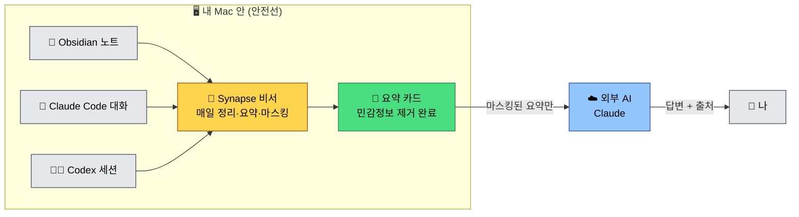

# Synapse Memory

> **개인용 AI 비서 · 세컨드 브레인 · 클론** —
> 내 Obsidian 메모와 Claude 대화 기록을 안전하게 정리해서
> 회사 맞춤 이력서, 과거 결정 회상, AI 의사결정 코파일럿까지.
>
> **원본 raw 데이터는 Mac 밖으로 나가지 않습니다.**
> 외부 AI에는 민감정보가 제거된 요약과 사용자가 승인한 자료만 전달합니다.

## 한 장으로 보는 원리



**비유로 한 줄**: Synapse 비서가 매일 내 노트장과 회의록을 정리해
**요약 카드**를 만들고, 외부 AI에 질문할 때는 **마스킹된 요약**과
승인된 자료만 들고 갑니다. 원본 raw 데이터는 Mac 안에 남습니다.

## Synapse가 풀어주는 7가지 답답함

평소 한 번이라도 부딪혔다면 이 도구가 맞습니다.

| # | 답답함 | Synapse가 해주는 일 | 담당 명령 |
|---|---|---|---|
| 1 | **"그 노트 어디 있더라?"** — 노트 1,000개 쌓이니 검색해도 안 나옴 | 매일 같은 회사·프로젝트끼리 자동으로 묶어 **한 장짜리 카드**로 압축 | `/synapse-daily` |
| 2 | **"Claude한테 매번 내 맥락을 처음부터 설명한다"** | 슬래시 한 줄로 **관련 카드 6장 + 출처**를 자동 주입 | `/synapse-ask` |
| 3 | **"AI에 개인 자료 던지자니 회사 NDA가…"** | 원본은 외부 차단 + **마스킹 2단계**(정규식 + 로컬 AI) + NDA 강제 차단 | (자동) |
| 4 | **"회사마다 이력서를 6시간씩 다시 쓴다"** | 회사 카드 + 내 프로젝트 매칭 → **30초 초안** | `/synapse-resume` |
| 5 | **"사소한 결정에 매일 피로하다"** | 내 결정 패턴 후보 → 내가 검토·승인 → **결정 코파일럿** | `/synapse-decide` |
| 6 | **"회고록·일기·기획서 초안을 비서가 학습했으면"** 🆕 | 외부 markdown / txt 흡수 → 말투·기술 선호·실수까지 ProfileFact 후보로 추출 | `persona ingest --file` |
| 7 | **"새 프로젝트를 내 기술 스택으로 빠르게 설계하고 싶다"** 🆕 | Profile + ProjectCard 종합 → **내가 직접 쓴 듯한 설계 초안** | `persona design-project` |

> 더 자세히:
> [5가지 답답함이 어떻게 풀리는가
> (담당 기능 매핑 포함)](docs/for-everyone/how-it-works.md)

> 🆕 **처음 설치하셨다면 `/synapse-onboard`** — AI가 답답함 1개를 골라
> 끝까지 체험시켜 줍니다.
>
> 🆕 **매일 어떤 작업부터 할지 모르겠다면 `/synapse-assistant`** — 현재
> vault 상태를 보고 오늘 추천 작업 1~3개를 제안하고, 각 작업마다 동의를
> 받아 대신 실행합니다.
>
> 🆕 **vault가 어지러워졌다면 `/synapse-cleanup`** — 오래된·휴면·빈 자료를
> archive 폴더로 이동합니다. 영구 삭제는 하지 않고,
> 매니페스트로 롤백할 수 있습니다.
>
> 🆕 **설정을 바꾸고 싶다면 `/synapse-config`** — 자연어로 cleanup 임계값,
> 모델, top_k 등을 변경합니다. 보호 키는 차단하고 advanced 키는
> 추가 경고를 표시합니다.

## 30초 미리보기

```text
$ /synapse-ask "iOS 클린 아키텍처 어떻게 도입했지?"

Domain–Data–Presentation 3계층 + Repository + DIContainer 조합으로 도입.
도입 기간 2024.01~05, 결과: 버그 수정 시간 71% 단축, 크래시율 2.1% → 0.8%.
출처: [이력서-2026], [sample-ios-app]
```

```text
$ /synapse-resume 샘플회사B
✓ 이력서 생성: 30_Creative/Drafts/Resume - 샘플회사B (2026-05).md
  매칭 카드 6개: sample-ios-app, 이력서-2026, mobile-ios-tablet-app, ...
```

```text
$ synapse-memory persona ingest --file ~/Documents/diary-2025.md
INGESTED: 1 files mirrored to L0 private storage
ProfileFact 추출 중 (외부 자료 기반)...
  → 4 fact 추출
✓ MemoryInbox PR 저장: ...90_System/AI/MemoryInbox/Profile-2026-05-13.md
```

```text
$ synapse-memory persona design-project "iOS Todo 앱 새로 시작"
## 추천 기술 스택
- Swift + SwiftUI [Profile: tech]
- CoreData 로컬 저장 [prj-todo-ios-2025]

## 단계별 진행 [Profile: work_style]
1. 의사코드로 데이터 모델 정리
...

✓ 설계 초안 저장: 20_Projects/Drafts/design_project - iOS Todo 앱 (2026-05-13).md
```

## 빠른 시작 — 비개발자

> 두 가지 방법 중 하나를 선택합니다. **방법 A를 권장**합니다.
> 둘 다 동일한 설치 프로그램을 실행하며, 결과는 같습니다.

### 방법 A — AI에게 설치 맡기기 (권장, 터미널 불필요)

Claude Code 또는 Codex 채팅창을 열고 아래 프롬프트를 그대로 붙여넣습니다.
AI가 다운로드 · 검증 · 안내까지 대신 해주며, 위험한 단계
(보안 경고·실제 적용)에서 멈추고 사용자 승인을 기다립니다.

```text
Synapse Memory를 설치해줘.

설치 파일은 아래 링크에서 받아줘.
https://github.com/Jimmy-Jung/synapse-memory/releases/download/v0.6.2/SynapseMemory-v0.6.2-macos-installer.zip

다운로드한 zip을 압축 해제한 뒤
installer/SynapseMemory-Installer.command가 있는지 확인하고,
zsh -n으로 문법 검사까지 해줘.

그 다음에는 바로 실행하지 말고 멈춘 뒤,
내가 직접 실행할 수 있는 방법을 안내해줘.

내가 "실행해"라고 명시적으로 말하면 기본 preview 모드로 실행해줘.
내가 "실제 적용해"라고 명시적으로 말하기 전까지는
SYNAPSE_INSTALLER_DRY_RUN=0을 붙이지 마.

설치 중 macOS 보안 경고가 뜨면 임의로 보안 설정을 바꾸지 말고,
내가 직접 열 수 있도록 안내해줘.

GUI 동의, Obsidian 저장소 위치 선택, Gatekeeper 우회, 실제 적용처럼
내가 직접 승인해야 하는 단계에서는 멈추고 안내해줘.

내가 설치를 실행했다고 알려주면,
최신 로그 경로와 synapse-memory doctor 결과를 확인해서 요약해줘.
```

이 프롬프트가 시키는 일을 한 줄씩 풀면 다음과 같습니다.

- 공식 GitHub Release에서 zip을 받고, 안전한지 검사
- 실제 실행 전에 멈추고 사용자에게 의사 확인
- 기본은 **preview(dry-run) 모드** — 실제 변경 없음
- "실제 적용해"라고 사용자가 말해야만 진짜 설치 진행
- 보안 경고는 사용자가 직접 처리 (AI가 보안 설정 임의 변경 금지)
- 설치 후 `doctor` 진단 자동 요약

> 💡 현재 MVP installer는 안전을 위해 기본값이 dry-run/preview입니다.
> 실제 적용 모드는 단일 동의 정책이
> [constitution](.specify/memory/constitution.md)에 반영된 뒤 활성화됩니다.

### 방법 B — 직접 더블클릭

터미널을 쓸 수 있거나 AI를 거치고 싶지 않은 분.

1. [**🔽 설치 zip 다운로드 (v0.6.2)**][installer-zip] — 받은 zip을 더블클릭하면
   `installer/SynapseMemory-Installer.command`가 생깁니다.
2. `SynapseMemory-Installer.command`를 **우클릭 → 열기 → (경고가 나오면)
   다시 열기**.
3. GUI 안내를 따라갑니다 — Homebrew · Claude Code · Obsidian 설치 →
   **Obsidian 저장소 위치 선택**(iCloud 추천) → 환경 점검.

> macOS가 "악성 코드 확인 불가" 경고를 띄우는 건 정상입니다.
> → [보안 경고 우회 안내](docs/for-everyone/installer-walkthrough.md#macos-보안-경고)
>
> 📖 **화면 캡처와 함께 보는 단계별 가이드**:
> [docs/for-everyone/installer-walkthrough.md](docs/for-everyone/installer-walkthrough.md)

설치 로그와 상태 manifest(`installer-*.state.json`)는
`~/Library/Logs/SynapseMemory/`에 남습니다.

### 플러그인 활성화 — Claude Code / Codex

installer를 **실제 적용 모드**(`SYNAPSE_INSTALLER_DRY_RUN=0`)로 실행하면
Claude Code와 Codex 플러그인 활성화까지 함께 처리합니다.
기본 preview 모드에서는 설정을 바꾸지 않고,
어떤 작업을 할지만 로그에 남깁니다.

이미 runtime은 준비되어 있고 플러그인만 직접 활성화하려면 아래처럼
도구별로 진행합니다.

#### Claude Code

Claude Code는 marketplace 등록, plugin 설치, enable 단계가 분리되어 있습니다.

```bash
claude plugin marketplace add --scope user Jimmy-Jung/synapse-memory
claude plugin install --scope user synapse-memory@synapse-memory-marketplace
claude plugin enable --scope user synapse-memory@synapse-memory-marketplace
claude plugin list
```

`claude plugin list`에서 `synapse-memory@synapse-memory-marketplace`가
`enabled`로 보이면 활성화된 상태입니다.

#### Codex

Codex는 marketplace 등록과 plugin enable 설정이 필요합니다. 비개발자 설치에서는
installer가 cache 준비와 `~/.codex/config.toml` 병합까지 자동으로 처리합니다.

```bash
codex plugin marketplace add Jimmy-Jung/synapse-memory
```

수동으로 설정할 때는 `~/.codex/config.toml`에 아래 항목이 있어야 합니다.

```toml
[plugins."synapse-memory@synapse-memory-marketplace"]
enabled = true
```

활성화 확인:

```bash
codex debug prompt-input "Synapse Memory plugin visibility check" \
  | grep "synapse-memory:synapse-memory"
```

위 grep 결과가 나오면 Codex에서 Synapse Memory skill을 볼 수 있는 상태입니다.

### 마지막 단계 — Claude Code 또는 Codex에서 첫 질문 (방법 A·B 공통)

Claude Code 또는 Codex를 열고:

```
/synapse-doctor       ← 환경 정상 여부 확인
/synapse-daily        ← 첫 데이터 정리 (1~2분)
/synapse-ask "..."   ← 내 자료에 질문하기
```

> 💡 **첫 `/synapse-daily`는 30분~1시간이 걸릴 수 있습니다** (노트 양에 따라).
> 진행 상황은 `synapse-memory daily-status` 또는
> `synapse-memory daily-status --watch`로 다른 터미널·AI 에이전트에서
> 확인할 수 있습니다. 두 번째 실행부터는 새로 늘어난 부분만 처리해
> 5분 안에 끝납니다.

문제가 생기면 `/synapse-fix` 한 줄로 자동 복구 가능한 항목을 고칩니다.

## 자주 묻는 질문

<details>
<summary><b>내 카톡·이메일·노트 내용이 외부로 새나가나요?</b></summary>

아니요. 모든 원본은 `~/.synapse/private/` (외부 접근 차단된 폴더)에 저장되고,
외부 AI(Claude)에는 **민감정보가 마스킹된 요약**만 보냅니다.
이메일·전화번호·계좌·주민번호·NDA 키워드 등은
2단계 마스킹(정규식 + 로컬 AI)으로 차단합니다.

자세히: [개인정보 · 비용 · 삭제 FAQ](docs/for-everyone/privacy-and-cost.md)
</details>

<details>
<summary><b>Claude 비용은 한 달에 얼마나 드나요?</b></summary>

매일 1회 실행 기준 월 **약 $5~15** 수준.
Claude Code 기존 구독을 그대로 사용합니다.
새 API 키 발급은 필요 없습니다.

자세히: [비용 안내](docs/for-everyone/privacy-and-cost.md#비용)
</details>

<details>
<summary><b>Obsidian을 안 써도 되나요?</b></summary>

현재는 Obsidian이 필수입니다. vault(노트 폴더) 하나만 있으면 됩니다.
새로 시작하는 경우 설치 프로그램이 vault를 자동으로 만들어 줍니다.
</details>

<details>
<summary><b>노트북을 분실하거나 초기화하면?</b></summary>

원본 노트는 Obsidian vault(iCloud 동기화 권장)에 남아 있어 복구 가능합니다.
Synapse가 만든 요약 카드는 vault 안에 함께 백업됩니다.
`~/.synapse/private/`의 처리된 데이터는 새 Mac에서 다시 만들면 됩니다.
</details>

<details>
<summary><b>완전히 삭제하려면?</b></summary>

자세한 절차는 [삭제 방법](docs/for-everyone/privacy-and-cost.md#완전-삭제)을
참고하세요.
요약: `~/.synapse/` 폴더 삭제 + 필요 시 `brew uninstall apfel`.
Obsidian vault 안의 카드는 Obsidian에서 직접 삭제합니다.
</details>

## 시스템 요구사항

- Mac (M1 이상, Apple Silicon)
- macOS Tahoe 26.0 이상
- Obsidian (vault 하나 이상)
- Claude Code (로그인 상태)

Intel Mac · macOS 25 이하는 지원하지 않습니다
(로컬 AI 도구 [apfel](https://apfel.franzai.com) 의존).

## 더 알아보기

| 누구라면 | 어디로 |
|---|---|
| 처음 써보는 분 | [설치 화면 가이드](docs/for-everyone/installer-walkthrough.md) · [동작 원리](docs/for-everyone/how-it-works.md) |
| 활용 사례 보고 싶은 분 | [무엇을 할 수 있는가](docs/for-everyone/what-you-can-do.md) |
| **왜 이렇게 설계됐나** | [설계 개요 (일반판)](docs/for-everyone/architecture-overview.md) |
| 개인정보 · 비용 · 삭제 | [Privacy & Cost FAQ](docs/for-everyone/privacy-and-cost.md) |
| 매일 사용하시는 분 | [사용 시나리오](docs/usage.md) · [CLI 레퍼런스](docs/commands.md) |
| 개발자 / 직접 설치 | [Getting Started (수동 설치)](docs/getting-started.md) |
| 코드 기여자 | [개발자 가이드](docs/development.md) · [Architecture (개발자판)](docs/architecture.md) |
| 용어가 헷갈리는 분 | [용어집](docs/glossary.md) |
| 설정 키별 의미·default·영향 | [Config 레퍼런스](docs/config.md) |

## 라이선스

MIT — [LICENSE](LICENSE).

[installer-zip]: https://github.com/Jimmy-Jung/synapse-memory/releases/download/v0.6.2/SynapseMemory-v0.6.2-macos-installer.zip
