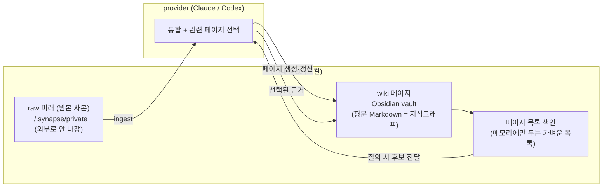
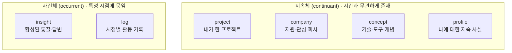
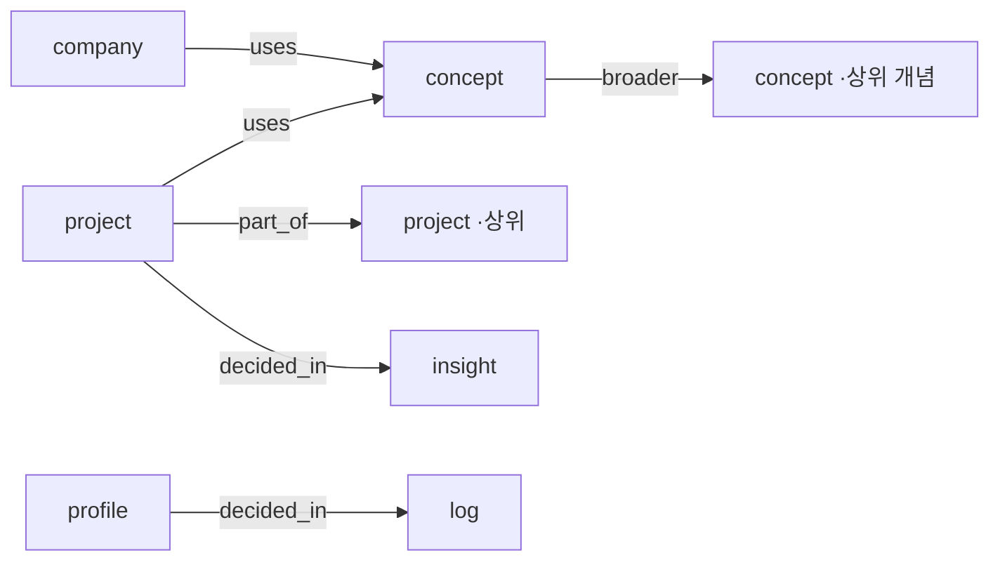
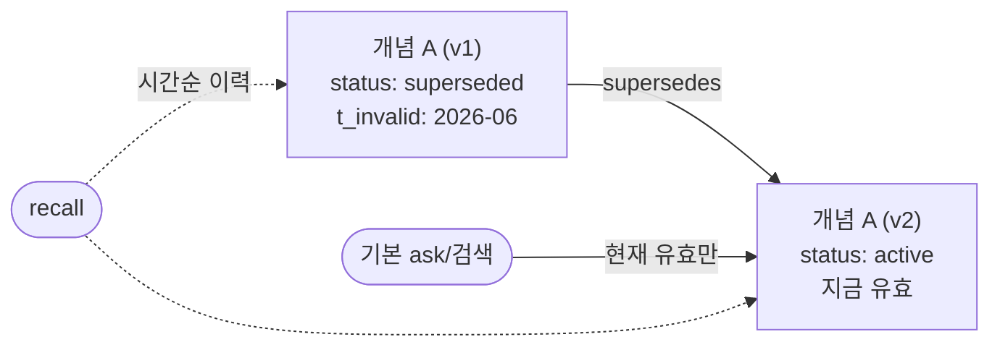

# Synapse Memory

Synapse Memory는 Claude Code·Codex 등 어떤 AI 툴과의 대화든 자동으로 인식해 서로 연결된 Obsidian wiki로 구축·유지해 주는 개인용 AI 메모리 도구입니다. 매일 수동으로 정리를 돌릴 필요 없이, 대화가 쌓이는 대로 wiki가 알아서 정리되고, 그 wiki가 다음 질문의 답이 됩니다.

대화 원본은 내 Mac 안의 `~/.synapse/private/`에 로컬 미러로만 보관됩니다.

> **버전**: 이 문서는 **v2.0** 기준입니다. v2.0 이전의 기능 도입 이력은 [docs/version-history.md](docs/version-history.md), 전체 변경 내역은 [CHANGELOG.md](CHANGELOG.md)를 참고하세요.

## 무엇을 해결하나요?

노트와 AI 대화가 쌓이면 보통 세 가지가 먼저 불편해집니다.

1. 분명 적어둔 내용을 다시 찾기 어렵습니다.
2. 새 AI 대화마다 내 프로젝트 맥락을 처음부터 설명해야 합니다.
3. 이력서·회고·의사결정처럼 "내가 예전에 뭘 했고 어떻게 판단했는지"가 필요한 작업을 매번 다시 정리합니다.

Synapse Memory는 새 노트와 대화 기록을 자동으로 모아 서로 연결된 wiki로 정리하고, 그 wiki로 질문에 답합니다. 사용자는 원본 파일을 뒤지는 대신 Claude Code의 `/sm:ask`·`/sm:recall`·`/sm:resume`, Codex의 `$ask`·`$recall`·`$resume` 같은 짧은 명령으로 자기 자료를 다시 사용합니다.

## 핵심 용어

처음 보면 낯선 용어를 먼저 정리합니다. 아래만 알면 나머지 문서가 쉽게 읽힙니다.

| 용어 | 쉬운 설명 |
| --- | --- |
| **raw 미러 (L0)** | AI 툴의 대화 로그 원본을 가공 없이 그대로 복사한 로컬 사본. `~/.synapse/private/`에 저장됩니다. "L0"는 가공 0단계, 즉 가장 밑의 원본 계층이라는 뜻입니다. |
| **entity(엔티티) / wiki 페이지** | 정리된 지식 한 조각(프로젝트·개념·회사 등)을 담은 Markdown 파일 하나. Synapse는 이 페이지를 6종으로 나눕니다. |
| **provider** | 통합·질의에 실제로 쓰는 외부 LLM. Claude 또는 Codex 중 설정한 쪽입니다. |
| **collect** | AI 대화 로그를 raw로 복사만 하는 단계. LLM을 쓰지 않아 빠릅니다. |
| **ingest** | raw 대화를 LLM에 읽혀 관련 wiki 페이지로 합치는 단계. 느리지만 실제 "정리"가 여기서 일어납니다. |
| **backfill** | 그동안 쌓인 과거 대화 전체를 한 번에 ingest하는 초기 구축 작업. |
| **watch** | collect + ingest를 20분마다 자동 실행하는 예약 작업(백그라운드). |
| **lint** | wiki의 구조·스키마 규칙 위반을 점검하고 자동으로 고치는 검증 단계. |
| **watermark** | 소스별 "여기까지 처리했음" 표시. 이미 정리한 대화를 다시 LLM에 보내지 않게 막습니다. |
| **typed / 무타입 relation** | 페이지 사이 연결에 의미(`uses`·`part_of` 등)를 붙인 관계가 typed. 의미 없이 그냥 이어둔 `related`가 무타입입니다. |
| **launchd / 데몬** | macOS가 백그라운드 작업을 예약 실행하는 장치. watch가 이걸로 20분 주기로 돕니다. 상시 떠 있는 프로그램이 아니라 필요할 때만 잠깐 실행됩니다. |

## 설계 철학

Synapse Memory v2.0은 다섯 가지 원칙 위에 있습니다. 한 줄 요약:

- **Local-first** — 원본은 내 Mac(`~/.synapse/private/`)에만, 결과물은 평문 Markdown.
- **Provider-only 검색** — 로컬 ML 상주 없이 provider(Claude/Codex)가 관련 페이지 선택.
- **단일 Entity 모델** — 6종 엔티티 + 단일 `schema.yaml`이 유일한 진실의 출처.
- **Typed relation 지식그래프** — 의미 있는 관계로 연결되고 검색이 관계를 따라감.
- **Valid-time 무효화** — 옛 사실은 무효화, 이력은 시간축에 보존.

각 선택의 배경, 엔티티를 6종으로 나눈 이유, 관계·시간 모델은 아래 [설계 철학 자세히 보기](#설계-철학-자세히-보기)에서 시각자료와 함께 설명합니다.

## 주요 기능

- **자동 wiki 엔진.** `watch install` 한 번이면 이후 Claude/Codex 대화가 20분마다 자동으로 wiki에 통합됩니다. 평소엔 상시 데몬 없이 조용히 돌고 끝납니다.
- **Typed relation 그래프 검색.** 관계 타입별로 이웃을 확장하고, 역방향 질의("X를 uses하는 project는?")까지 답합니다. `part_of`·`broader`는 이행적으로, `same_as`는 대칭적으로 확장됩니다.
- **시간 무효화 + 회상.** `supersedes` 선언 시 옛 페이지는 `status: superseded` + `t_invalid`로 자동 정리됩니다. `recall`은 supersedes 이력을 시간순으로 따라가 "내 입장이 어떻게 바뀌었는지"를 보여줍니다.
- **개념 분류 + 온톨로지.** concept는 `kind`(technology/tool/algorithm/methodology)로 하위분류되고, 결정은 insight/log로 기록됩니다. 역량 질문(competency question — 그래프가 답할 수 있어야 하는 표준 질문 세트) 15개 중 14개가 그래프만으로 답 가능한 수준까지 완성됐습니다.
- **Insight 축적.** `ask --save`로 저장한 답변은 `<vault>/Insights/YYYY/MM/`에 insight 엔티티로 쌓여 다음 질문의 검색 대상이 됩니다. 좋은 답변이 채팅에서 증발하지 않고 누적됩니다.
- **그래프 건강 지표.** `doctor`가 그래프 상태를 세 수치로 보여줍니다 — `typed_relation_coverage`(의미 있는 관계의 비율), `legacy_related_residual`(아직 남은 무타입 연결 수), `orphan_ratio`(아무 연결도 없는 고립 페이지 비율). ingest가 무타입 연결을 차단해 이 지표가 나빠지지 않게 막습니다.
- **자동 컨텍스트 주입.** 전역 hook 한 번 설치로 등록된 프로젝트의 Claude Code/Codex 세션 시작 시 Profile/DecisionPatterns 요약이 자동 주입됩니다. 개인 Profile 내용이 git에 커밋되는 `CLAUDE.md`에 남지 않습니다.

## 설치

설치는 세 가지 흐름이 있습니다. 처음이라면 **방법 A**를 권장합니다.

### 방법 A — AI에게 자동 설치 준비 맡기기

Claude Code 또는 Codex 채팅창에 아래 프롬프트를 그대로 붙여넣습니다. AI가 설치 zip을 받고, 압축을 풀고, 실행 전 검증까지 대신합니다. 실제 실행이나 보안 경고 우회처럼 사용자 승인이 필요한 단계에서는 멈추도록 설계한 프롬프트입니다.

```text
Synapse Memory를 설치해줘.

설치 파일은 아래 링크에서 받아줘.
https://github.com/Jimmy-Jung/synapse-memory/releases/download/v2.0.2/SynapseMemory-v2.0.2-macos-installer.zip

다운로드한 zip을 압축 해제한 뒤
installer/SynapseMemory-Installer.command가 있는지 확인하고,
zsh -n으로 문법 검사까지 해줘.

그 다음에는 바로 실행하지 말고 멈춘 뒤,
내가 직접 실행할 수 있는 방법을 안내해줘.

내가 "실행해"라고 명시적으로 말하면 기본 preview 모드로 실행해줘.
내가 "실제 적용해"라고 명시적으로 말하기 전까지는
SYNAPSE_INSTALLER_DRY_RUN=0을 붙이지 마.

설치 중 macOS 보안 경고가 뜨면 임의로 보안 설정을 바꾸지 말고,
내가 직접 열 수 있도록 안내해줘.

GUI 동의, Obsidian 저장소 위치 선택, Gatekeeper 우회, 실제 적용처럼
내가 직접 승인해야 하는 단계에서는 멈추고 안내해줘.

내가 설치를 실행했다고 알려주면,
최신 로그 경로와 synapse-memory doctor 결과를 확인해서 요약해줘.
```

### 방법 B — 직접 다운로드해서 실행하기

1. [SynapseMemory-v2.0.2-macos-installer.zip][installer-zip]을 다운로드합니다.
2. zip을 열고 `installer/SynapseMemory-Installer.command`를 실행합니다.
3. 안내에 따라 Obsidian vault를 선택하고 환경 점검을 마칩니다.
4. Claude Code에서는 `/sm:doctor`, Codex에서는 `$doctor`로 상태를 확인합니다.

macOS 보안 경고가 나오면 파일을 우클릭한 뒤 "열기"를 선택합니다. 설치 프로그램은 기본적으로 preview 모드로 동작하며, 실제 변경이 필요한 단계에서는 사용자 확인을 받습니다.

### 방법 C — 플러그인만 직접 설치하기

이미 `synapse-memory` CLI와 runtime이 준비되어 있고 Claude Code/Codex 플러그인만 붙이고 싶을 때 사용합니다.

Claude Code:

```bash
claude plugin marketplace add --scope user Jimmy-Jung/synapse-memory
claude plugin install --scope user sm@synapse-memory-marketplace
claude plugin enable --scope user sm@synapse-memory-marketplace
claude plugin list
```

`claude plugin list`에서 `sm@synapse-memory-marketplace`가 enabled로 보이면 설치된 상태입니다. 슬래시 명령은 `/sm:ask`, `/sm:daily`처럼 짧은 prefix로 노출됩니다.

Codex:

```bash
codex plugin marketplace add Jimmy-Jung/synapse-memory
codex plugin marketplace upgrade synapse-memory-marketplace
```

Codex CLI에서는 marketplace snapshot을 갱신한 뒤 plugin catalog와 config를 확인합니다. 플러그인 이름은 `synapse-memory`가 아니라 manifest 이름인 `sm`입니다.

```toml
[plugins."sm@synapse-memory-marketplace"]
enabled = true
```

확인은 다음처럼 합니다.

```bash
codex plugin list | grep 'sm@synapse-memory-marketplace'
codex debug prompt-input \
  --disable apps --disable memories --disable chronicle --disable multi_agent \
  "Synapse Memory plugin visibility check" \
  | grep "synapse-memory-marketplace/sm"
```

출력이 있으면 Codex가 Synapse Memory plugin skill root를 볼 수 있는 상태입니다. Codex TUI의 Plugins 브라우저에는 custom git marketplace가 표시되지 않을 수 있습니다. 이 경우에도 `$ask`처럼 `$`로 skill을 검색했을 때 `ask (sm)`가 보이면 사용할 수 있습니다. plugin update 직후 기존 Codex 세션에는 이전 skill 목록이 남을 수 있으므로 새 세션에서 확인합니다. Codex marketplace catalog는 `.agents/plugins/marketplace.json`에 있고, Codex install source는 `plugins/sm/.codex-plugin/plugin.json`입니다.

## 빠른 시작

Claude Code에서는 다음 순서로 시작합니다.

```text
/sm:doctor
/sm:daily
/sm:ask "내 iOS 프로젝트 구조를 요약해줘"
```

Codex TUI에서는 `/sm`이 아니라 `$`로 skill을 검색합니다.

```text
$doctor
$daily
$ask "내 iOS 프로젝트 구조를 요약해줘"
```

처음 실행하는 `daily`는 노트 양에 따라 오래 걸릴 수 있습니다. 빠르게 첫 답변을 보고 싶다면 터미널에서 quick 모드를 먼저 실행합니다.

```bash
synapse-memory daily --quick
```

그 뒤에는 Claude Code에서 `/sm:assistant`, Codex에서 `$assistant`를 실행하면 현재 상태를 보고 오늘 할 일을 1–3개로 줄여서 제안합니다.

### 최초 설치 후 권장 흐름

```bash
# 1) 자동 컨텍스트 주입 hook (전역 1회)
synapse-memory hook install

# 2) 자동 통합 데몬 설치 — 이후 대화가 20분마다 wiki로 자동 통합
synapse-memory watch install

# 3) (선택) 기존 대화 이력 한 번에 구축 — 소스별로
synapse-memory backfill --source claude-code
synapse-memory backfill --source codex

# 4) 정상 동작 점검
synapse-memory doctor
synapse-memory watch status      # 설치 여부 + 소스별 watermark
```

설치 후에는 손댈 게 없습니다. 대화를 하면 세션 종료 시 raw로 미러되고, watch가 20분마다 wiki로 통합합니다. `backfill`은 **대량 첫 구축**용으로, 끊겨도 다시 실행하면 이어서 처리합니다. 진행 상황은 `~/.synapse/private/watch.out.log`(통합 결과)와 `watch.err.log`(에러)에서 봅니다.

## 매일 쓰는 명령

| 하고 싶은 일 | Claude Code | Codex | 터미널 |
| --- | --- | --- | --- |
| 환경 점검 | `/sm:doctor` | `$doctor` | `synapse-memory doctor` |
| 자동 복구 가능한 문제 수정 | `/sm:fix` | `$fix` | `synapse-memory doctor --fix` |
| 새 노트와 대화 기록 정리 | `/sm:daily` | `$daily` | `synapse-memory daily --quick` |
| 내 자료에 질문 | `/sm:ask "질문"` | `$ask "질문"` | `synapse-memory ask "질문"` |
| 답변을 Insight 카드로 저장 | `/sm:ask "질문" --save` | `$ask "질문" --save` | `synapse-memory ask "질문" --save` |
| 예전에 한 생각 회상 | `/sm:recall "주제"` | `$recall "주제"` | `synapse-memory persona what-did-i-think "주제"` |
| 의사결정 도움 받기 | `/sm:decide "상황"` | `$decide "상황"` | `synapse-memory persona decide "상황"` |
| 회사 맞춤 이력서 초안 | `/sm:resume <회사>` | `$resume <회사>` | `synapse-memory persona draft-resume <회사>` |
| 오늘 할 일 추천 | `/sm:assistant` | `$assistant` | `synapse-memory assistant-status` |
| Profile 후보 항목별 GUI 승인 | `/sm:apply-profile [date]` | `$apply-profile` | `synapse-memory list-pending-profiles` |
| 다른 프로젝트에 sm 컨텍스트 등록 | `/sm:setup` | `$setup` | `synapse-memory setup` |
| 등록된 프로젝트 marker + 캐시 갱신 | `/sm:sync` | `$sync` | `synapse-memory sync` |

### 자동 통합 엔진 제어 (터미널)

대부분은 `watch install` 한 번이면 끝나고, 아래 명령은 수동 제어가 필요할 때만 씁니다.

| 하고 싶은 일 | 터미널 |
| --- | --- |
| 자동 트리거 설치 (launchd) | `synapse-memory watch install` |
| 자동 트리거 상태 확인 / 제거 | `synapse-memory watch status` / `synapse-memory watch uninstall` |
| watch 작업을 지금 한 번 직접 실행 | `synapse-memory watch run` |
| 쌓인 raw 대화를 지금 wiki로 통합 | `synapse-memory ingest --now` |
| wiki 구조 자동수정 + schema 검증 | `synapse-memory lint --now` |
| 전체 대화 이력을 wiki로 1회 구축 | `synapse-memory backfill` |
| wiki 근거로 질문에 답변 (인용 포함) | `synapse-memory wiki ask "<질문>"` |

명령 자세한 사용법은 [docs/reference.md](docs/reference.md)를 참고하세요.

## 파이프라인 동작 원리 (collect → ingest → watch)

대화가 wiki가 되기까지 3단계를 거칩니다. 핵심은 **느린 LLM 단계(ingest)와 빠른 복사 단계(collect)의 분리**, 그리고 **이미 처리한 대화는 다시 보지 않는 watermark**입니다.

```
[AI 로그]                [raw 미러 (원본 사본)]         [Obsidian vault]
~/.claude  ──collect──▶  ~/.synapse/private/raw  ──ingest(LLM)──▶  wiki 페이지
~/.codex                 (대화 로그 그대로 복사)       (대화→페이지 통합)
```

| 단계 | 하는 일 | LLM 호출 | 속도 |
| --- | --- | --- | --- |
| **collect** | AI 로그 파일(jsonl 형식)을 raw로 증분(바뀐 부분만) 복사 (`collect claude-code` / `collect codex`) | ✗ | 빠름 (파일 I/O) |
| **ingest** | raw 대화 1건씩 LLM에 읽혀 관련 wiki 페이지에 통합 (`ingest --source …`) | ✓ 대화당 1회 | 느림 |
| **watch** | launchd가 **20분마다** 위 두 단계를 자동 실행 (`watch install`) | ✓ | 백그라운드 |

- **doc = 대화 세션 파일 1개.** ingest는 doc 하나를 LLM에 통째로 읽혀 페이지를 만들거나 갱신합니다.
- **무엇이 밖으로 나가나.** collect(미러) 단계는 로컬 폴더에만 복사하고 외부로 아무것도 보내지 않습니다. ingest/backfill/watch 단계는 wiki 통합을 위해 대화 원문(작은 대화는 전체, 큰 대화는 일부만 샘플링)을 provider로 보낼 수 있고, 질문(ask) 경로는 정리된 wiki 페이지와 승인된 Profile/DecisionPatterns를 중심으로 보냅니다.
- **소스(source)와 LLM은 별개.** `--source`는 *어느 도구의 로그*(claude-code / codex)를 읽을지 고를 뿐이고, 통합에 쓰는 LLM은 `~/.synapse/config.yaml`의 `ai_provider`가 정합니다. 두 소스 모두 같은 provider가 처리합니다.
- **watermark로 재처리 방지.** 소스별로 마지막 처리 시각을 기록해, 이미 통합한 대화는 건너뛰고 새 대화만 LLM에 보냅니다. 진행 중(최근 수정) 세션은 settled 필터로 잠시 대기합니다.
- **watch는 상시 데몬이 아닙니다.** 20분마다 짧게 돌고 끝나며, 평소엔 프로세스가 없습니다.

## 활용 방법

Synapse Memory는 "쌓아두는 도구"가 아니라 "다시 꺼내 쓰는 도구"입니다. 대표 시나리오:

- **새 대화에서 맥락 재설명 없이 시작.** hook을 설치해 두면 프로젝트 세션을 열 때 Profile/DecisionPatterns 요약이 자동 주입됩니다. "TCA를 왜 도입했지?"처럼 물으면 wiki 근거로 바로 답합니다.

  ```bash
  synapse-memory ask "TCA를 왜 도입했지?"
  ```

- **내 생각의 변화 추적.** 같은 주제에 대한 과거 입장과 그 뒤 `supersedes`로 바뀐 입장을 시간순으로 되짚습니다.

  ```bash
  synapse-memory persona what-did-i-think "AI 코딩 도구"
  ```

- **회사 맞춤 이력서 초안.** 축적된 프로젝트/성과 기록에서 특정 회사에 맞춘 초안을 뽑습니다.

  ```bash
  synapse-memory persona draft-resume examplecorp
  ```

- **의사결정 보조.** 현재 상황을 넣으면 과거 결정 패턴을 근거로 판단을 돕습니다.

  ```bash
  synapse-memory persona decide "모듈 분리 vs 단일 패키지 유지"
  ```

- **좋은 답변을 지식으로 축적.** `ask --save`로 답변을 insight 카드로 남기면 다음 질문의 검색 대상이 되어 wiki가 점점 똑똑해집니다.

## 자동 컨텍스트 주입 (hook)

매번 `/sm:setup`으로 marker를 관리하지 않아도, 전역 hook 한 번 설치로 등록된 프로젝트에서 Claude Code/Codex 세션 시작 시 Profile/DecisionPatterns 요약이 자동 주입됩니다.

```bash
synapse-memory hook install        # 전역 1회
synapse-memory setup               # 프로젝트마다 — repo 파일 수정 없이 등록
synapse-memory doctor              # 현재 cwd 등록/cache/command 상태까지 확인
```

- Profile 승인(`/sm:apply-profile`) 후 컨텍스트 캐시가 자동 갱신되어 다음 세션부터 바로 반영됩니다. 수동 갱신은 `synapse-memory context render`.
- 개인 Profile 내용이 git에 커밋되는 `CLAUDE.md`에 남지 않습니다.
- hook이 설치되어 있어도 현재 디렉터리가 registry에 없으면 의도적으로 아무 것도 주입하지 않습니다. 해당 repo에서 `synapse-memory setup`을 한 번 실행하세요.
- `synapse-memory hook install`은 PATH가 좁은 앱 실행 환경에서도 동작하도록 가능한 경우 `synapse-memory` 실행 파일의 절대경로를 hook command에 기록합니다. 기존 설치가 PATH 의존 command라면 다시 실행하면 정규화됩니다.
- Codex는 첫 hook 실행 전 `/hooks`에서 설치된 command hook을 신뢰 승인해야 할 수 있습니다.
- hook을 쓰지 않는 프로젝트는 `synapse-memory setup --target codex`로 `AGENTS.md` marker를 사용할 수 있습니다. `/sm:sync`는 marker 갱신 + 캐시 재렌더를 함께 수행합니다.
- 설치 상태는 `synapse-memory doctor`가 점검합니다.

## 설계 철학 자세히 보기

### 계층 구조 — 왜 local-first + provider-only인가

Synapse Memory는 데이터를 세 계층으로 나누고, 무거운 지능은 밖(provider)에 둡니다.



- **왜 local-first인가.** 개인 자료를 다루므로 기능보다 안전 경계가 먼저입니다. 원본은 내 Mac을 벗어나지 않고, 결과물은 사람이 직접 열어 읽고 고칠 수 있는 평문 Markdown으로 남습니다. 독점 DB에 갇힌 지식은 검토도 이관도 어렵습니다.
- **왜 provider-only인가.** 상주하는 로컬 ML 프로세스를 의도적으로 피합니다. 개인 도구 하나에 벡터DB·임베딩 파이프라인을 상시 띄우면 유지비가 효용을 압도하고, GPU·메모리 요구사항이 진입 장벽이 됩니다. 이미 강력한 provider가 있는데 검색기를 다시 만들 이유가 없습니다. 통합·검색 작업은 짧게 살고 종료돼 메모리를 곧바로 반납합니다.

### 엔티티를 왜 6종으로 나눴나

개인 AI 메모리가 실제로 답해야 하는 질문은 네 갈래입니다 — 내 **커리어**(뭘 했고 어디에 지원하나), 내 **지식**(뭘 아나), 내 **시간축**(언제 뭘 했고 뭘 깨달았나), 그리고 **나 자신**(선호·사실). 이 질문들을 온톨로지의 고전적 두 축 — **지속체(continuant)** vs **사건체(occurrent)** — 로 가르면 6종이 나옵니다.



페이지 사이를 잇는 관계(`uses`·`broader`·`decided_in` 등)는 아래 [관계와 시간](#관계와-시간--왜-typed-relation--valid-time인가) 절에서 그래프와 표로 정리합니다.

**왜 하필 6개?** 더 잘게 쪼개면 무타입 `related` 시절처럼 데이터가 스키마를 따르지 못할 위험(harmonization 실패 — 스키마와 실제 데이터가 어긋남)이 커지고, 더 뭉치면 관계의 domain/range(관계가 *어느 타입에서 나가 어느 타입으로 가는지*)로 검증할 수가 없습니다. 6종은 **검증 가능한 최소 구분**입니다. 지속체 4종은 오래 사는 실체라 `supersedes`로 갱신되고, 사건체 2종은 `observed_at`(관찰 시점)으로 시점에 고정됩니다.

| 엔티티 | 폴더 | 부류 | 무엇을 담나 | 대표 필드 |
| --- | --- | --- | --- | --- |
| `project` | `Entities/Projects/` | 지속체 | 내가 수행한 프로젝트(진실의 출처) | `role`, `stack`, `metrics`, `period_*` |
| `company` | `Entities/Companies/` | 지속체 | 지원·관심 회사와 포지션 맥락 | `positions`, `resume_language`, `size` |
| `concept` | `Concepts/` | 지속체 | 재사용 가능한 지식 노드 | `kind`(technology/tool/algorithm/methodology), `aliases` |
| `profile` | `Profile/` | 지속체 | 나에 대한 지속 사실·선호 | `scope`, `confidence` |
| `insight` | `Insights/YYYY/MM/` | 사건체 | 질문에 대한 합성된 답·통찰 | `question`, `command`, `observed_at` |
| `log` | `Logs/YYYY/MM/` | 사건체 | 시점에 묶인 활동 기록 | `summary`, `command`, `observed_at` |

### 관계와 시간 — 왜 typed relation + valid-time인가

무타입 `related` 링크만 쌓인 그래프는 "조화되지 않은(unharmonized) KG"로, 오히려 LLM의 답변 품질을 떨어뜨립니다. 재설계의 진단은 "표현력 부족이 아니라 거버넌스 부재"였습니다. 그래서 wiki를 버리는 대신 **엣지에 타입을 강제**했습니다 — Markdown 페이지는 노드의 직렬화, wikilink는 엣지의 뷰이므로, 관계에 타입만 붙으면 wiki가 그대로 지식그래프가 됩니다. 관계에 의미가 있어야 검색이 그 의미를 따라 역방향 ("X를 uses하는 project는?")까지 답합니다.



화살표는 *주어 → 목적어* 방향입니다. `concept ·상위 개념`·`project ·상위`는 같은 타입의 다른 페이지로, `broader`·`part_of`가 같은 종류끼리 잇는다는 것을 나타냅니다.

| 관계 | domain → range | 성질 | 뜻과 예 |
| --- | --- | --- | --- |
| `uses` | 모든 타입 → `concept` | — | 이 페이지가 쓰는 기술·개념 (예: `project` → `TCA`) |
| `part_of` | 모든 타입 → 모든 타입 | 이행적, 역 `has_part` | 상위 구성요소에 속함 (예: `결제 모듈` → `앱 전체`) |
| `broader` | `concept` → `concept` | 이행적, 역 `narrower` | 개념 계층, SKOS broader (예: `SwiftUI` → `UI 프레임워크`) |
| `decided_in` | 모든 타입 → `insight`/`log` | — | 이 결정이 기록된 시점 |
| `supersedes` | 모든 타입 → 모든 타입 | valid-time 트리거 | 옛 사실을 대체 |
| `same_as` | 모든 타입 → 모든 타입 | 대칭 | 동일 실체, OWL sameAs |

`part_of`·`broader`·`same_as`·`supersedes`처럼 **같은 타입끼리** 잇는 관계는 자기 자신이 아니라 *같은 종류의 다른 페이지*를 연결합니다.

**왜 valid-time 무효화인가.** 사람의 판단은 시간이 지나며 바뀝니다. 옛 사실을 지우면 "왜 바꿨는지"를 회상할 수 없고, 그냥 두면 낡은 사실이 검색을 오염시킵니다. `supersedes`는 둘 다 해결합니다 — 대체된 페이지는 `status: superseded` + `t_invalid`로 표시되어 현재 검색에서 빠지고, 이력은 시간축에 그대로 남아 `recall`이 입장 변화를 되짚습니다.



이 설계에 참고한 온톨로지·지식그래프 자료:

- 관계 어휘(`broader`/`same_as` 등) — [OWL·RDF·RDFS·SKOS 표준 비교](https://medium.com/@jaywang.recsys/ontology-taxonomy-and-graph-standards-owl-rdf-rdfs-skos-052db21a6027)
- 그래프를 CQ로 검증하는 방법 — [Competency Questions in Ontology Engineering: A Survey](https://link.springer.com/chapter/10.1007/978-3-031-47262-6_3), [CACM — A Lightweight Methodology for Rapid Ontology Engineering](https://cacm.acm.org/research/a-lightweight-methodology-for-rapid-ontology-engineering/)
- 시간축 무효화 + 에이전트 장기기억 — [Graphiti 아키텍처 가이드](https://medium.com/@saeedhajebi/building-ai-agents-with-knowledge-graph-memory-a-comprehensive-guide-to-graphiti-3b77e6084dec)
- 개인용 지식그래프의 실용 경계 — [Personal Knowledge Graphs in Obsidian](https://volodymyrpavlyshyn.medium.com/personal-knowledge-graphs-in-obsidian-528a0f4584b9)

전체 참고 자료 목록과 학습 정리는 [specs/022-ontology-completion/learning-guide.md](specs/022-ontology-completion/learning-guide.md)에 있습니다.

## 문서 읽는 순서

1. [문서 안내](docs/README.md) — 전체 흐름
2. [처음부터 끝까지 사용하기](docs/start-here.md) — 설치 후 첫 질문까지
3. [개인정보, 비용, 삭제](docs/privacy-and-cost.md) — 데이터 보관 위치와 운영 비용
4. [명령과 문제 해결](docs/reference.md) — 자주 쓰는 명령, 설정, 복구
5. [버전 이력](docs/version-history.md) — v2.0 이전의 기능 도입 흐름

## 요구사항

- macOS (launchd 기반 자동 통합 데몬)
- Obsidian vault
- Claude Code 또는 Codex (통합에 쓰는 LLM provider 제공)

로컬 LLM/임베딩을 쓰지 않으므로 GPU·대용량 메모리나 특정 칩셋/macOS 버전 요구사항은 없습니다.

## 라이선스

MIT — [LICENSE](LICENSE)

[installer-zip]: https://github.com/Jimmy-Jung/synapse-memory/releases/download/v2.0.2/SynapseMemory-v2.0.2-macos-installer.zip
