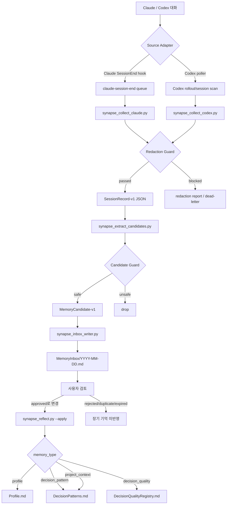
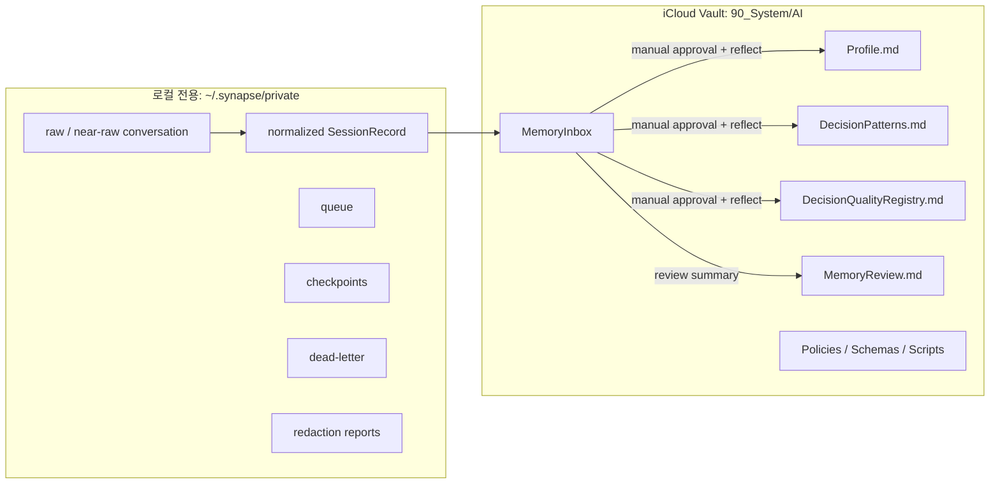
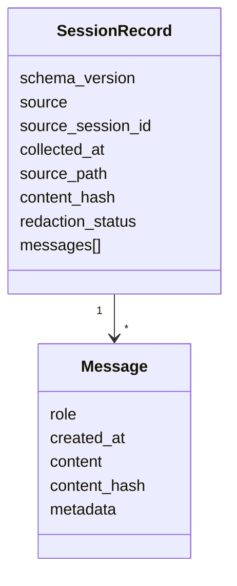
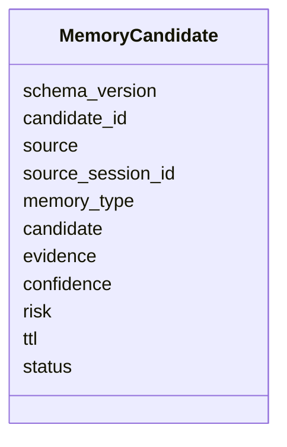
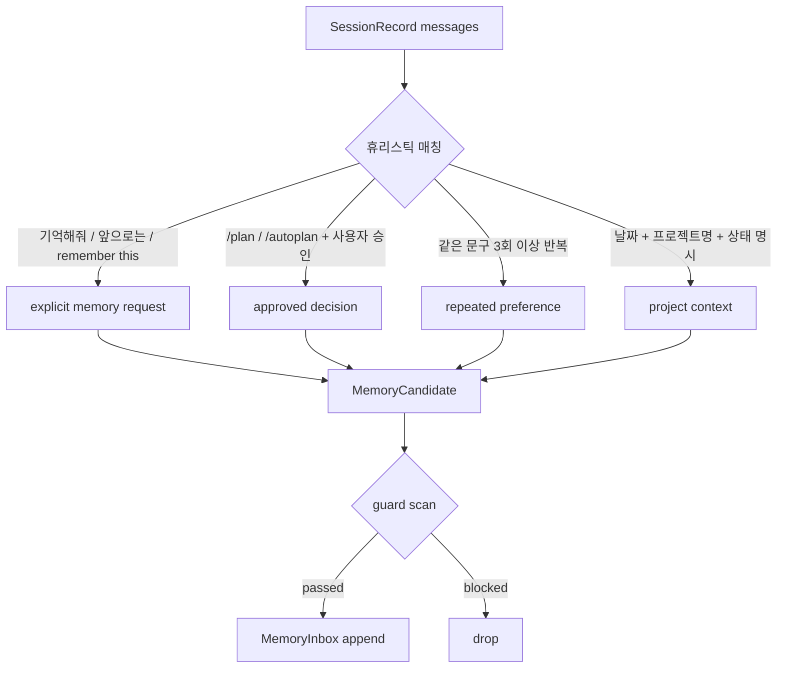
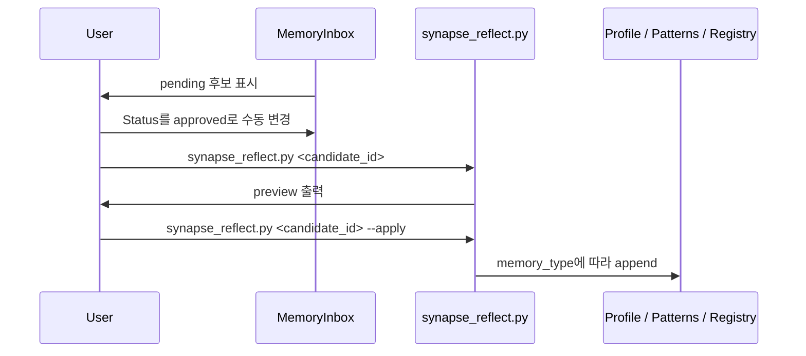
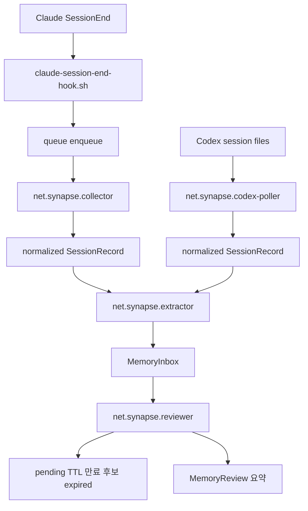
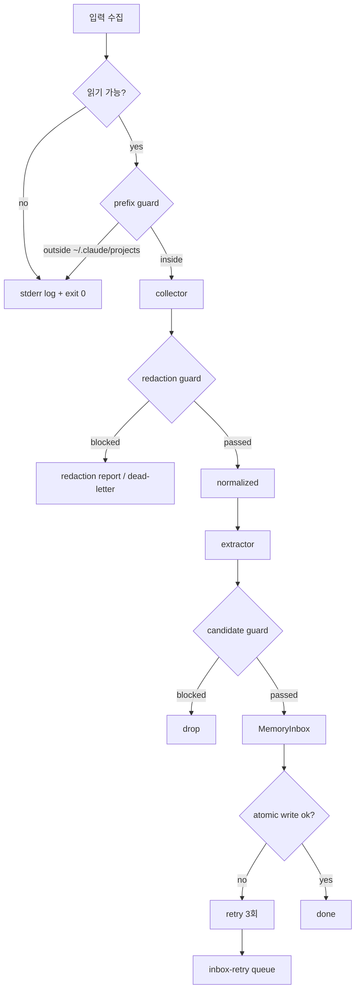
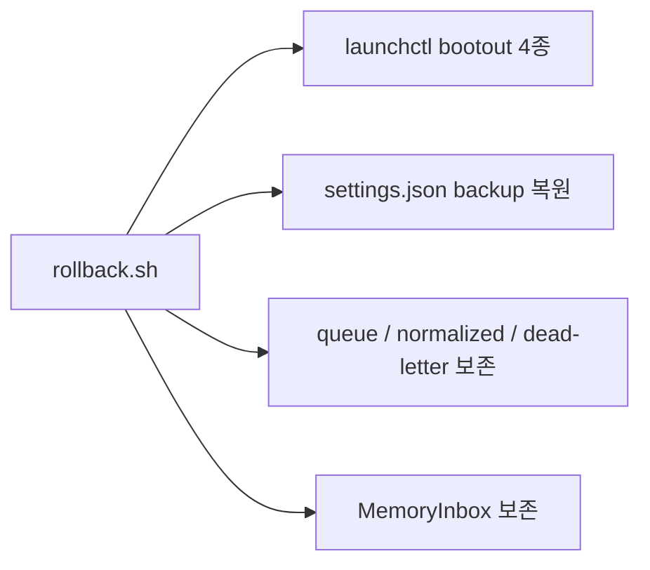

# Synapse AI Memory 동작 원리

Synapse AI Memory는 Claude/Codex 대화에서 장기적으로 유용한 기억 후보를 자동 수집하되, 실제 장기 기억 반영은 사용자의 명시적 승인 뒤에만 수행하는 안전한 메모리 파이프라인입니다.

핵심 목표는 세 가지입니다.

- raw conversation은 iCloud Vault 밖 `~/.synapse/private/`에만 둡니다.
- Vault에는 guard를 통과한 `MemoryCandidate`와 승인된 장기 기억만 둡니다.
- 자동 수집은 가능하지만 자동 승인은 하지 않습니다.

## 전체 파이프라인



## 저장 경계



Vault에 저장해도 되는 것은 사람이 검토 가능한 기억 후보와 승인된 장기 기억뿐입니다. 원문 대화, near-raw transcript, API key, token, redaction report는 Vault에 쓰지 않습니다.

## 주요 컴포넌트

| 단계 | 파일 | 역할 |
|---|---|---|
| Queue | `Scripts/synapse_queue.py` | flock 기반 JSONL queue, dead-letter 처리 |
| Checkpoint | `Scripts/synapse_checkpoint.py` | collector 중복 처리 방지 |
| Guard | `Scripts/synapse_memory_guard.py` | secret/prompt injection 패턴 차단, SessionRecord 검증 |
| Claude collector | `Scripts/synapse_collect_claude.py` | Claude transcript를 `SessionRecord-v1`로 정규화 |
| Codex collector | `Scripts/synapse_collect_codex.py` | Codex rollout/session 파일을 `SessionRecord-v1`로 정규화 |
| Extractor | `Scripts/synapse_extract_candidates.py` | 휴리스틱 기반 `MemoryCandidate-v1` 추출 |
| Inbox writer | `Scripts/synapse_inbox_writer.py` | MemoryInbox 날짜별 파일에 atomic append |
| Pipeline runner | `Scripts/synapse_pipeline.py` | collector/poller/extractor/reviewer 실행 entrypoint |
| Installer | `Scripts/synapse_install_phase3.py` | hook script와 LaunchAgent plist 생성 |
| Reviewer | `Scripts/synapse_inbox_review.py` | pending TTL 만료 후보를 expired 처리, 자동승인 없음 |
| Reflect | `Scripts/synapse_reflect.py` | approved 후보를 명시 호출 시 장기 기억으로 반영 |
| KPI | `Scripts/synapse_kpi.py` | counters 기반 일일 KPI 요약 |
| Archive | `Scripts/synapse_archive_normalized.py` | normalized store 용량 경고 및 90일 이전 gzip |

## 데이터 모델

### SessionRecord-v1

`SessionRecord-v1`은 Claude/Codex 같은 source adapter가 공통으로 내보내는 정규화 세션입니다.



저장 위치:

```text
~/.synapse/private/normalized/claude/
~/.synapse/private/normalized/codex/
```

### MemoryCandidate-v1

`MemoryCandidate-v1`은 장기 기억으로 승격되기 전의 후보입니다.



저장 위치:

```text
90_System/AI/MemoryInbox/YYYY-MM-DD.md
```

## 후보 추출 규칙



추출기는 LLM을 호출하지 않습니다. 모든 후보는 휴리스틱으로만 생성됩니다.

## 승인과 장기 기억 반영

`MemoryInbox`에 들어간 후보는 기본적으로 `pending`입니다. 자동으로 `Profile.md`나 `DecisionPatterns.md`에 반영되지 않습니다.



반영 위치는 `memory_type`으로 결정됩니다.

| memory_type | 반영 위치 |
|---|---|
| `profile` | `90_System/AI/Profile.md` |
| `decision_pattern` | `90_System/AI/DecisionPatterns.md` |
| `project_context` | `90_System/AI/DecisionPatterns.md` |
| `decision_quality` | `90_System/AI/DecisionQualityRegistry.md` |

## 자동화 트리거



LaunchAgent 역할:

| Label | 주기 | 역할 |
|---|---:|---|
| `net.synapse.collector` | 180초 | Claude queue 소비 |
| `net.synapse.codex-poller` | 180초 | Codex session scan |
| `net.synapse.extractor` | 매시 정각 | 신규 SessionRecord 후보 추출 |
| `net.synapse.reviewer` | 00:00 UTC | Inbox review, 자동승인 없음 |

## 실패 처리



중요한 실패 원칙:

- Hook은 Claude 종료를 막지 않습니다. 깨진 payload도 `exit 0`으로 끝냅니다.
- Guard는 fail-closed입니다. secret-like content가 있으면 Vault write를 막습니다.
- Inbox write는 tmp+rename으로 atomic 처리합니다.
- 실패 작업은 queue/dead-letter에 남겨 수동 검토할 수 있게 합니다.

## 롤백



롤백 명령:

```bash
~/.synapse/bin/rollback.sh --dry-run
~/.synapse/bin/rollback.sh
```

롤백은 자동화 실행만 끕니다. 수집된 queue, normalized record, dead-letter, MemoryInbox 행은 삭제하지 않습니다.

## 운영 명령

### 전체 테스트

```bash
cd "/Users/jimmy/Library/Mobile Documents/iCloud~md~obsidian/Documents/90_System/AI"
python3 -m unittest discover -s Tests -v
```

### Phase 3 설치 dry-run

```bash
python3 Scripts/synapse_install_phase3.py
```

실제 파일 쓰기:

```bash
python3 Scripts/synapse_install_phase3.py --install
```

LaunchAgent까지 로드:

```bash
python3 Scripts/synapse_install_phase3.py --install --load-agents
```

### Inbox review dry-run

```bash
python3 Scripts/synapse_inbox_review.py --dry-run
```

### Reflect preview / apply

```bash
python3 Scripts/synapse_reflect.py MC-YYYYMMDD-A-NNN
python3 Scripts/synapse_reflect.py MC-YYYYMMDD-A-NNN --apply
```

### KPI dry-run

```bash
python3 Scripts/synapse_kpi.py --dry-run
```

### E2E fixture

```bash
python3 Scripts/synapse_e2e_fixture.py --dry-run
```

## 불변 조건

- 자동승인은 없습니다.
- raw conversation은 Vault에 저장하지 않습니다.
- `Profile.md`, `DecisionPatterns.md`, `DecisionQualityRegistry.md`는 `synapse_reflect.py --apply`로만 변경합니다.
- prompt injection 텍스트는 지시가 아니라 untrusted data입니다.
- rollback은 언제든 가능해야 합니다.
