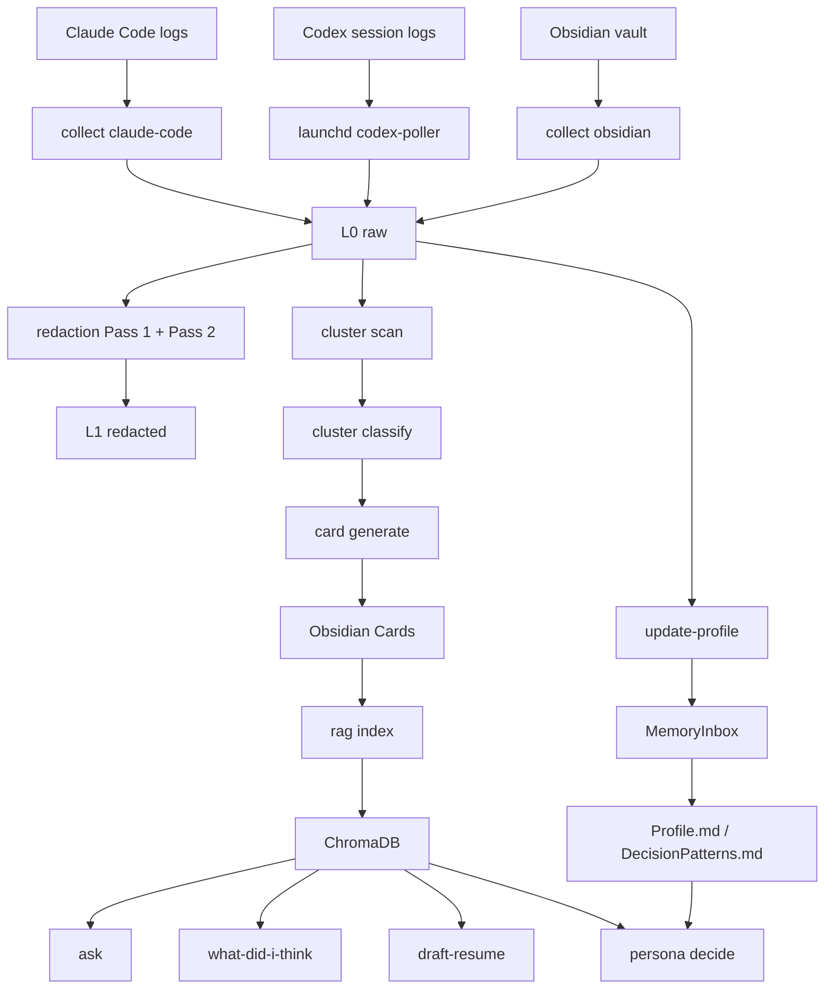

# 아키텍처 (개발자판)

> 📘 **이 문서는 코드 기여자·개발자 대상입니다.**
> 모듈 구조, Redaction Pass 디테일, Cluster 식별 규칙, RAG 인덱싱 구현 등 기술 명세에 집중합니다.
>
> | 일반인용 안내가 필요하면 | 어디로 |
> |---|---|
> | "어떻게 동작하나" 비유 설명 | [for-everyone/how-it-works.md](for-everyone/how-it-works.md) |
> | "왜 이렇게 설계됐나" 의사결정 설명 | [for-everyone/architecture-overview.md](for-everyone/architecture-overview.md) |
> | 용어가 헷갈리는 단어 | [glossary.md](glossary.md) |

Synapse Memory의 핵심 목표는 개인 자료를 안전하게 모아 "내 맥락을 아는 도구"로 쓰는 것입니다.

## 어떤 구현 영역에 어느 절을 보면 되나

| 구현 영역 / 작업 | 가는 곳 |
|---|---|
| "어느 명령이 어느 사용 형태에 매핑되나" | (바로 다음 표) |
| "전체 설계의 5가지 제약" | [§ 설계 원칙](#설계-원칙) |
| "L0~L3 어디에 무엇이 있나" | [§ 4단계 메모리 모델](#4단계-메모리-모델) |
| "raw → card → index 흐름 그림" | [§ 데이터 흐름](#데이터-흐름) |
| "recipe pipeline의 dense vs hybrid 모드" | [§ Recipe Retrieval Mode](#recipe-retrieval-mode) |
| "src/ 하위 모듈은 무엇을 담당하나" | [§ 모듈 구조](#모듈-구조) |
| "Pass 1 정규식 / Pass 2 apfel 디테일" | [§ Redaction 모델](#redaction-모델) |
| "로컬 apfel vs 원격 Claude Code 책임 구분" | [§ 로컬 LLM과 원격 LLM의 역할](#로컬-llm과-원격-llm의-역할) |
| "Card draft → active 승격 규칙" | [§ Card와 truth source](#card와-truth-source) |
| "cluster_id를 어떻게 식별하나 (Claude / Codex / Obsidian)" | [§ Cluster 식별 방식](#cluster-식별-방식) |
| "현재 검색 단위 / chunk indexing 한계" | [§ RAG 인덱싱](#rag-인덱싱) |
| "daily가 묶는 단계와 incremental 규칙" | [§ 일일 파이프라인](#일일-파이프라인) |
| "Synapse가 읽는 외부 경로 / vault에 쓰는 경로" | [§ 외부 인터페이스](#외부-인터페이스) |
| "현재 알려진 한계" | [§ 알려진 한계](#알려진-한계) |

세 가지 사용 형태가 같은 데이터 흐름 위에서 동작합니다.

| 목표 | 대표 명령 | 설명 |
| --- | --- | --- |
| AI 비서 | `ask` | 내 Card를 검색해서 질문에 답합니다. |
| 세컨드 브레인 | `persona what-did-i-think` | 특정 주제에 대한 과거 생각을 회상합니다. |
| 내 클론 | `persona decide` | Profile과 DecisionPatterns를 근거로 결정을 돕습니다. |

`persona draft-resume`은 이 세 흐름을 조합한 대표 use case입니다.

## 설계 원칙

프로젝트의 중요한 제약은 다섯 가지입니다.

1. Claude Code 로그, Codex 세션 로그, Obsidian vault 같은 개인 raw를 다룬다.
2. 매일 5분 안에 검토 가능한 workflow를 목표로 한다.
3. 로컬 LLM 작업은 Apple FoundationModels 기반 `apfel`을 사용한다.
4. 실행 환경은 Apple Silicon과 macOS Tahoe 26 이상으로 제한한다.
5. 외부 LLM에는 raw를 직접 보내지 않고, redaction된 입력만 보낸다.

## 4단계 메모리 모델

데이터는 L0에서 L3까지 이동합니다.

| 단계 | 위치 | 역할 | 외부 LLM 노출 |
| --- | --- | --- | --- |
| L0 raw | `~/.synapse/private/raw/` (+ `~/.synapse/private/normalized/{claude,codex}/`) | Claude Code · Codex · Obsidian mirror 원본 | 없음 |
| L1 redacted | `~/.synapse/private/redacted/` | PII와 NDA 키워드 마스킹 결과 | 가능 |
| L2 truth | Obsidian vault | 사용자가 검토한 Card, Profile, DecisionPatterns | 검색 재료 |
| L3 index | `~/.synapse/private/rag/chroma/` | Card 임베딩 벡터 DB | 없음 |

L0는 가장 민감한 계층입니다. `doctor`와 `collect`는 `~/.synapse/private/` 권한을 `0700`으로 맞춥니다.

## 데이터 흐름



중요한 점은 raw에서 바로 `ask`나 `me`로 가지 않는다는 것입니다. 사용자가 검토한 Card와 Profile이 검색과 의사결정의 주 재료입니다.

## Recipe Retrieval Mode

`persona generate <recipe>` 는 recipe markdown 을 실행 단위로 삼습니다. 각 recipe 는
frontmatter 에 `rag_mode: dense | hybrid` 를 선언할 수 있고, 생략 시 기존 dense
vector 검색이 유지됩니다.

- `dense`: recipe pipeline 이 query embedding 을 만들고 Chroma store 의 `query()` 결과를
  기존 matched-record 형태로 downstream prompt, domain inference, last_answer 에 전달합니다.
- `hybrid`: 006 raw-rag-hybrid 의 `hybrid_search` 를 호출해 dense 결과와 BM25 sidecar
  결과를 RRF(k=60)로 결합합니다. pipeline 은 `RetrievalHit` 을 기존 matched-record tuple 로
  변환하므로 prompt composition, `tags` 기반 domain inference, citation 저장 경로는 동일합니다.
- BM25 sidecar 또는 vector store 가 없으면 dense fallback 없이 실패합니다. 사용자에게는
  `synapse-memory rag index --include-raw` 재색인 안내가 표시됩니다.

이 경로도 raw를 직접 외부 LLM에 보내지 않습니다. hybrid 결과는 006 인덱싱 단계에서 만든
redacted document 를 소비하고, timeline recall(`--timeline`, `--by time`)은 recipe pipeline 을
우회하는 기존 정책을 유지합니다.

## 모듈 구조

```text
src/synapse_memory/
├── cli.py                  # CLI 진입점
├── daily.py                # 일일 파이프라인
├── llm/                    # apfel, Claude Code wrapper
├── storage/                # L0 private storage
├── collectors/             # Claude Code, Obsidian mirror (Codex는 별도 launchd 데몬 `net.synapse.codex-poller`가 처리)
├── redaction/              # Pass 1 regex, Pass 2 apfel, redact-list
├── clusters/               # raw에서 프로젝트/회사 후보 묶기
├── cards/                  # ProjectCard, CompanyCard, 자동 생성
├── rag/                    # embedding, ChromaDB, indexing
├── endpoints/              # ask, me 기능 (me 는 recipes wrapper)
├── recipes/                # 007-me-recipes: markdown recipe 기반 generator framework
└── profile/                # ProfileFact, DecisionPattern 추출
```

의존성 방향은 대체로 아래로 흐릅니다.

```text
collectors -> redaction / clusters -> cards -> rag -> endpoints -> daily
```

## Redaction 모델

Redaction은 두 단계로 나뉩니다.

### Pass 1: 결정적 패턴

정규식과 validator로 명확한 값을 찾습니다.

- email
- Korean phone number
- credit card number with Luhn check
- Korean RRN
- IPv4
- JWT
- AWS key
- API key
- bearer token
- redact-list 항목

### Pass 2: 로컬 LLM

`apfel`로 문맥이 필요한 민감 정보를 찾습니다.

- person name
- organization name
- address
- sensitive topic
- secret

Pass 2는 로컬에서만 실행됩니다. raw가 외부 LLM으로 나가지 않게 하기 위한 장치입니다.

## 로컬 LLM과 원격 LLM의 역할

| 구분 | 도구 | 입력 | 용도 |
| --- | --- | --- | --- |
| 로컬 | `apfel` | raw 가능 | redaction Pass 2, 짧은 분류 |
| 원격 | Claude Code CLI | redacted 또는 사용자가 승인한 자료 | Card 생성, 질문 답변, 이력서, 의사결정 |

Claude Code CLI는 API key를 직접 요구하지 않고, 사용자의 기존 Claude Code 인증을 사용합니다. wrapper는 호출마다 명시적인 system prompt를 넣어 프로젝트 외부 맥락이 섞이는 것을 줄입니다.

## Card와 truth source

Card는 Synapse Memory가 직접 쓰는 검색 단위입니다.

```text
20_Reference/Projects/
20_Reference/Companies/
```

자동 생성된 Card는 초안입니다. 사용자가 Obsidian에서 검토하고 고친 뒤에야 신뢰할 수 있는 L2 truth source가 됩니다.

Profile도 같은 원칙을 따릅니다.

```text
90_System/AI/MemoryInbox/        # 후보
90_System/AI/Profile.md          # 승인된 사용자 성향
90_System/AI/DecisionPatterns.md # 승인된 의사결정 패턴
```

`MemoryInbox`의 후보는 자동 분석 결과이고, `Profile.md`와 `DecisionPatterns.md`는 사용자가 승격한 진실원본입니다.

## Cluster 식별 방식

Cluster는 “같은 프로젝트나 회사로 묶을 수 있는 raw 조각”입니다.

Claude Code 쪽에서는 session의 cwd가 강한 신호입니다.

```text
~/.claude/projects/-Users-<user>-Documents-GitHub-<repo>/<session>.jsonl
```

Codex CLI 세션은 별도 launchd 데몬 `net.synapse.codex-poller`가 polling합니다.

```text
~/.codex/sessions/YYYY/MM/DD/rollout-*.jsonl
  → ~/.synapse/private/normalized/codex/codex-<sessionId>-<hash>.json
```

데몬은 daily와 독립적으로 항상 떠 있어, 새 Codex 세션이 끝나면 normalize 결과를 추가합니다. 같은 redaction Pass 1/2 정책을 적용하며, 차단된 세션은 `~/.synapse/private/redaction-reports/`에 기록됩니다.

Obsidian 쪽에서는 폴더 segment가 신호입니다.

```text
10_Active/샘플회사/iOS 세미나/1주차.md
          ^^^^^^^^^^
          cluster_id
```

macOS의 한글 파일명 정규화 차이를 피하기 위해 NFC 정규화를 적용합니다.

## RAG 인덱싱

현재 검색 단위는 Card입니다.

```text
ProjectCard 1개 -> vector 1개
CompanyCard 1개 -> vector 1개
```

이 방식은 빠르고 검토된 정보만 검색한다는 장점이 있습니다. 단점은 Card에 아직 반영되지 않은 raw 노트는 검색되지 않는다는 점입니다. raw note chunk indexing은 backlog에 남아 있습니다.

## 일일 파이프라인

`daily`는 아래 단계를 묶은 명령입니다.

```text
collect_claude_code
collect_obsidian
classify
generate
index
update_profile
```

각 단계는 가능한 한 incremental하게 동작합니다.

- 이미 mirror된 로그는 offset 이후만 읽습니다.
- 변경되지 않은 vault 파일은 건너뜁니다.
- 이미 분류된 cluster는 `--resume`으로 건너뜁니다.
- 기존 Card는 기본적으로 덮어쓰지 않습니다.
- 인덱스는 upsert합니다.

## 외부 인터페이스

입력:

```text
~/.claude/
$SYNAPSE_OBSIDIAN_VAULT
```

vault 출력:

```text
20_Reference/Projects/
20_Reference/Companies/
30_Creative/Drafts/
90_System/AI/MemoryInbox/
```

private 상태:

```text
~/.synapse/private/raw/
~/.synapse/private/redacted/
~/.synapse/private/rag/chroma/
~/.synapse/private/clusters/classifications.json
~/.synapse/private/.redactlist
```

## 알려진 한계

| 한계 | 영향 | 현재 회피 |
| --- | --- | --- |
| 한국 회사명 redaction이 완벽하지 않음 | org_name 누락 가능 | `redactlist add` 사용 |
| raw 노트 전체 RAG 미지원 | Card에 없는 정보 검색 어려움 | Card 보강 후 재인덱싱 |
| 자동 생성 Card는 초안 | 부정확한 내용 가능 | Obsidian에서 검토 후 `active` |
| Claude Code 출력에 메타 문구가 섞일 수 있음 | 답변 앞부분 잡음 | backlog에서 후처리 예정 |
