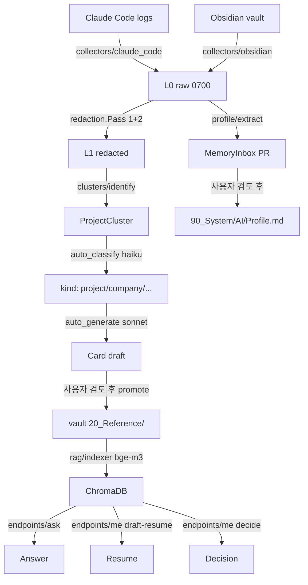

# 아키텍처

## 진짜 목표 (3가지 동시)

```
AI 비서        — "이거 도와줘" + 내 맥락 알고 답변
세컨드 브레인   — "내가 X에 대해 뭐라 했었지?" 즉시 인출
내 클론        — "나라면 이 결정 어떻게?" 내 패턴으로 응답
```

이력서 작성은 셋이 합쳐진 데모 use case — `me draft-resume`이 그것.

## 5가지 핵심 설계 결정 (변경 불가 제약)

```
1. 수집 범위 = Tier-3 (메일·메시지·음성까지 포함 가능)
2. 일일 5분 승인 (자동승인 + 예외만 사용자 검토)
3. 로컬 LLM = Apple FoundationModels (apfel)
4. 시스템 = Apple Silicon + macOS Tahoe 26+ (fallback 없음)
5. 외부 LLM 입력은 반드시 redacted (raw 노출 절대 금지)
```

## 4-tier 메모리 모델

```
L0: ~/.synapse/private/raw/      (0700)
    외부 LLM 노출 금지. Tier-3 raw 원본 격리.
    Claude Code mirror, Obsidian mirror.

L1: ~/.synapse/private/redacted/  (Pass 1+2 결과)
    Card 자동 생성용 입력. redact-list 자동 적용.

L2: vault 진실원본
    20_Reference/Projects/, Companies/  (Card)
    90_System/AI/Profile.md             (사용자 성향)
    90_System/AI/DecisionPatterns.md    (의사결정 패턴)
    90_System/AI/MemoryInbox/           (검토 대기 PR)

L3: ~/.synapse/private/rag/chroma/  (ChromaDB)
    bge-m3 임베딩 벡터. L2 Card 인덱싱.
```

## 모듈 의존성

```
┌─────────────────────────────────────┐
│ llm/  (apfel + Claude Code wrapper) │
│ storage/  (L0 격리)                  │
└─────────┬───────────────────────────┘
          │
┌─────────▼───────────────┐
│ collectors/             │ Claude Code + Obsidian mirror
└─────────┬───────────────┘
          │
┌─────────▼───────────────┐
│ redaction/              │ Pass 1 (regex) + Pass 2 (apfel) + redactlist
└─────────┬───────────────┘
          │
┌─────────▼───────────────┐
│ clusters/               │ raw → ProjectCluster (cwd + vault folder)
└─────────┬───────────────┘
          │
┌─────────▼───────────────┐
│ cards/                  │ auto-classify + auto-generate (Claude)
└─────────┬───────────────┘
          │
┌─────────▼───────────────┐
│ rag/                    │ bge-m3 + ChromaDB + indexer
└─────────┬───────────────┘
          │
┌─────────▼───────────────┐
│ endpoints/              │ ask + me {draft-resume, ...}
│ profile/                │ Profile/DecisionPattern 추출
└─────────┬───────────────┘
          │
┌─────────▼───────────────┐
│ daily.py                │ 통합 파이프라인
└─────────────────────────┘
```

## 데이터 흐름 (수집 → endpoint)



## 보안 / 프라이버시 모델

### 1. L0 격리

```
~/.synapse/private/   (0700 - 소유자 전용)
└── raw/              모든 외부 데이터 mirror
    ├── claude-code/  (~113MB 평균)
    └── obsidian/     (~16MB)
```

`SYNAPSE_L0_ROOT` 환경변수로 override 가능 (테스트용).

권한 위반 시 자동 정정: `doctor` 또는 `collect` 명령이 매번 0700으로 강제.

### 2. 2-pass redaction

```
[Pass 1]  결정적 regex + validator
  - email, phone_kr (KR 형식), card (Luhn), rrn (체크섬+성별),
    ipv4, jwt, aws_key, api_key_sk/github, bearer
  - F1 = 1.00 (골든셋 58 samples)

[Pass 2]  apfel (Apple FoundationModels, 로컬)
  - person_name, org_name, address, sensitive_topic, secret
  - 8개 false-positive 휴리스틱
    (MEGA_ORG_DENYLIST, NON_PII_TERMS, 파일명, ALL_CAPS,
     UUID/hash, path/identifier, dash+ascii, 숫자 포함 person)
  - F1 = 0.83

[Redactlist]  사용자 명시 NDA 회사·프로젝트
  - Pass 1 단계에 동적 합류 (priority 200, 최우선)
  - case-insensitive 정확 substring 매치
```

### 3. 로컬 vs 원격 LLM 분리

```
[로컬 = apfel]
  - Apple FoundationModels (~3B 파라미터)
  - 4K 컨텍스트, 청크 단위 분류 작업
  - Tier-3 raw 안전 (외부 노출 없음)
  - 용도: redaction Pass 2, 짧은 분류

[원격 = Claude Code CLI subprocess]
  - sonnet/opus/haiku, OAuth 인증 (별도 API key 불필요)
  - 200K 컨텍스트, 합성·추론
  - 입력은 반드시 redacted만
  - --bare 미사용 (OAuth 무시함)
  - --system-prompt 항상 명시 → CLAUDE.md/memory cache 30K 회피
  - --no-session-persistence, --permission-mode bypassPermissions
  - 용도: Card 자동 생성, ask, me endpoints, Profile 추출
```

### 4. vault 안 진실원본 보호

vault `90_System/AI/`는 mirror 대상에서 제외 (`collectors/obsidian/mirror.py`의
`EXCLUDED_DIRS`). 순환 방지 + 메모리는 단방향(v2 → vault) 쓰기만.

## Claude Code CLI subprocess 설계 결정

### 왜 `--bare` 안 쓰나

docs: *"Anthropic auth is strictly ANTHROPIC_API_KEY or apiKeyHelper. **OAuth and keychain are never read.**"*

→ Pro/Max 구독 사용자는 OAuth 인증인데 `--bare`에선 무시됨. 단발 호출당 "Not logged in" 에러. 별도 API key 발급 강제 = v2 가치 훼손.

### cache 30K 문제와 해결

`--bare` 없이 호출 시 매 호출에 사용자 CLAUDE.md + memory + plugins이 system prompt에 자동 추가 → `cache_creation_input_tokens` 30,000+ → $0.20+/call.

해결: `--system-prompt <custom>` 항상 명시. docs: *"dynamic sections are ignored with `--system-prompt`"* → cache 폭증 회피.

검증: `me decide` 한 호출 ~$0.15 (sonnet, --system-prompt 명시).

### `--json-schema` 안 쓰는 이유

테스트 중 sonnet이 `--json-schema` 강제 시 빈 응답 만드는 케이스 발견. 대신:
- system prompt에 "JSON only, 첫 문자 `{`" 강하게 명시
- `_parse_json_with_fallback` — 코드 펜스 / 자연어 prefix 자동 추출

## Cluster 식별 휴리스틱

### Claude Code cwd 기반 (강한 신호)

```
~/.claude/projects/-Users-jimmy-Documents-GitHub-<repo>/<session>.jsonl
                                                  ^^^^^
                                                  cluster_id
```

jsonl 첫 N 줄에서 `cwd` 필드 추출 → basename = cluster_id.

### Vault 폴더 segment 기반 (NFC 정규화)

```
10_Active/메가스터디/iOS 파트 세미나/1주차/x.md
          ^^^^^^^^^^
          cluster_id (depth=2 segment)
```

macOS는 NFD로 저장 → `unicodedata.normalize("NFC", name)` 필수 (한글 자모 결합).

`VAULT_GENERIC_SEGMENTS = {"Topics", "Drafts", "Hobby", ...}`는 한 단계 더 들어감
(`30_Creative/Drafts/AI/` → cluster "AI").

`VAULT_CLUSTER_MIN_FILES = 2` — 1개 노트는 cluster 아님.

### 신뢰도 (`ProjectCluster.confidence`)

```
cwd만                       → 0.5
+ vault 노트                 → 0.8
+ 태그 (#dom/*)              → 0.9
+ 명시 metadata (project_id) → 1.0 (W6 backlog)
```

## RAG 인덱싱 단위 결정

**현재: Card 단위 (1 vector / Card).**
- Card는 정제된 정보 → primary 검색 단위
- 11 Card = 11 vectors. 작아서 인덱싱·검색 빠름

**확장 가능 (W6 backlog):**
- raw 노트 청크 단위 (1330 vault .md → ~5000 vectors)
- chunk_max_tokens=600, paragraph 기반 분할
- Card vs raw 다른 가중치로 hybrid

## 일일 5분 워크플로 보장

`daily` 명령 incremental 패턴:

```
1. collect_claude_code   변경 없으면 0초
2. collect_obsidian      mtime+hash 비교, 변경분만 copy
3. classify --resume     이미 분류된 cluster skip
4. card generate         이미 있는 Card skip (--force로 강제)
5. rag index             ChromaDB upsert (idempotent)
6. update_profile        매일 새 분석 (history.jsonl 마지막 N)
```

평균 시간:
- 변경 없는 날: ~30초
- 새 cluster 1-2개: 2-3분
- 풀 처리 (cold start): 5-10분

## 알려진 한계

| 한계 | 원인 | 회피 |
|---|---|---|
| `★ Insight` 박스 가끔 등장 | Claude Code explanatory mode | 답변 품질 영향 없음 |
| org_name 한국 회사 F1=0.50 | apfel 작은 모델 한계 | `redactlist`로 직접 차단 |
| raw 노트 RAG 미지원 | Card만 인덱싱 | W6 backlog (chunk 임베딩) |
| `cache_creation 0` 보장 안 됨 | Claude Code 내부 동작 변화 가능 | `--system-prompt` 항상 명시 |

## 시스템 외부 인터페이스

```
입력
  ~/.claude/                  (Claude Code session)
  $VAULT/                     (Obsidian iCloud sync)

출력 (vault)
  20_Reference/Projects/      (Card)
  20_Reference/Companies/
  30_Creative/Drafts/         (Resume - <회사> (YYYY-MM).md)
  90_System/AI/MemoryInbox/   (Profile-YYYY-MM-DD.md)

상태/private
  ~/.synapse/private/raw/     (L0 raw)
  ~/.synapse/private/redacted/
  ~/.synapse/private/rag/chroma/ (벡터 DB)
  ~/.synapse/private/clusters/classifications.json
  ~/.synapse/private/.allowlist
  ~/.synapse/private/.redactlist
```
