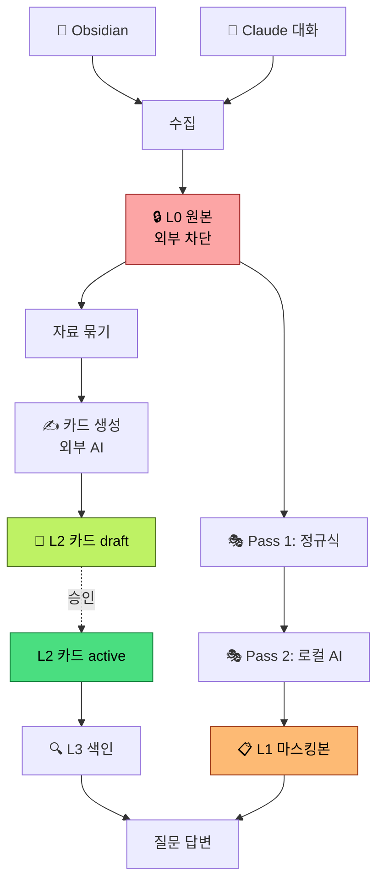

# 설계 개요 — 왜 이렇게 만들었나요?

> 이 문서는 비개발자도 이해할 수 있는 **설계 의사결정** 설명입니다.
> "어떻게 동작하는가" 사용자 관점은 [5가지 답답함](how-it-works.md),
> 정확한 기술 명세는 [아키텍처 (개발자판)](../architecture.md)를 보세요.

## 어떤 의문에 어느 절을 보면 되나

| 의문 | 어느 절 |
|---|---|
| "이 도구를 만든 사람은 뭘 두려워했나" | [§ 5가지 원칙은 어떤 두려움에서 나왔나](#5가지-원칙은-어떤-두려움에서-나왔나) |
| "왜 데이터를 4단계로 나눴나" | [§ 4단계 메모리 모델](#4단계-메모리-모델--왜-4개로-나눴나) |
| "데이터가 어디서 어디로 가나" | [§ 데이터가 흐르는 길](#데이터가-흐르는-길) |
| "왜 로컬 AI와 외부 AI를 함께 쓰나" | [§ 왜 로컬 AI와 외부 AI를 둘 다 쓰나요?](#왜-로컬-ai와-외부-ai를-둘-다-쓰나요) |
| "왜 Obsidian이 필수인가" | [§ 왜 Obsidian이 필수인가요?](#왜-obsidian이-필수인가요) |
| "Recipe라는 개념은 왜 만들었나" | [§ 왜 Recipe 개념을 만들었나요?](#왜-recipe-개념을-만들었나요) |
| "왜 자료를 자동으로 묶나" | [§ 왜 cluster를 자동으로 묶나요?](#왜-cluster를-자동으로-묶나요) |
| "현재 한계와 회피책" | [§ 알려진 한계와 어떻게 대응하나](#알려진-한계와-어떻게-대응하나) |

## 5가지 원칙은 어떤 두려움에서 나왔나

추상적인 "보안 우선·로컬 우선" 같은 슬로건이 아니라, *실제로 두려웠던 5가지 시나리오*에서 원칙이 도출됐습니다.

| # | 시나리오 (두려움) | 원칙 | 결과로 도입된 장치 |
|---|---|---|---|
| 1 | "내 카톡·이메일·일기 노트가 외부 AI 학습 데이터에 들어간다" | **외부 LLM에는 raw를 직접 보내지 않는다** | 4단계 메모리 모델 (L0~L3) + 2단계 마스킹 |
| 2 | "마스킹이 새로운 위험을 만든다 — 원본을 보긴 봐야 가릴 수 있는데, 그 마스킹 도구도 외부로 보내면 안 된다" | **로컬 LLM은 apfel을 쓴다** | apfel(Apple FoundationModels) 기반 Pass 2, 인터넷 차단 |
| 3 | "AI가 멋대로 정의한 '나'가 의사결정에 쓰인다" | **사용자가 직접 검토·승인한 자료만 진실원본** | Card `status: draft → active` + MemoryInbox 검토 흐름 |
| 4 | "매일 30분 정리 부담을 더하기 싫다" | **매일 5분 안에 검토 가능해야 한다** | 증분 처리(daily incremental) + Inbox 모델 |
| 5 | "Intel Mac이나 구버전 macOS에서 보안 약점이 생긴다" | **Apple Silicon + macOS 26 이상만 지원** | 호환성보다 안전 우선, 로컬 LLM 성능 확보 |

각 원칙이 *어떤 안전장치*로 구현됐는지 표 마지막 열에 나옵니다. 다음 절들이 이 장치들을 자세히 설명합니다.

## 4단계 메모리 모델 — 왜 4개로 나눴나?

```
L0 원본         L1 마스킹본     L2 진실원본         L3 검색 색인
잠긴 캐비넷  →  검정펜 사본  →  내가 승인한 카드  →  카드 도서관 색인표
```

| 단계 | 어디 있나 | 누가 보나 | 왜 분리했나 |
|---|---|---|---|
| **L0 원본** | `~/.synapse/private/raw/` (권한 0700) | 본인만 (외부 AI 절대 X) | 진본 보존, 마스킹 실패 시 복원용 |
| **L1 마스킹본** | `~/.synapse/private/redacted/` | 외부 AI도 가능 | 외부에 보내기 전 안전한 형태 |
| **L2 진실원본** | Obsidian vault | 외부 AI 가능 | 사용자가 직접 검토·승인 — AI 생성물에 대한 신뢰 가드 |
| **L3 검색 색인** | `~/.synapse/private/rag/chroma/` | 본인만 | 빠른 검색을 위한 보조, 색인 자체는 외부로 안 나감 |

**핵심**: L0(원본) → L1(마스킹) → L2(검토 후 승인) → L3(색인) 흐름을 강제하면, *어떤 단계에서도 사용자 검토를 건너뛰고 외부에 나갈 수 없습니다*.

## 데이터가 흐르는 길



> **승인 단계**가 핵심: 자동 생성된 카드는 `status: draft`로 시작합니다. 사용자가 Obsidian에서 확인하고 `status: active`로 바꿔야 검색·이력서 생성에 사용됩니다. AI가 만든 결과를 사람이 한 번 거치는 안전장치입니다.

## 왜 로컬 AI와 외부 AI를 둘 다 쓰나요?

| 작업 | 도구 | 왜 |
|---|---|---|
| 민감정보 마스킹 (Pass 2) | **로컬 AI** (apfel) | 원본을 봐야 가릴 수 있는데, 외부로 나가면 안 됨 — 그러니 내 Mac 안에서만 |
| 카드 생성·질문·이력서 | **외부 AI** (Claude) | 긴 문맥과 정교한 글쓰기는 강력한 클라우드 모델이 잘함 |

**즉**: 로컬 AI가 *문지기*, 외부 AI가 *작가* 역할.

## 왜 Obsidian이 필수인가요?

세 가지 이유 때문입니다.

1. **마크다운 파일 = 영구 보관 형식** — Synapse가 사라져도 노트는 평범한 텍스트 파일로 남음
2. **iCloud/Dropbox 동기화 = 자동 백업** — 노트북을 잃어도 노트는 살아 있음
3. **사람이 직접 검토할 작업 공간** — 카드 `draft → active` 승인이 Obsidian 안에서 자연스럽게 진행

만약 모든 걸 데이터베이스에 넣었다면 더 빠르지만, "내가 마음대로 열어보고 고치는" 감각이 사라집니다.

## 왜 이런 폴더 구조(`00_Inbox`, `10_Active`, …)를 골랐나요?

### 어디서 참고했나

두 가지 정립된 컨벤션을 섞은 형태입니다.

1. **[PARA Method](https://fortelabs.com/blog/para/)** — Tiago Forte가 *Building a Second Brain*에서 제안한 분류:
   **P**rojects(진행 중) · **A**reas(영역) · **R**esources(자료) · **A**rchives(보관). Obsidian/Notion 커뮤니티의 *사실상 표준*.
2. **[Johnny.Decimal](https://johnnydecimal.com/)** — 모든 폴더에 두 자리 숫자 prefix를 붙여 시각적 정렬과 빠른 찾기를 보장하는 시스템.

이 둘을 합쳐서 `00_Inbox` / `10_Active` / `20_Reference` / `30_Creative` / `90_System` 같은 *숫자 prefix + PARA 의미* 구조가 나왔습니다. 자기계발·지식관리 커뮤니티에서 가장 많이 인용되는 "PARA + Johnny.Decimal" 하이브리드입니다.

### 왜 이 변형을 골랐나

| 이유 | 무엇이 좋아지나 |
|---|---|
| **숫자 prefix** | 알파벳순 정렬 = 시간 흐름·중요도 순으로 자동 정렬. `00_Inbox`가 항상 맨 위, `90_System`이 항상 맨 아래 |
| **PARA 의미 유지** | Obsidian 튜토리얼·플러그인이 PARA를 가정하는 경우가 많음 — 학습 곡선이 거의 0 |
| **cluster 식별과 정확히 맞물림** | Synapse는 `10_Active/<회사>/<프로젝트>/` 같은 폴더 segment를 cluster_id로 변환. PARA의 "Projects는 폴더로 묶는다" 원칙과 1:1 매칭 |
| **사용자 영역 vs Synapse 영역 분리** | `90_System/AI/`를 Synapse 전용으로 격리. 사용자는 `00`~`30`만 신경 쓰면 됨 |
| **빈 자리 확보 (40~80)** | 사용자가 자기 워크플로에 맞춰 `40_Archive`, `50_Reading`, `60_Research` 등을 자유롭게 추가 가능 — Synapse가 강제하지 않음 |

### 어디까지 강제되나

엄밀히 말하면 Synapse가 *강제하는* 폴더는 다음뿐입니다.

- `20_Reference/{Projects,Companies}/` — Synapse가 카드를 *저장*하는 위치 (변경 가능하지만 권장 기본값)
- `30_Creative/Drafts/` — 이력서 초안 저장 위치
- `90_System/AI/` — Synapse 전용 시스템 영역

`00_Inbox`나 `10_Active`라는 이름은 **사용자 컨벤션**이지 Synapse가 검사하는 이름이 아닙니다. 다만 *cluster 자동 묶기*는 폴더 segment를 신호로 쓰기 때문에, 노트를 *어떤 폴더에든 일관되게* 모아두기만 하면 됩니다. PARA 변형을 추천하는 이유는 학습 곡선이 가장 낮기 때문입니다.

### 다른 컨벤션을 쓰고 있다면

이미 Zettelkasten, ACCESS, LATCH 같은 다른 시스템으로 정리하고 있다면 굳이 옮길 필요 없습니다. 다음 두 가지만 지키면 됩니다.

1. **같은 프로젝트/회사 노트가 *같은 폴더*에 2개 이상 모이게 두기** — cluster 인식의 유일한 조건
2. **`90_System/AI/`(또는 동등한 Synapse 전용 폴더)를 따로 비워두기** — 자동 생성 결과가 사용자 노트와 섞이지 않도록

## 왜 "Recipe" 개념을 만들었나요?

`me draft-resume`, `me decide` 같은 작업은 사실 같은 패턴을 가집니다.

```
관련 카드 찾기 → 프롬프트 조립 → 외부 AI 호출 → 결과 저장
```

이 패턴을 마크다운 파일 하나로 표현할 수 있게 만든 게 **Recipe**. 새 작업을 추가할 때 코드를 안 고치고 마크다운만 추가하면 됩니다.

## 왜 cluster를 자동으로 묶나요?

평소에 노트를 쓸 때 "이건 회사 A 프로젝트, 이건 회사 B 프로젝트"를 의식하지 않습니다. 하지만 이력서·회상에는 그 구분이 꼭 필요합니다.

Synapse는 두 가지 신호로 자동 묶습니다.

- **Claude Code 대화**: 어느 폴더에서 작업했나 (`cwd`)
- **Obsidian 노트**: 어느 폴더 안에 있나 (예: `10_Active/회사A/`)

이 정보로 같은 프로젝트·회사 자료를 자동으로 묶어 한 장의 카드로 요약합니다.

## 알려진 한계와 어떻게 대응하나

| 한계 | 영향 | 회피 방법 |
|---|---|---|
| 한국 회사명 마스킹이 완벽하지 않음 | 회사명이 외부에 나갈 수 있음 | `redactlist add "회사명"`으로 강제 마스킹 |
| Card에 없는 raw 노트는 검색 불가 | 최근 노트가 답변에 안 나옴 | Card 보강 후 `rag index --rebuild` |
| 자동 생성 Card는 초안 | 부정확할 수 있음 | Obsidian에서 검토 후 `status: active` |
| Claude 답변에 메타 문구가 섞임 | 답변 첫 줄에 잡음 | 향후 후처리 패치 예정 |

## 더 알아보기

- [동작 원리 (사용자 관점)](how-it-works.md) — *어떻게 동작하나*
- [무엇을 할 수 있는가](what-you-can-do.md) — 활용 사례
- [Privacy · 비용 · 삭제 FAQ](privacy-and-cost.md)
- [아키텍처 (개발자판)](../architecture.md) — 정확한 기술 명세
- [용어집](../glossary.md)
