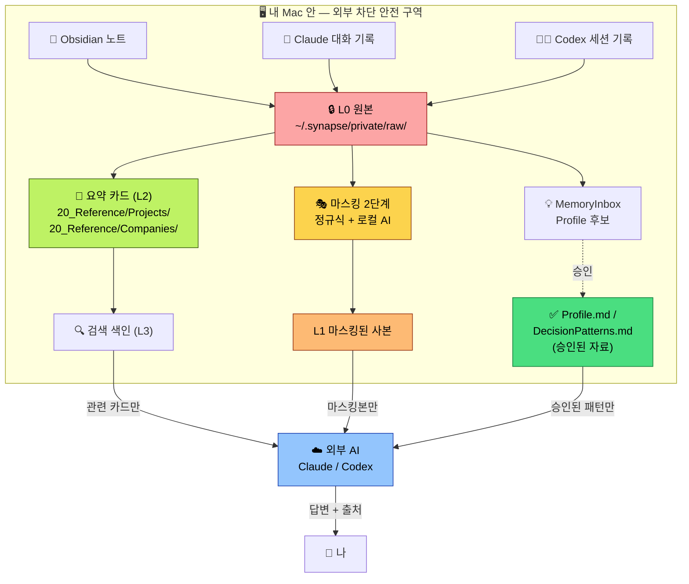
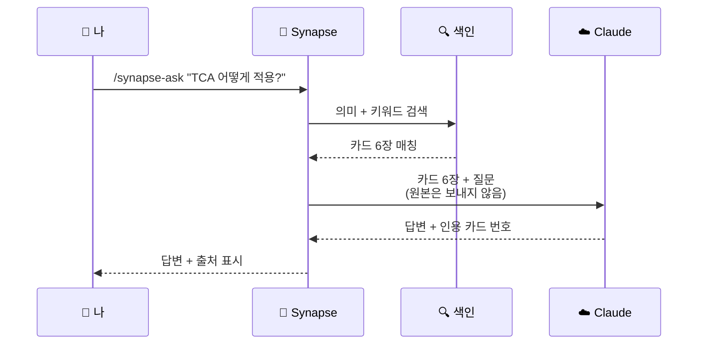

# Synapse Memory가 풀어주는 5가지 답답함

> 만들기 전에 매일 부딪혔던 것들.
> 하나라도 공감되면 이 도구가 맞습니다.
>
> "왜 이런 설계 선택을 했나"는 [설계 개요](architecture-overview.md),
> 정확한 기술 명세는 [아키텍처 (개발자판)](../architecture.md)을 보세요.

---

## 답답함 1 — "그 노트... 어디 있더라?"

> 노트가 1,000개를 넘었다. 분명 작년에 정리해뒀는데 검색해도 안 나온다.
> 키워드는 기억 안 나고, 폴더 구조는 그때그때 바뀌었고, 백링크는 거미줄.
> Obsidian 검색은 *정확한 단어*가 들어 있어야만 잡힌다.

### 어떻게 풀었나

매일 한 번 `/synapse-daily`가 돕니다.

1. 새 노트와 대화 기록만 모음 (이미 처리한 것은 건너뜀)
2. 같은 회사·프로젝트 자료를 *자동으로* 한 묶음으로 인식
3. 묶음 하나당 **한 장짜리 요약 카드**로 압축
4. 카드를 의미 검색이 가능한 형태로 색인

검색 단위가 "노트 1,000장"에서 "카드 20~50장"으로 줄어듭니다. *의미 검색*까지 되니까 "TCA 도입 결정"이라고 물어도 그 정확한 단어가 들어 있지 않은 노트까지 매칭됩니다.

### 담당 기능

| 단계 | 명령 | 역할 |
|---|---|---|
| 수집 | `collect` | Obsidian + Claude + Codex 새 변경분만 모으기 |
| 자동 묶기 | `cluster scan` → `cluster classify` | "이 자료들은 같은 프로젝트 같다" 판단 |
| 요약 카드 만들기 | `card generate` | 묶음을 한 장짜리 카드로 (Claude가 작성) |
| 검색 색인 | `rag index` | 의미 검색을 위해 카드 임베딩 |

---

## 답답함 2 — "Claude한테 매번 내 컨텍스트를 처음부터 설명한다"

> 새 채팅 = 매번 0부터.
> "우리는 SwiftUI 쓰고, MVVM 변형이고, Tuist로 모듈화했고, 인증은…"
> 어제 결정한 것도 새 채팅에서는 모른다.

### 어떻게 풀었나

Claude Code 또는 Codex 안에서 `/synapse-ask "..."` 한 번 부르면

1. 내 카드 중 관련 카드 6장을 자동으로 찾고
2. 질문 옆에 *그 카드들*을 같이 보냄
3. 답변에는 *어느 카드를 인용했는지* 출처 표시까지

새 채팅이라도 즉시 "내 맥락을 아는 Claude"가 됩니다.

### 담당 기능

| 단계 | 명령 | 역할 |
|---|---|---|
| 슬래시 진입 | `/synapse-ask` | 채팅 안에서 한 줄로 호출 |
| 관련 카드 찾기 | RAG 검색 (dense + BM25 hybrid) | 의미·키워드 둘 다 매칭 |
| 답변 + 출처 | `endpoints/ask.py` | 외부 AI 호출 결과에 인용 표시 |

---

## 답답함 3 — "AI에 개인 자료 던지자니 회사 NDA가…"

> "이력서 써줘" 한 마디면 회사 NDA 내용·동료 이름·고객 정보가 그대로 외부로.
> "Pro 구독은 학습 안 한다"고 해도 *전송 자체*가 무섭다.
> 카톡 백업·이메일은 더 민감.

### 어떻게 풀었나

**"원본은 절대 외부로 안 나간다"가 1번 규칙.** 그래서 격리 + 마스킹을 강제합니다.

1. **원본 격리** — 모든 raw는 `~/.synapse/private/` 안 권한 0700 폴더에. 같은 Mac의 다른 사용자도 못 봄
2. **2단계 마스킹**:
   - **1단계 (정규식)**: 이메일·전화·계좌·주민번호·JWT·API 키처럼 패턴이 명확한 거 → 패턴 100% 매칭이면 무조건 가림
   - **2단계 (로컬 AI, apfel)**: 사람 이름·회사명·주소처럼 문맥이 필요한 거 → *내 Mac 안에서만 동작하는 AI*가 처리, 인터넷 연결 없음
3. **외부 AI 입력 제한** — Claude·외부 AI에는 *마스킹된 사본* 또는 *내가 직접 승인한 카드*만 전달
4. **NDA 강제 차단** — `redactlist add "회사명"`으로 특정 단어는 정규식 1단계에서 무조건 `[REDACT_*]`로 치환

### 담당 기능

| 단계 | 명령/위치 | 역할 |
|---|---|---|
| 원본 격리 | `~/.synapse/private/raw/` (0700) | 외부 차단 저장소 |
| Pass 1 마스킹 | `redaction/patterns.py` | 정규식 + Luhn 등 결정적 매칭 |
| Pass 2 마스킹 | `apfel` 로컬 AI | 문맥 의존 PII (이름·조직·주소) |
| NDA 차단 | `redactlist add "..."` | 사용자 정의 무조건 차단 단어 |
| 4단계 메모리 모델 | L0 → L1 → L2 → L3 | 단계마다 *외부 공개 가능 여부* 명시 |

---

## 답답함 4 — "회사마다 이력서를 6시간씩 다시 쓴다"

> 같은 경험인데 회사 키워드에 맞게 다시 정렬·강조.
> 결국 시간 없어서 못 쓰는 회사가 절반.
> 매번 비슷한 내용을 다른 문장으로 옮겨 적고 있다.

### 어떻게 풀었나

`/synapse-resume <회사>` 한 줄로 초안이 30초 만에 나옵니다.

1. 그 회사 카드에서 *원하는 기술 스택·도메인·키워드* 추출
2. 내 프로젝트 카드 중 매칭률 높은 것 6장 자동 선별
3. 회사 톤·언어로 이력서 초안 작성 (Claude가 글쓰기 담당)
4. Obsidian의 `30_Creative/Drafts/`에 마크다운 파일로 저장

이력서는 *초안*입니다. 본인이 확인하고 다듬은 뒤 제출. 회사마다 6시간 → **30초 초안 + 30분 다듬기**로 축소.

### 담당 기능

| 단계 | 명령/위치 | 역할 |
|---|---|---|
| 슬래시 진입 | `/synapse-resume <회사>` | 채팅·터미널 어디서든 호출 |
| 회사 키워드 추출 | Company Card frontmatter | 카드를 만들어둘수록 정확도 ↑ |
| 매칭 카드 선별 | RAG 검색 + 우선순위 | 의미·역할·기간 매칭 |
| 초안 작성 | `recipes/resume.md` (외부 AI) | 회사 톤에 맞춘 글쓰기 |

---

## 답답함 5 — "사소한 결정에 매일 피로하다"

> "이력서를 sonnet으로 쓸까 opus로 쓸까."
> "이 PR을 큰 단위로 갈까 쪼갤까."
> 결정 자체보다 *이미 결정한 패턴을 또 고민하는 것*이 더 피로.

### 어떻게 풀었나

매일 `daily`가 내 결정 흔적을 보고 *"이 사람 이런 패턴 같다"* 후보를 추출해 **MemoryInbox**에 둡니다.

1. AI가 후보 추출 → `90_System/AI/MemoryInbox/Profile-YYYY-MM-DD.md`에 저장
2. 내가 5분 검토 → 맞는 것만 `Profile.md` / `DecisionPatterns.md`로 옮김
3. `/synapse-decide "..."` 부르면 그 패턴을 보고 결정 권장

핵심: **내가 검토해서 옮긴 것만 사용**합니다. AI가 멋대로 정의한 "나"가 아니라 *내가 인정한* "나"가 의사결정 재료가 됩니다.

### 담당 기능

| 단계 | 명령/위치 | 역할 |
|---|---|---|
| 후보 추출 | `persona update-profile` | raw 패턴 → ProfileFact 후보 |
| 후보 보관 | `MemoryInbox/` | "검토 대기" 받은편지함 |
| 승인 (수동) | Obsidian 편집 | `Profile.md` / `DecisionPatterns.md`로 이동 |
| 결정 도움 | `/synapse-decide` | 승인된 패턴 기반 권장 |

---

## 한 장으로 보는 등장인물

> **빨강 → 노랑 → 주황 → 라임 → 초록**의 흐름은 "민감 → 안전" 단계를 시각화합니다.
> 외부 AI가 받는 건 항상 *라임 이상*(요약 카드 또는 마스킹본)뿐.

---

## 등장인물 6명

| 등장인물 | 정체 | 역할 |
|---|---|---|
| 📔 **Obsidian 노트** | 내가 평소 쓰는 개인 노트 | 원본 자료의 80% |
| 💬 **Claude 대화 기록** | Claude Code에서 나눈 대화 | 의사결정과 작업 기록 |
| 🧑‍💻 **Codex 세션 기록** | Codex CLI에서 나눈 대화 | (Codex 사용 시) 추가 작업 기록 |
| 🤖 **Synapse 비서** | 이 도구 (내 Mac 안에서만 동작) | 매일 정리·요약·마스킹 |
| 📑 **요약 카드** | 회사·프로젝트별 한 장짜리 정리본 | 외부 AI에 보내는 *유일한 재료* |
| ☁️ **외부 AI** | Claude / Codex | 요약 카드만 받아 답을 만듦 |

> Claude Code 대화는 `/synapse-daily` 실행 때 같이 수집됩니다.
> Codex 대화는 백그라운드 도우미(launchd `net.synapse.codex-poller`)가 새 세션이 끝날 때마다 자동 수집해두기 때문에, Codex만 쓰셔도 카드 재료가 모입니다.

---

## 내 노트는 vault 어디에 두면 되나요?

Obsidian vault 폴더 컨벤션 — **어디에 두느냐가 카드 생성에 영향을 줍니다.**

| 폴더 | 용도 | 카드가 자동 생성? |
|---|---|---|
| 📥 `00_Inbox/` | **임시 받은편지함** — 정리 안 된 새 노트를 부담 없이 던지는 곳 | ❌ 안 됨 (cluster로 안 묶임) |
| 🔥 `10_Active/<회사>/<프로젝트>/` | 진행 중 프로젝트 노트 | ✅ 같은 폴더에 2개 이상 쌓이면 자동 |
| 📑 `20_Reference/{Projects,Companies}/` | Synapse가 만든 요약 카드 | (자동 생성 결과물) |
| ✍️ `30_Creative/Drafts/` | Synapse가 만든 이력서 초안 | (자동 생성 결과물) |
| 🤖 `90_System/AI/` | Synapse 전용 (Profile, MemoryInbox, DailyReports) | 직접 노트를 두지 마세요 |

**일반 흐름**: 새 생각은 `00_Inbox`에 부담 없이 → 주 1회 정리할 때 `10_Active/<회사>/<프로젝트>/`로 옮김 → 다음 `/synapse-daily`가 자동으로 카드 생성.

자세한 표·예시는 [vault 폴더 컨벤션 가이드](../usage.md#vault-폴더-컨벤션--노트를-어디에-두면-카드가-생기나)를 참고하세요.

---

## 동작 방식 한 단락 요약

내 Mac 안에 *Synapse 비서*가 산다. 매일 한 번 돌면서:

1. Obsidian과 Claude·Codex 대화의 **새것만** 모은다
2. 같은 회사·프로젝트 자료끼리 묶어 **한 장짜리 카드**로 압축한다
3. 외부 AI에 보낼 때를 대비해 **민감정보를 가린 사본**도 따로 만든다
4. 내 결정 흔적에서 **"이 사람 이런 성향 같다" 후보**를 MemoryInbox에 둔다 (내가 직접 검토해서 승인)
5. 슬래시 명령으로 물으면, **관련 카드 + 마스킹된 사본 + 승인된 패턴**만 외부 AI에 보내고 답을 받는다

**원본은 어떤 경우에도 외부로 안 나간다.** 이게 1번 규칙.

---

## 질문이 답으로 바뀌는 과정 (`/synapse-ask`)

---

## 다음에 읽을 문서

- [무엇을 할 수 있는가](what-you-can-do.md) — 실제 명령 사용 예시
- [설계 개요](architecture-overview.md) — 왜 이런 선택들을 했나
- [개인정보 · 비용 · 삭제 FAQ](privacy-and-cost.md) — 가장 자주 묻는 우려
- [설치 화면 가이드](installer-walkthrough.md) — 단계별 설치
- [아키텍처 (개발자판)](../architecture.md) — 정확한 기술 명세
- [용어집](../glossary.md) — 모르는 단어가 있을 때
