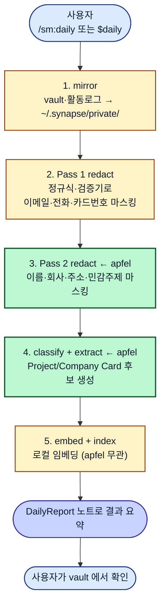
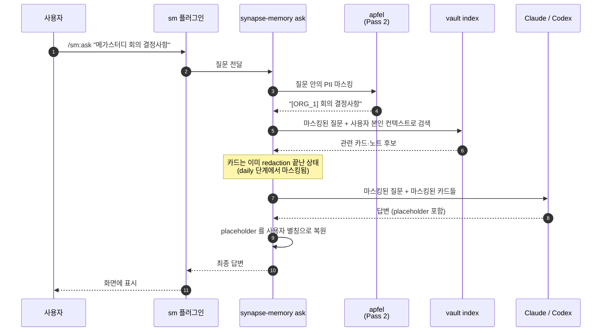
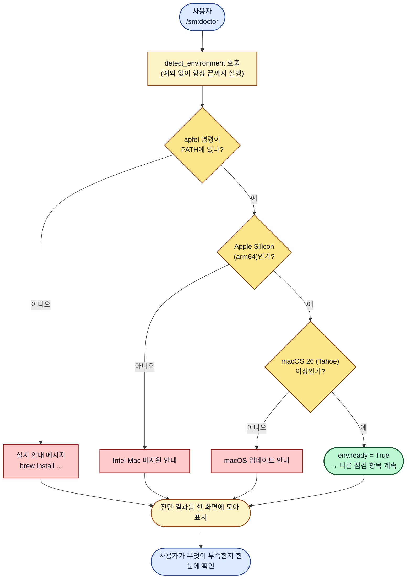
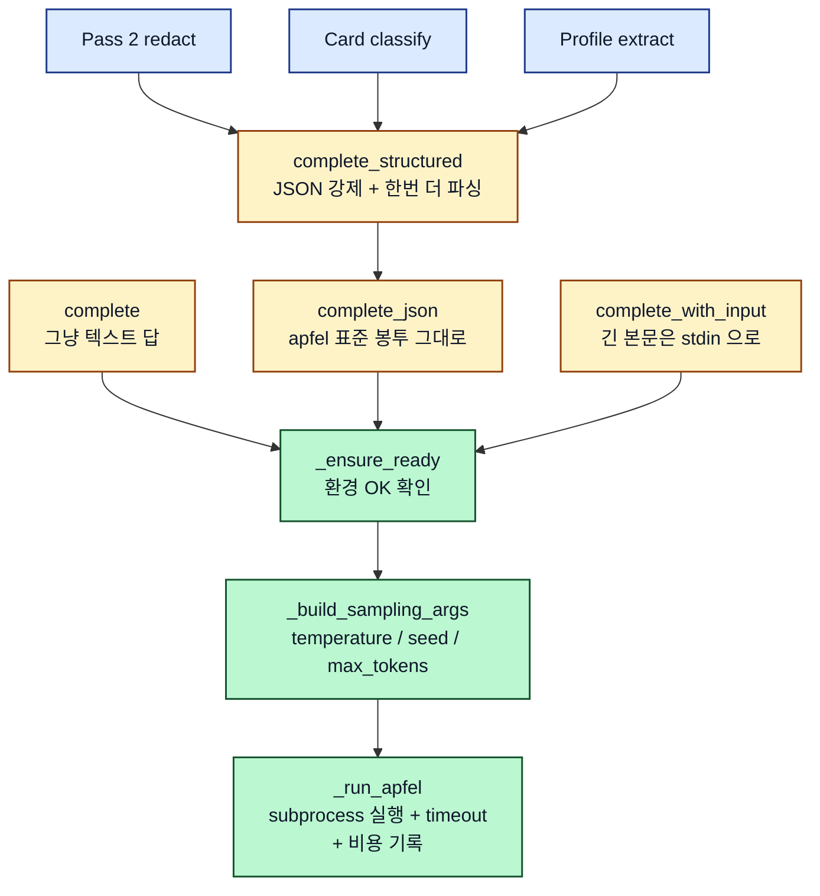
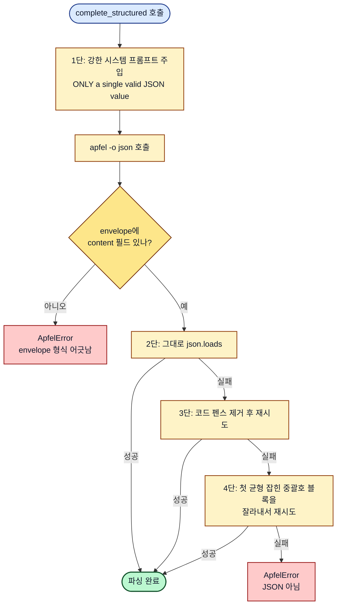
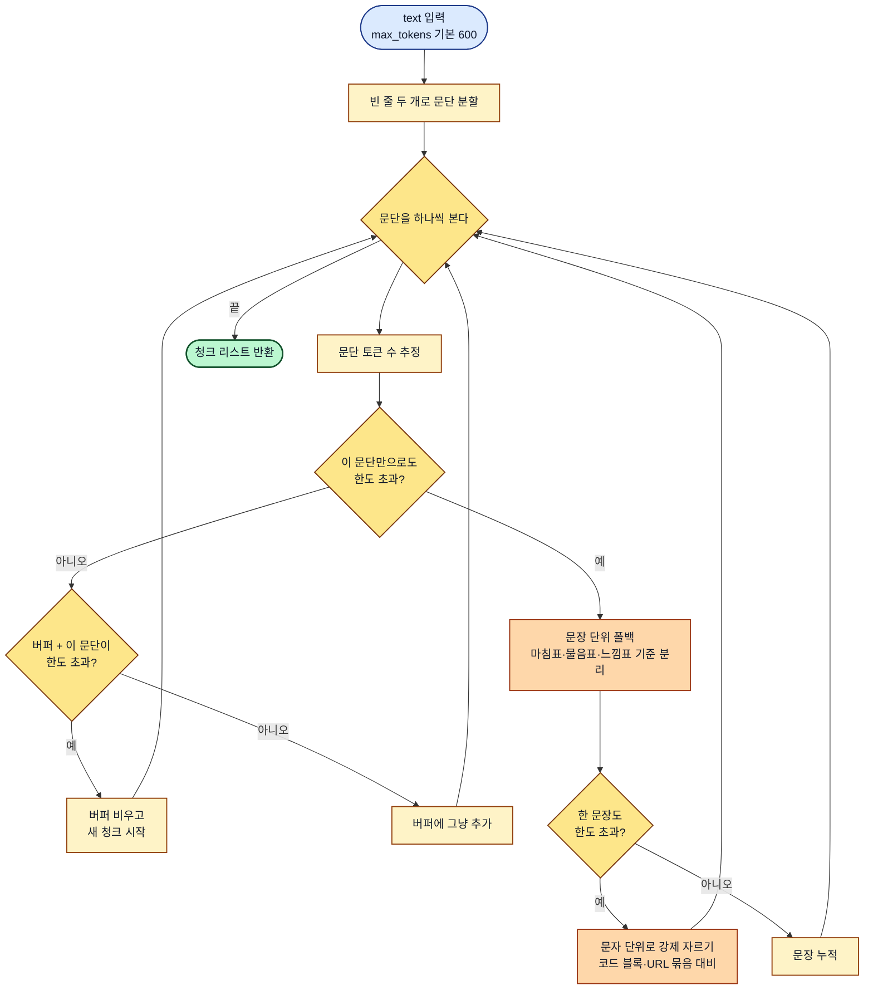
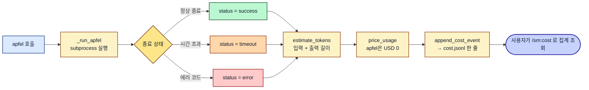

# 로컬 LLM (apfel) 동작 원리와 설계

작성자: JunyoungJung
작성일: 2026-05-18

이 문서는 Synapse Memory를 쓸 때 **"내가 명령 하나 치면 내 Mac 안에서 무슨 일이
일어나는가"** 를 따라가며, 그 안에서 로컬 LLM (Apple FoundationModel) 이 어떤
역할을 맡는지 설명합니다. 사용자는 apfel 을 직접 부르지 않습니다 — 슬래시 명령
뒤에서 자동으로 호출되는 부품입니다.

읽기 전 한 줄:

> **apfel** 은 macOS Tahoe(26) 가 제공하는 **Apple FoundationModel** 을 명령줄로
> 부를 수 있게 해주는 외부 도구입니다. Synapse Memory 는 이 도구를 Python
> `subprocess` (다른 프로그램을 자식 프로세스로 실행하는 표준 모듈) 로 감싸,
> 사용자가 슬래시 명령을 칠 때마다 자동으로 호출합니다.

---

## 1. 큰 그림 — 내 명령이 외부 AI까지 가는 길

사용자가 Claude Code 에서 `/sm:ask "지난 주에 결정한 거 뭐였지"` 같은 명령을 치면,
다음 흐름이 자동으로 돕니다. 사용자는 ① 과 ⑤ 만 보고, ② ~ ④ 는 내부에서 일어납니다.

핵심은 **③ 로컬 게이트가 ④ 원격 AI 보다 먼저** 라는 점입니다. 원본은 ③ 에서 한 번
정제되어, 외부로는 마스킹된 사본만 나갑니다.

| 단계 | 누가 | 무엇을 |
| --- | --- | --- |
| ① 입력 | 사용자 | `/sm:ask`, `/sm:daily`, `/sm:redact` 등 |
| ② 플러그인 | Claude Code / Codex 플러그인 | 명령을 CLI 호출로 번역 |
| ③ 로컬 게이트 | `synapse-memory` 내부 → apfel | 민감정보 마스킹, 분류, 태깅 |
| ④ 원격 AI | Claude / Codex | 정제된 입력으로만 합성·추론 |
| ⑤ 출력 | 사용자 | 결과 노트 또는 답변 |

> **왜 이 구조인가.** 사용자는 매번 "이 명령은 외부로 무엇이 나가지?" 를 확인할 수
> 없습니다. 대신 "어떤 명령이든 일단 ③ 을 거친다" 는 단일 규칙을 코드로 강제하면,
> 새 기능을 만들 때 redaction 을 깜빡할 수가 없습니다. apfel 은 그 ③ 의 두뇌입니다.

---

## 2. 시나리오 1: `/sm:daily` — 매일 도는 정리 파이프라인

사용자가 가장 자주 치는 명령입니다. Obsidian vault 의 새 노트와 Claude/Codex 활동
로그를 한 번에 정리합니다. 이 한 번의 명령 안에서 apfel 이 두 단계로 호출됩니다.

사용자가 본 결과 (예: "오늘 3개 노트가 정리되어 Project Card 1개가 갱신됨") 는
초록 단계 두 번 — Pass 2 redact 와 classify — 가 apfel 을 부른 결과입니다.

| 단계 | apfel 역할 | 만약 apfel 이 빠지면 |
| --- | --- | --- |
| 2. Pass 1 | 사용 안 함 (정규식만) | 그대로 동작 |
| 3. Pass 2 | 자유형 PII (이름·회사·주소) 검출 | Pass 1 만으로 진행 (이름 노출 위험) |
| 4. classify | Card 카테고리·태그 자동 생성 | 사용자가 수동 분류 필요 |

> **왜 apfel 이 두 번 등장하나.** 한 번은 "외부로 나가도 되는 모양으로 정제" (Pass 2),
> 한 번은 "vault 안에서 검색·집계할 수 있는 구조로 변환" (classify). 둘 다 결과가
> 짧고 검증 가능해서 로컬 모델로 충분합니다.

---

## 3. 시나리오 2: `/sm:ask` — 질문이 외부 AI까지 가는 길

사용자가 자연어로 질문하면, **질문 본문조차 그대로 외부로 보내지 않습니다.** 질문 안의
이름·회사명도 일단 로컬에서 마스킹한 다음 RAG 검색과 외부 호출이 이뤄집니다.

외부로 나가는 한 통의 요청 안에는 **원본 이름·회사가 단 한 글자도 들어 있지 않습니다.**
응답이 돌아온 뒤에야 placeholder (`[ORG_1]`) 를 사용자가 보기 좋은 별칭으로 복원합니다.

> **왜 질문에도 마스킹을 거나.** "메가스터디 영업팀의 김부장이 어제 말한 거" 같은
> 질문은 그 자체로 민감 정보입니다. 외부 모델은 학습에 쓰지 않더라도, 로깅·전송
> 경로 어디서든 노출 가능성이 0 이 아닙니다. 질문도 데이터입니다.

---

## 4. 시나리오 3: `/sm:doctor` — apfel 이 잘 깔려 있나 확인

`synapse-memory doctor` 가 가장 먼저 묻는 것 중 하나가 "apfel 호출이 가능한가" 입니다.
세 가지를 부작용 없이 확인합니다.

조건 중 하나가 막혀도 **예외를 던지지 않습니다.** 이유는 doctor 가 "한 줄 한 줄 멈추지
말고 끝까지 다 점검해서 모아 보여줘야" 사용자가 무엇을 더 설치해야 하는지 한 번에
알 수 있기 때문입니다. 실제 호출이 일어나는 시점 (Pass 2, classify 등) 에서만 막힙니다.

---

## 5. 내부 구조 — 모든 길이 통과하는 한 함수

위 세 시나리오 모두 결국 `apfel.complete_*` 라는 같은 도구를 부릅니다. 입출력 모양만
다른 4개의 진입점이 있고, 코어는 하나입니다.

| 코드에서의 진입점 | 답이 어떤 모양으로 오나 | 어디서 쓰나 |
| --- | --- | --- |
| `complete` | 그냥 문자열 | 짧은 한 문장 |
| `complete_json` | `{content, metadata, model}` 봉투 dict | 메타데이터까지 필요할 때 |
| `complete_structured` | 파싱된 JSON 값 | **시나리오 2·3 의 대부분이 이걸 씀** |
| `complete_with_input` | 위 둘 중 선택 | 본문이 명령 인자로 못 들어갈 만큼 길 때 |

공통 옵션: `temperature` (창의성↔결정성, PII 검출은 `0.0`), `seed` (재현용),
`max_tokens` (답 길이 상한), `permissive` (Apple 가드 완화), `timeout`.

---

## 6. 왜 `subprocess` 래퍼인가 — 단순함이 안전이다

Apple FoundationModels 은 Swift 로 제공됩니다. Python 에서 직접 부르려면 다리
라이브러리 + 모델 메모리 관리가 필요합니다. 우리는 잘 만든 외부 명령 `apfel` 을
그냥 실행합니다 — 터미널에서 `ls` 를 치는 것과 같은 방식입니다.

| 결정 | 이유 |
| --- | --- |
| `subprocess` 만 사용 | 추가 패키지 0개. Python 표준만 |
| 모든 호출에 `-q` (quiet) | 진행률 바·색상 코드가 결과 문자열에 섞이지 않게 |
| 강제 `timeout=30s` | 모델이 멈춰도 사용자 명령이 영원히 매달리지 않게 |
| stderr 그대로 보존 | 모델이 실패하면 그 메시지를 `ApfelError` 안에 담아 전달 |

오버헤드는 한 번 호출당 약 50ms (프로세스 띄우는 시간) + 모델 추론. 그래서 긴 노트는
한 번이라도 호출을 덜 하기 위해 미리 잘라서 보냅니다 (다음 절).

---

## 7. "JSON 으로만 답해" 를 4단으로 지킨다

Apple FoundationModel 은 컨텍스트 4K 의 작은 모델입니다. "JSON 으로 답해" 라고만
부탁하면 자연어 설명을 덧붙이거나 코드 펜스로 감싸서 새어 나옵니다.
`complete_structured` 는 4단 방어로 이걸 막습니다.

가장 까다로운 게 4단 — **첫 균형 잡힌 중괄호 블록 추출**. 단순 정규식으로는 문자열
안에 `}` 가 있으면 깨집니다. 그래서 미니 파서를 만들었습니다: "여는 괄호 개수를 세다가
0 이 되는 지점" 을 찾고, 문자열 내부 괄호와 이스케이프 문자는 무시합니다.

> **왜 이렇게까지.** 외부 Claude API 는 JSON Schema 강제가 가능하지만,
> FoundationModel 은 그런 보장이 없습니다. 한국어 입력 기준 4단까지 가는 비율은
> 약 5–10%. 이 안전망이 없으면 그 5–10% 가 그대로 사용자 명령 실패로 이어집니다.

---

## 8. 긴 글은 잘라서 보낸다 — 3단 폴백

apfel 의 안전 입력 한도는 약 2400 토큰 (4K 컨텍스트에서 답할 자리 ~1500토큰 확보).
긴 노트를 한 번에 던지면 잘리니, `chunk_by_paragraph` 가 의미 단위로 미리 자릅니다.

3단계로 점점 의미를 덜 보존하며 잘라냅니다.

1. **문단 단위** (90% 이상이 여기서 해결)
2. **문장 단위** — 한 문단이 한도 초과일 때만
3. **문자 단위 강제 분할** — 한 문장조차 너무 길면 (긴 URL 묶음, 코드 블록 등)

토큰 수는 정확히 셀 수 없어서 한글 1.5 글자 ≈ 1 토큰, 영문/숫자 4 글자 ≈ 1 토큰 으로
추정합니다 (오차 ±20%).

> **왜 한도(2400) 가 아니라 600 으로 잘게 자르나.** 청크가 작을수록 모델 답이
> 일정하고, 한 청크 실패가 전체에 미치는 영향도 작습니다. 600은 한도의 약 25% —
> "한 청크가 망가져도 다른 청크들로 충분히 복구 가능한" 정도입니다.

---

## 9. 모든 호출이 비용 로그에 남는다

`/sm:cost` 로 사용자가 보는 비용 집계는 외부 API 만이 아니라 **로컬 apfel 호출까지
포함** 됩니다. API 비용은 0 이지만 시간·전력은 들기 때문입니다.

| 필드 | 값 예시 | 의미 |
| --- | --- | --- |
| `provider` | `"apfel"` | 어떤 백엔드를 썼는지 |
| `model` | `"apple-foundationmodel"` | 모델 식별자 |
| `input_tokens` / `output_tokens` | `180 / 42` | 휴리스틱 추정 |
| `elapsed_s` | `4.7` | 실제 걸린 시간 |
| `status` | `success / timeout / error` | 결과 |
| `usd` | `0.0` | 비용 (로컬이라 0) |

> **왜 비용 0 인데 굳이 기록하나.** "오늘 daily 가 왜 30분 걸렸지?" 같은 사용자 질문에
> 답하려면 로컬 호출 시간도 측정 대상이어야 합니다. 비용 0 이라 안 적으면 어디서
> 시간이 새는지 영원히 모릅니다.

---

## 10. 자주 묻는 점 (사용자 관점)

### apfel 이 없으면 Synapse Memory 가 안 돌아가나요?

`/sm:doctor` 가 먼저 알려주고, 실제 호출이 필요한 명령은 친절히 중단합니다.

- **`/sm:redact` Pass 2 가 빠지면** — Pass 1 (정규식) 만으로 진행. 이메일·전화 등은
  여전히 마스킹되지만 이름·회사명은 마스킹 안 됨 → 사용자가 외부로 보내기 전 직접
  확인 필요.
- **`/sm:daily` classify 가 빠지면** — Card 자동 생성이 멈춤. mirror·redact 까지는 진행.
- **"원본 → 외부 LLM" 직결은 설계상 불가능합니다** — apfel 이 없다고 redaction 을
  건너뛰는 옵션은 만들지 않았습니다.

### 왜 Ollama, llama.cpp 같은 게 아니라 Apple FoundationModel 인가요?

- 모델·메모리를 macOS 가 알아서 관리합니다. 다른 앱이 메모리를 더 필요로 하면
  자동 unload, 다시 부르면 자동 load — Python 코드는 신경 쓸 게 없습니다.
- 사용자 설치 부담 0. macOS Tahoe 면 그냥 켜져 있습니다.
- 단점: 4K 컨텍스트, 작은 모델, 비결정성. 그래서 "redaction · 분류 · 태깅" 처럼 결과
  분량이 작고 검증 가능한 작업에만 씁니다. 추론·합성은 외부 모델 몫.

### `/sm:daily` 가 너무 오래 걸려요. apfel 때문인가요?

`/sm:cost` 로 확인해보세요. provider 별 elapsed 시간이 집계되어 있습니다.
대부분의 시간은 Pass 2 redact + classify 의 apfel 호출에서 옵니다.
청크 수가 많을수록 호출 수가 늘어나니, 한 번에 처리하는 노트 수를 줄이면 빨라집니다.

### timeout 30초는 어디서 정한 수인가요?

apfel v1.3.3 + M-series Mac 기준, 600 토큰 청크 → JSON 응답이 보통 3–8초입니다.
30초는 "확실히 매달려 있다" 고 판단할 수 있는 안전 한도입니다. 더 큰 입력이 필요하면
timeout 을 늘리기 전에 먼저 `chunk_by_paragraph` 로 더 잘게 자르는 게 정답입니다.

### 다이어그램 색은 무엇을 의미하나요?

| 색 | 역할 |
| --- | --- |
| 파랑 | 사용자 행동 / 입력 |
| 노랑 | 처리 단계 |
| 진노랑 | 분기점 (decision) |
| 주황 | 폴백 (예외 경로) |
| 초록 | apfel 호출 / 성공 종료 |
| 빨강 | 실패 / 에러 |
| 보라 | 외부 시스템 / 다음 단계로 넘기는 출구 |

라이트·다크 모드 모두에서 글자가 읽히도록 fill 은 파스텔, stroke 는 진한 색,
text 는 명시적으로 `#0f172a` (거의 검정) 으로 지정했습니다.

---

## 11. 관련 코드 빠른 색인

| 파일 | 내용 |
| --- | --- |
| [`src/synapse_memory/llm/apfel.py`](../src/synapse_memory/llm/apfel.py) | apfel CLI 래퍼 본체 |
| [`src/synapse_memory/llm/__init__.py`](../src/synapse_memory/llm/__init__.py) | public symbol re-export |
| [`src/synapse_memory/llm/ai_api.py`](../src/synapse_memory/llm/ai_api.py) | 원격 provider facade |
| [`src/synapse_memory/llm/claude.py`](../src/synapse_memory/llm/claude.py) | Claude CLI 어댑터 |
| [`src/synapse_memory/llm/codex.py`](../src/synapse_memory/llm/codex.py) | Codex CLI 어댑터 |
| [`src/synapse_memory/redaction/pass2.py`](../src/synapse_memory/redaction/pass2.py) | 시나리오 1·2 의 Pass 2 본체 |
| [`src/synapse_memory/cards/auto_classify.py`](../src/synapse_memory/cards/auto_classify.py) | 시나리오 1 의 classify 본체 |
| [`src/synapse_memory/cost/events.py`](../src/synapse_memory/cost/events.py) | 비용 기록 스키마 |
| `tests/test_apfel.py` | 옵션 변경 시 함께 동기화할 것 |

처음 읽는다면 [`docs/start-here.md`](start-here.md) →
[`docs/privacy-and-cost.md`](privacy-and-cost.md) → 이 문서 순서를 권장합니다.
