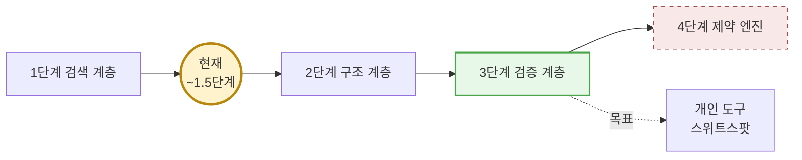
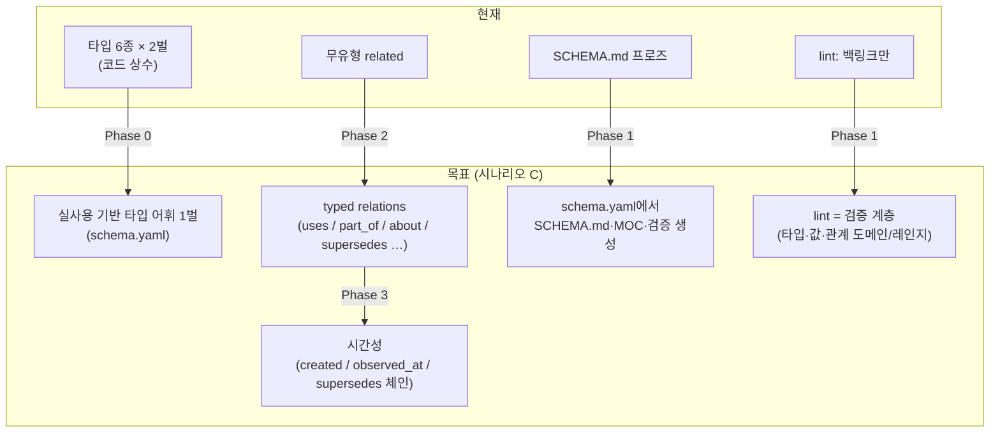
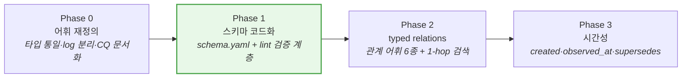
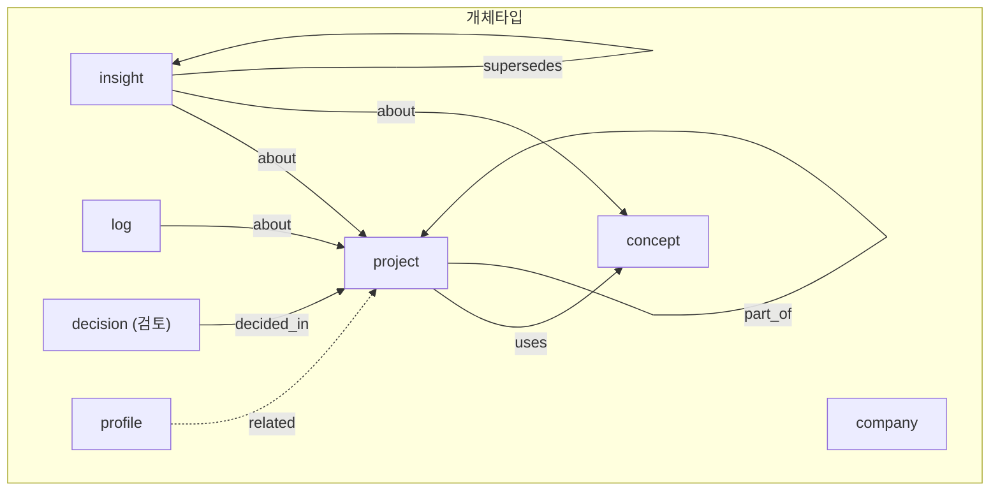

# 온톨로지 아키텍처 검토안·개선안

작성일: 2026-07-05
검토 범위: `src/synapse_memory/` 전체, 실제 Documents vault (md 2,197개), 온톨로지/LLM 메모리 시스템 자료조사
배경 지식: [ontology-learning-guide.md](ontology-learning-guide.md) (학습자료 — 용어는 이 문서 기준)
관련 문서: [current-issues-and-improvement-plan.md](current-issues-and-improvement-plan.md) (운영 이슈, 2026-06-21)

---

## 0. 결론 요약 (TL;DR)

**"이 프로젝트의 성질이 온톨로지에 가깝다"는 직관은 맞습니다.** synapse-memory는 이미
개체 타입, 인스턴스(페이지 1개 = 개체 1개), 출처(provenance), 링크 그래프, 스키마 문서,
무결성 lint를 갖춘 — 정확히 말하면 **"온톨로지가 없는 지식그래프"** 입니다.

그러나 **아키텍처를 온톨로지 시스템으로 갈아엎는 것(RDF/OWL/그래프 DB 전환)은 권장하지
않습니다.** 이유는 두 가지입니다.

1. vault 실사에서 발견된 실제 문제들(낡은 인덱스, 중복 저장소, 미사용 타입, 고아 페이지,
   MOC↔SCHEMA 모순)은 **표현력 부족이 아니라 스키마 거버넌스 부재**에서 온 것입니다.
   OWL 추론 엔진은 낡은 index.md를 고쳐주지 않습니다.
2. Obsidian 마크다운이 이 제품의 저장소이자 UI입니다. 트리플스토어로 옮기는 순간
   Obsidian Graph/Dataview/사용자 편집이라는 제품 정체성이 죽습니다.

**권장안은 "마크다운-네이티브 경량 온톨로지"의 점진 도입**입니다. 지금의 파일 포맷과
파이프라인을 유지한 채, ① 실사용에 맞춘 타입 어휘 재정의 → ② 스키마의 코드화(prose →
기계가독 스키마 + lint 검증) → ③ 유형화된 관계(typed relations) 도입 → ④ 시간성 강화
순서로 올라갑니다. 이는 온톨로지 메모리 성숙도 모델에서 현재의 1.5~2단계를 3단계(검증
계층)로 끌어올리는 경로이며, 개인 도구의 스위트스팟입니다.

---

## 1. 검토 방법

| 항목 | 내용 |
| --- | --- |
| 코드 분석 | `src/synapse_memory/` 전 모듈 (~42.8k LOC), 지식 모델링 관점 |
| vault 실사 | Documents vault md 2,197개 — 플러그인 생성분 372개 전수, 사용자 노트 표본 조사 |
| 자료조사 | 온톨로지 표준(RDF/OWL/SKOS), 설계 방법론(CQ), LLM 메모리 시스템(Zep/Graphiti, GraphRAG), 성숙도 모델 — 출처는 [학습자료](ontology-learning-guide.md#sources) |

---

## 2. 현재 상태 진단

### 2.1 코드가 말하는 것 — 온톨로지 구성요소 대차대조표

| 온톨로지 요소 | 현재 구현 | 평가 |
| --- | --- | --- |
| 클래스(타입) | [wiki/page.py](../src/synapse_memory/wiki/page.py) `VALID_TYPES = (project, company, person, concept, profile, insight)` | ✅ 있음, 그러나 **평평하고 2벌** |
| 인스턴스 | 페이지 파일 1개 = 개체 1개 (`Entities/Projects/carelog.md`) | ✅ 건강함 (entity-note 패턴) |
| 데이터 속성 | frontmatter `slug/title/status/updated/sources` | ✅ 있음, 값 검증 없음 |
| **관계(객체 속성)** | `related:` + `[[wikilink]]` — **전부 무유형** | ❌ 없음 — 최대 공백 |
| 스키마 명세 | `SCHEMA.md` — vault에 쓰이는 **프로즈 템플릿** ([wiki/schema.py](../src/synapse_memory/wiki/schema.py)) | ⚠️ 있으나 기계가 검증 불가 |
| 제약/검증 | lint가 백링크 상호성·죽은 링크·고아만 검사 ([wiki/lint.py](../src/synapse_memory/wiki/lint.py)) | ⚠️ 구조만, 타입·값·관계 검증 없음 |
| 시간성 | `updated` 1개 필드. `created` 없음, 사실 단위 시간 없음 | ❌ 사실상 없음 |
| 추론/질의 | LLM-as-retriever ([wiki/llm_retrieval.py](../src/synapse_memory/wiki/llm_retrieval.py)) — 텍스트 인덱스에서 slug 선별 | ⚠️ 그래프 순회 없음, LLM 암묵 추론에 전적 의존 |

구조적 부채 두 가지가 두드러집니다.

**① 지식 모델이 2벌이다.** v1 Cards(`cards/` — `ProjectCard/CompanyCard/InsightCard`,
`20_Reference/` 폴더)와 v2 Wiki(`wiki/` — `WikiPage`, `Entities/` 등)가 병존하고, 타입
어휘도 각각 존재합니다(`VALID_KINDS` vs `VALID_TYPES`). 둘 다 같은 LLM 검색기
(`select_related`)로 흘러들지만 폴더 트리·코드 경로·스키마가 분리되어 있습니다.

**② 스키마의 원본이 셋이다.** 타입→폴더 매핑과 필드 규칙이 (a) Python 상수,
(b) vault의 `SCHEMA.md` 프로즈, (c) `MOC.md`의 Dataview 쿼리에 각각 하드코딩되어 있고,
서로를 검증하는 장치가 없습니다. 실제로 이 셋은 이미 어긋났습니다(§2.2-6).

### 2.2 vault가 말하는 것 — 실사용 실태

플러그인 생성 페이지 372개의 타입 분포:

| type | 개수 | 비율 | 해석 |
| --- | ---: | ---: | --- |
| insight | 137 | 37% | 이 중 **~67개는 활동 로그**(activity-log, code-review-audit 등) — 타입 오용 |
| concept | 119 | 32% | 건강하게 사용됨 |
| project | 112 | 30% | 핵심 타입. 단 **27개는 `related` 0개인 고아** |
| profile | 4 | 1% | 소수 정예, 정상 |
| company | 1 | <1% | **사실상 미사용** |
| person | 0 | 0% | **폴더도 안 만들어짐** |

관찰된 마찰 지점 (전수 확인):

1. **선언 스키마와 실사용의 괴리** — 타입 6종 중 2종(company, person)이 죽어 있고,
   가장 많이 쓰이는 insight는 "질문 답변 저장"과 "활동 로그"라는 서로 다른 두 종류를
   한 타입에 욱여넣고 있음.
2. **컨트롤 플레인이 낡음** — `index.md`는 프로젝트 111개 중 47개만 반영된 초기 스냅샷.
   `90_System/AI/DailyReports/`, `MemoryInbox/`는 빈 폴더인데 `MOC.md`는 여전히 그 폴더를
   Dataview로 쿼리(항상 빈 표). MOC의 Graph 색상 가이드는 폐기된 `node/card` 태그 기준.
3. **MOC↔SCHEMA 모순** — SCHEMA는 회사를 `Entities/Companies/`에 두라 하고, MOC은
   `20_Reference/Companies/`(사용자 폴더)를 쿼리. 스키마 원본이 셋이라서 생긴 전형적 drift.
4. **마이그레이션 잔해** — 구 `90_System/AI/Profile.md`와 신 `Profile/ai-profile.md`가
   같은 내용의 두 벌로 병존. 구 태그(`node/card` 7건 등) 잔존.
5. **개체 해소 실패 사례** — merge 큐에 `integral-ios-ms` ~ `integral-ios-ms-qa` 근접 중복.
   "integrate-not-index" 원칙이 중복 개체 생성을 못 막음.
6. **두 세계의 단절** — 사용자 세계(~1,800개, PARA + `#dom/*` 태그 + 수기 MOC)와 플러그인
   세계(372개, `node/wiki`)가 서로 링크하지 않음. 위키링크 5,873개 중 플러그인 그래프는
   자기들끼리만 연결.

한편 **건강한 부분**도 분명합니다: `sources:` provenance는 매우 충실하고(카드 1개가
세션 40+건 인용), lint가 유지하는 `related` 링크의 참조 무결성은 깨진 곳이 없었습니다.

### 2.3 성숙도 진단

온톨로지 메모리 성숙도 모델([학습자료 §6.2](ontology-learning-guide.md))에 대입하면:



- 검색은 임베딩조차 없는 provider-only(LLM-as-retriever)로 1단계 변형.
- 개체·링크는 있으나 관계가 무유형이라 2단계 미달 — "무엇이 존재하는지"는 절반만 기술.
- 검증(3단계)은 백링크 상호성 하나뿐.

**진단 결론: 문제의 뿌리는 표현력이 아니라 거버넌스입니다.** 스키마가 프로즈로만 존재해
기계가 강제할 수 없으니, 타입 오용(insight=로그), 죽은 타입(company/person), 스키마 원본
간 drift, 낡은 인덱스가 조용히 누적됐습니다. 이것이 온톨로지 관점 재설계가 진짜로 고쳐야
할 대상입니다.

---

## 3. 시나리오 평가

### 시나리오 A — 전면 전환: RDF/OWL 또는 그래프 DB 기반 온톨로지 시스템 ❌ 기각

트리플스토어(또는 Neo4j류)에 지식을 넣고 마크다운은 뷰로 강등하는 안.

| 관점 | 평가 |
| --- | --- |
| 제품 정체성 | Obsidian 마크다운이 저장소이자 UI. Graph/Dataview/직접 편집이 죽으면 다른 제품이 됨 |
| 의존성 철학 | 런타임 의존성이 PyYAML 하나뿐인 프로젝트. 그래프 DB는 정면 충돌 |
| 직전 결정과 모순 | spec 020에서 로컬 임베딩·벡터·BM25를 **제거**하고 provider-only로 단순화한 직후. 그래프 DB 도입은 그 결정의 번복 |
| 문제 적합성 | §2.2의 관찰된 문제 중 형식 온톨로지가 해결하는 것이 거의 없음 (낡은 인덱스·중복 저장소는 거버넌스 문제) |
| 유지비 | 사용자 1인. OWL 온톨로지 자체가 새 유지보수 대상이 됨 |

Graphiti조차 엄격한 온톨로지 없이 "LLM 동적 분류 + 선택적 타입 가이드"로 출발했다는 점이
업계의 수렴점을 보여줍니다. 개인 도구가 그보다 형식적일 이유가 없습니다.

### 시나리오 B — 현상 유지 + 개별 버그픽스 ⚠️ 불충분

index.md 재생성, MOC 쿼리 수정, 구 파일 삭제만 하는 안. 당장의 증상은 사라지지만
**스키마 원본이 셋(코드/SCHEMA.md/MOC)인 구조가 남는 한 같은 drift가 재발**합니다.
실제로 2026-06-21 감사 이후 2주 만에 이번 실사에서 새 drift가 발견됐습니다.

### 시나리오 C — 마크다운-네이티브 경량 온톨로지 점진 도입 ✅ 권장

파일 포맷(frontmatter + 마크다운)과 파이프라인(collect→ingest→lint)을 유지한 채,
온톨로지의 부품을 필요한 순서대로 얹는 안. 상세는 §4.



---

## 4. 개선안 — 단계별 로드맵

각 Phase는 독립 배포 가능하며, 이전 Phase 없이는 다음이 성립하지 않는 순서로 배열했습니다.

### Phase 0 — 실사용 기반 어휘 재정의 (설계 작업, 코드 소량)

온톨로지 설계의 정석대로 **역량 질문(CQ)에서 출발**합니다. 이 시스템의 CQ는 이미
명령어로 존재합니다: `/sm:ask`(사실 질의), `/sm:recall`(입장 변화), `/sm:decide`(패턴
기반 판단), `/sm:resume`(회사별 성과 조합). 이 네 질문 유형이 답하는 데 필요한 만큼만
어휘를 갖춥니다.

작업:

1. **타입 어휘 1벌로 통일.** v1 `VALID_KINDS`와 v2 `VALID_TYPES`를 v2 기준으로 통합.
   v1 Cards 경로(`cards/`, `20_Reference/{Projects,Companies}`)는 읽기 전용 legacy로
   공식 봉인하거나 v2로 1회 마이그레이션. (마이그레이션 스크립트는 `sources:`에
   `legacy-project-card:` provenance가 이미 있으므로 왕복 검증 가능)
2. **실사용 반영한 타입 정리:**
   - `log`(활동 기록) 타입 신설 — insight 137개 중 ~67개가 여기로 이동. "질문에 대한
     답변 저장"(insight)과 "오늘 한 일 기록"(log)은 질의 패턴이 다른 별개 클래스.
   - `person`: 인스턴스 0개. **제거** (필요해지면 그때 추가 — YAGNI).
   - `company`: 인스턴스 1개이나 `/sm:resume`의 CQ가 요구하는 타입이므로 **유지하되**,
     `20_Reference/Companies/`(사용자 폴더)와의 관계를 정리(둘 중 하나로 통일).
   - `decision` 타입 신설 검토 — recall/decide의 CQ가 "결정"을 1급 개체로 요구.
     현재 `Profile/decision-patterns.md` 한 파일에 뭉쳐 있는 것을 분리할지 판단.
3. **CQ 문서화** — `specs/`에 CQ 목록을 남겨 이후 어휘 추가의 심사 기준으로 사용.

완료 기준: 타입 상수가 코드에 1곳, 각 타입에 실인스턴스 ≥1 또는 명시적 CQ 근거가 있음.

### Phase 1 — 스키마의 코드화 (거버넌스 확립, 최우선 효과)

§2의 근본 원인 수술. **스키마 원본을 `schema.yaml` 하나로 만들고 나머지는 전부 생성물로
강등**합니다.

```yaml
# 예시: <repo>/src/synapse_memory/wiki/schema.yaml (형식은 구현 시 확정)
types:
  project:
    folder: Entities/Projects
    fields: {status: [active, stale, review, archived], updated: date}
  concept: { folder: Concepts, ... }
  log:     { folder: Logs/{yyyy}/{mm}, ... }
relations:            # Phase 2에서 채움
  uses:     {domain: [project], range: [concept]}
  about:    {domain: [insight, log], range: [project, concept, company]}
```

작업:

1. `schema.yaml` 로더 + 검증기. 기존 dataclass들은 이 스키마에서 파생되거나 대조 검증.
2. vault의 `SCHEMA.md`(프로즈)와 `MOC.md`의 Dataview 쿼리를 **schema.yaml에서 생성** —
   MOC↔SCHEMA 모순 클래스의 재발을 구조적으로 차단.
3. **lint를 검증 계층으로 승격**: 백링크 검사에 더해 ① frontmatter 필수 필드·값 enum,
   ② type↔폴더 일치, ③ slug=파일명, ④ index.md 신선도(전체 페이지 수 대조), ⑤ 구 태그
   (`node/card` 등) 탐지를 추가. 위반은 기존 검토 큐(`## 검토 큐`) 방식으로 보고.
4. 마이그레이션 잔해 1회 청소: 구 `90_System/AI/{Profile,DecisionPatterns}.md` 제거,
   빈 폴더 정리, index.md 재생성.

완료 기준: `synapse-memory lint --now`가 §2.2의 마찰 1~4를 전부 탐지·보고. 스키마 변경이
파일 1개 수정으로 SCHEMA.md/MOC/검증에 일괄 반영.

### Phase 2 — 유형화된 관계 (온톨로지의 본체)

무유형 `related:`를 유지한 채, **frontmatter 최상위 key로 관계 어휘를 추가**합니다.
Dataview가 frontmatter 링크 목록을 그대로 질의할 수 있어 Obsidian에서 즉시 동작합니다.

```yaml
# Entities/Projects/carelog.md (구조 예시)
type: project
uses: ["[[clean-architecture]]", "[[tca]]"]      # project → concept
part_of: []                                       # project → project
related: ["[[ai-profile]]"]                       # 무유형 fallback — 유지
```

시작 관계 어휘 (CQ 역산, 6개 이내로 절제):

| 관계 | domain → range | 답하는 CQ |
| --- | --- | --- |
| `uses` | project → concept | "이 기술을 어디에 썼지?" (resume, ask) |
| `part_of` | project → project | 하위 모듈/서브프로젝트 구조 |
| `about` | insight·log → any | "X에 대해 내가 뭐라 했지?" (recall) |
| `decided_in` | decision → project | "왜 그렇게 결정했지?" (decide) |
| `supersedes` | any → 같은 타입 | 입장 변화 체인 (recall) — Phase 3의 기반 |
| `same_as` | any → 같은 타입 | 병합 대기 중복 표시 (merge 큐 연동) |

작업:

1. schema.yaml의 `relations:`에 어휘·domain/range 정의 (Phase 1 산출물 확장).
2. [wiki/integration.py](../src/synapse_memory/wiki/integration.py)의 `INTEGRATION_SCHEMA`에
   관계 필드 추가 — 인제스트 LLM이 통합 시 관계 타입을 고르게 함(온톨로지 유도 추출).
   단, 확신 없으면 무유형 `related`로 남기게 해 recall 저하를 방지(Graphiti식 절충).
3. lint에 domain/range 검사 추가 (`uses`의 목적어가 concept이 아니면 검토 큐로).
4. **검색기 1-hop 확장**: `select_related`가 고른 페이지의 typed 이웃(uses/part_of/about)을
   컨텍스트에 추가 — 그래프 DB 없이 관계 질의의 효용을 얻는 최소 구현.
5. 기존 `related:` 5,800여 링크의 소급 분류는 **하지 않음** — 새 인제스트부터 적용하고,
   자주 조회되는 페이지만 lint가 점진 승격 제안 (빅뱅 마이그레이션 회피).

완료 기준: 새로 인제스트된 페이지에 typed relation이 붙고, Dataview로
`WHERE contains(uses, [[tca]])` 질의가 동작하며, ask 응답에 1-hop 이웃이 인용됨.

### Phase 3 — 시간성 (세컨드 브레인의 차별점 완성)

`/sm:recall`의 핵심 약속("입장 변화 분석")을 데이터 모델이 뒷받침하게 합니다.
Graphiti bi-temporal의 경량판입니다.

작업:

1. `created` 필드 도입 — 현재 플러그인 페이지의 `created` 커버리지는 **0%**. 신규 페이지에
   기록 시작 + 기존 페이지는 git/`sources:` 타임스탬프에서 1회 소급.
2. insight/log에 `observed_at`(사실이 관찰된 시각) — `updated`(파일 수정)와 분리.
3. `supersedes` 체인 활용: 입장이 바뀌면 새 insight가 옛 insight를 supersedes하고, 옛
   페이지는 `status: superseded`로 무효화(삭제 안 함 — 변화 이력이 곧 자산).
4. `recall` time 모드가 supersedes 체인을 직접 순회해 "언제 → 무엇에서 → 무엇으로"를
   구성 (현재는 카드 timeline 메타 정렬뿐).

완료 기준: "X에 대한 내 입장 변화"가 supersedes 체인 순회로 답변되고, 무효화된 옛 입장이
현재형 답변에 섞여 나오지 않음.

### 보류 (명시적 YAGNI)

- **4단계 제약 엔진**(규칙 추론, 능동 모순 탐지): 개인 도구에 과함. lint 검토 큐로 충분.
- **RDF/JSON-LD export**: 상호운용 수요가 생기면 schema.yaml → JSON-LD 컨텍스트 매핑으로
  그때 추가. 지금은 소비자가 없음.
- **person 타입, 클래스 계층(is-a)**: 인스턴스가 생기면 그때.

### 로드맵 요약



효과 대비 비용이 가장 좋은 것은 **Phase 1**입니다. Phase 0+1만으로 §2.2 마찰의 대부분이
구조적으로 재발 불가능해지며, Phase 2부터가 "온톨로지다운" 표현력 확장입니다.

---

## 5. 목표 데이터 모델 (Phase 2 완료 시점)



모든 개체는 공통 속성 `slug · title · status · created · updated · sources(provenance)`를
가지며, 관계는 frontmatter 최상위 key로 표현되고 schema.yaml이 domain/range를 정의,
lint가 검증합니다. 저장 형식은 지금과 동일한 마크다운 + frontmatter — **Obsidian에서
그대로 열리고, Dataview로 그대로 질의되고, git으로 그대로 diff됩니다.**

---

## 6. 리스크와 반론

| 리스크 | 완화 |
| --- | --- |
| 온톨로지 유도 추출이 LLM의 추출 유연성을 해쳐 놓치는 지식이 늘 수 있음 | 무유형 `related` fallback 유지 (Graphiti식 절충). 관계 어휘를 6개 이내로 절제 |
| 관계 어휘가 자라며 스키마가 관료화될 위험 | 새 관계 추가는 "이미 무유형으로 반복 출현 + CQ 근거"를 요구하는 규칙을 schema.yaml 주석에 명문화 |
| 기존 372페이지 소급 마이그레이션 비용 | 소급하지 않음이 기본값. lint의 점진 승격 제안만 |
| ingest 프롬프트 복잡도 증가 → 통합 품질 저하 | Phase 2를 A/B로 검증 (관계 필드 on/off로 같은 세션 인제스트 비교) 후 기본값 결정 |
| 사용자 세계(#dom/* 태그)와의 단절은 남음 | 이번 범위 밖으로 명시. 단 schema.yaml에 사용자 태그 어휘를 주석으로 병기해 향후 다리 놓을 자리 표시 |

---

## 7. 결정이 필요한 사항

1. **v1 Cards의 운명** — legacy 봉인(읽기 전용) vs v2로 1회 마이그레이션. (권장: 마이그레이션 —
   이중 모델 유지비가 봉인의 이득을 넘음)
2. **`decision` 타입 신설 여부** — decide/recall CQ의 비중이 판단 기준. (권장: Phase 0에서는
   보류, decision-patterns.md가 비대해지면 분리)
3. **`log` 타입 분리 시 기존 activity-log류 insight ~67개의 소급 이동 여부.** (권장: 이동 —
   기계 식별 가능한 명명 패턴이라 스크립트 1회로 끝남)
4. **Phase 2 착수 시점** — Phase 1 안정화 후 즉시 vs 한 달 관찰 후. (권장: lint 검증이
   검토 큐를 안정적으로 비운 뒤)
