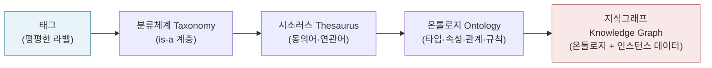
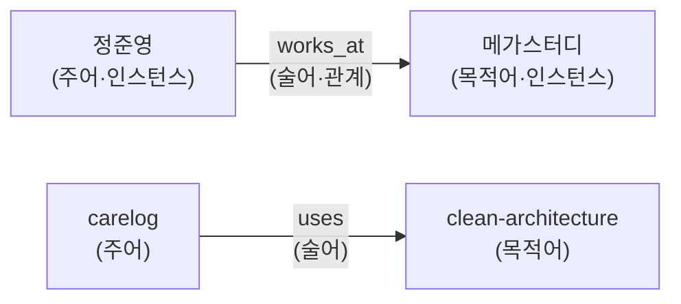
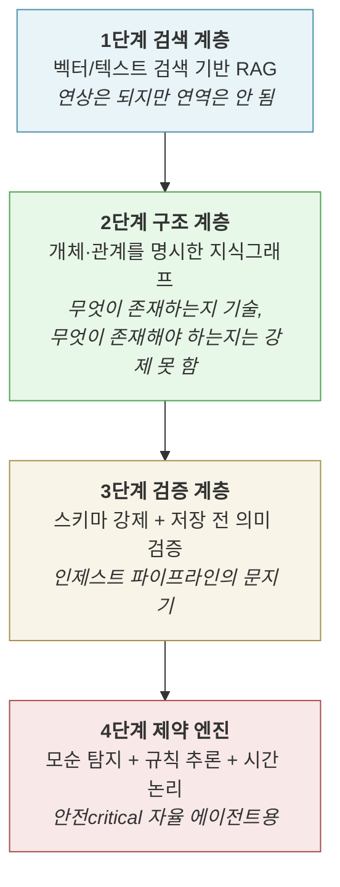

# 온톨로지 학습 가이드 — 개념부터 LLM 메모리 시스템까지

작성일: 2026-07-05
목적: synapse-memory를 온톨로지 관점에서 재검토하기 전에 필요한 배경 지식을 정리한 학습자료.
같이 읽기: [ontology-architecture-review-2026-07-07.md](ontology-architecture-review-2026-07-07.md) (사후 감사·개선안)

---

## 1. 온톨로지란 무엇인가

온톨로지(ontology)는 원래 "존재하는 것들에 대한 학문"이라는 철학 용어지만, 정보과학에서는
훨씬 실용적인 정의를 씁니다.

> **온톨로지 = 어떤 도메인에 대한 공유된 개념화(conceptualization)의 형식적이고 명시적인 명세(specification)**
> — Tom Gruber의 고전적 정의

풀어서 말하면 다음 세 가지를 **기계가 읽을 수 있는 형태로** 선언한 것입니다.

1. 이 도메인에는 **어떤 종류의 것들**(클래스/타입)이 존재하는가 — 예: 프로젝트, 회사, 사람, 개념
2. 그것들은 **어떤 속성**을 가지는가 — 예: 프로젝트는 시작일·기술스택·상태를 가진다
3. 그것들은 **서로 어떤 관계**를 맺을 수 있는가 — 예: 사람은 회사에 `works_at`, 프로젝트는 개념을 `uses`

핵심은 "형식적(formal)"과 "명시적(explicit)"입니다. 머릿속에만 있거나 프로즈 문서로만
존재하는 분류 기준은 온톨로지가 아닙니다. 코드나 데이터가 **검증하고 추론할 수 있는**
형태여야 온톨로지입니다.

---

## 2. 지식 조직의 스펙트럼: 태그에서 온톨로지까지

온톨로지를 이해하는 가장 좋은 방법은 "표현력의 사다리" 위에 놓고 보는 것입니다.
오른쪽으로 갈수록 표현력과 추론 능력이 커지지만, 구축·유지 비용도 커집니다.

| 단계 | 표현하는 것 | 예시 | 할 수 있는 질문 |
| --- | --- | --- | --- |
| **태그** | 소속(membership)만 | `#dom/ios`, `#type/ref` | "iOS 태그 붙은 노트 전부" |
| **분류체계(taxonomy)** | 상하위 계층(is-a) | 기술 > 모바일 > iOS > SwiftUI | "모바일 하위의 모든 것" |
| **시소러스** | 동의어, 연관어 | "iOS ≈ 아이폰 개발" | "유사 용어 포함 검색" |
| **온톨로지** | 타입 + 속성 + **관계의 의미** + 제약 | `Person —works_at→ Company` | "내가 일했던 회사에서 쓴 기술은?" |
| **지식그래프** | 온톨로지(스키마) + 실제 개체(인스턴스) | "정준영 —works_at→ 메가스터디" | 위 질문의 **실제 답** |

세 용어의 관계를 한 문장으로 정리하면:

> **분류체계와 온톨로지는 지식그래프를 조직하는 설계도이고, 지식그래프는 그 설계도 위에
> 실제 데이터(인스턴스)를 채운 구현체다.** ([Neo4j 정리](https://neo4j.com/blog/knowledge-graph/taxonomy-vs-ontology-vs-knowledge-graph/))

실무에서 중요한 조언 하나:

> "많은 지식그래프는 단순하게 시작하고, 형식적 의미론이나 상호운용성이 정말 필요해질 때
> 비로소 온톨로지를 추가한다." — Neo4j

즉 **온톨로지는 전부-아니면-전무가 아니라 점진적으로 추가하는 것**이 현대의 표준
접근입니다. 이 관점이 synapse-memory 검토의 출발점이 됩니다.

---

## 3. 온톨로지의 구성요소

형식 언어(OWL 등)와 무관하게, 모든 온톨로지는 아래 부품으로 이루어집니다.

### 3.1 트리플(triple) — 최소 단위

모든 지식은 **주어(subject) – 술어(predicate) – 목적어(object)** 3요소로 쪼갤 수 있습니다.

Obsidian의 `[[위키링크]]`와 결정적으로 다른 점이 여기 있습니다.
`[[clean-architecture]]`라는 링크는 "**무언가 관련 있다**"만 말할 뿐,
그 관계가 `uses`인지 `supersedes`인지 `contradicts`인지 말하지 않습니다.
**링크에 술어(관계 타입)를 붙이는 순간 태그/링크의 세계에서 온톨로지의 세계로 넘어갑니다.**

### 3.2 부품 목록

| 구성요소 | 뜻 | synapse-memory에서의 대응물 |
| --- | --- | --- |
| **클래스(Class)** | 개체의 종류/타입 | `VALID_TYPES = (project, company, person, concept, profile, insight)` |
| **인스턴스(Instance/Individual)** | 클래스에 속하는 실제 개체 | `Entities/Projects/carelog.md` 파일 하나 |
| **데이터 속성(Datatype Property)** | 개체가 가진 값 | frontmatter의 `status`, `updated`, `slug` |
| **객체 속성(Object Property) = 관계** | 개체 사이의 유형화된 연결 | **없음** — `related:`는 무유형 링크 |
| **계층(Hierarchy)** | 클래스 간 is-a 관계 | 없음 (타입이 평평함) |
| **공리/제약(Axiom/Constraint)** | 반드시 성립해야 하는 규칙 | 부분적 — lint의 백링크 상호성 정도 |
| **추론(Inference)** | 명시되지 않은 사실 도출 | 없음 (LLM의 암묵 추론에 의존) |

제약(constraint)의 예를 들면:

- **도메인/레인지 제약**: `works_at`의 주어는 반드시 `person`, 목적어는 반드시 `company`여야 한다.
- **카디널리티 제약**: 프로젝트의 `status`는 정확히 1개여야 한다.
- **값 제약**: `status`는 `active|stale|review` 중 하나여야 한다.

이런 제약이 있어야 "쓰기 시점에 잘못된 지식이 들어오는 것"을 기계가 막을 수 있습니다.

### 3.3 스키마와 온톨로지의 차이

"DB 스키마랑 뭐가 다르냐"는 질문이 자연스럽게 나옵니다. 실용적인 답:

- **DB 스키마**: 닫힌 세계. 정의 안 된 것은 저장 불가. 추론 없음.
- **온톨로지**: 열린 세계(open-world assumption). "아직 모르는 사실"과 "거짓인 사실"을
  구분하고, 명시된 공리로부터 새 사실을 추론할 수 있음.

개인 지식 도구 수준에서는 이 구분이 흐릿해도 됩니다. **"검증 가능한 타입·속성·관계 어휘"가
있으면 실용적 의미의 온톨로지**라고 봐도 무방합니다.

---

## 4. 표준 기술 스택 (알아만 두기)

시맨틱 웹 계열의 공식 표준들입니다. 개인 도구에 이걸 그대로 도입하는 경우는 드물지만,
용어가 자주 나오므로 지도를 그려둡니다.

| 표준 | 역할 | 한 줄 요약 |
| --- | --- | --- |
| **RDF** | 데이터 모델 | 모든 것을 트리플(주어-술어-목적어)로 표현하는 규격 |
| **RDFS** | 가벼운 스키마 | 클래스, 서브클래스, 도메인/레인지 정도의 어휘 |
| **OWL** | 본격 온톨로지 언어 | 논리 공리, 카디널리티, 추론 가능한 풍부한 표현 |
| **SKOS** | 분류체계용 경량 표준 | 태그/시소러스 수준을 표준화할 때 (broader/narrower/related) |
| **SPARQL** | 질의 언어 | 트리플 저장소에 대한 SQL 격 |
| **JSON-LD** | 직렬화 | JSON에 시맨틱 컨텍스트를 얹는 포맷. 웹 친화적 export에 적합 |

기억할 실무 감각 ([OWL/RDF/SKOS 비교](https://medium.com/@jaywang.recsys/ontology-taxonomy-and-graph-standards-owl-rdf-rdfs-skos-052db21a6027)):

- OWL은 **추론이 정말 필요할 때만**. 학습·유지 비용이 큽니다.
- 단순 계층·연관이면 SKOS 수준으로 충분합니다.
- 요즘 산업계 지식그래프(Neo4j 등)는 RDF 대신 **속성 그래프(property graph)** 모델을
  쓰는 경우가 많습니다 — 형식 추론은 포기하고 표현·질의 편의를 택한 절충안.

---

## 5. 온톨로지 설계 방법론

### 5.1 역량 질문(Competency Questions) — 가장 중요한 도구

온톨로지 설계의 표준 출발점은 클래스 다이어그램이 아니라 **"이 온톨로지가 답할 수 있어야
하는 질문 목록"** 입니다. 이를 역량 질문(CQ)이라 부릅니다.
([survey](https://link.springer.com/chapter/10.1007/978-3-031-47262-6_3))

synapse-memory에 적용해 보면 CQ는 이런 것들입니다.

- "내가 TCA를 왜 도입했지?" → `project —made_decision→ decision —about→ concept`
- "carelog에서 쓴 기술 중 다른 프로젝트에도 쓴 것은?" → `project —uses→ concept` 관계의 교집합
- "AI 코딩 도구에 대한 내 입장이 어떻게 변했지?" → 시간 축이 있는 `insight —about→ concept`
- "메가스터디 지원서에 쓸 수 있는 성과는?" → `person —worked_on→ project —achieved→ metric`

**CQ를 먼저 쓰면 온톨로지의 범위가 저절로 정해집니다.** 답할 필요 없는 질문을 위한
클래스·관계는 만들지 않는 것 — YAGNI의 온톨로지 버전입니다.

### 5.2 경량 방법론의 6단계

전통적 방법론(METHONTOLOGY 등)은 무겁습니다. 실무형 경량 방법론
([CACM](https://cacm.acm.org/research/a-lightweight-methodology-for-rapid-ontology-engineering/))의 골자:

1. 비공식 역량 질문 수집 (사용자 언어 그대로)
2. 기존 온톨로지 조사 — **재사용 우선** (예: 인물·조직이면 schema.org, POLE 모델)
3. 디자인 패턴으로 핵심 클래스·관계 스케치
4. 최소 형식화 (전체 OWL 말고, 필요한 만큼만)
5. CQ를 실제 질의로 변환해 검증
6. 사용하면서 반복 확장

### 5.3 자주 재사용되는 상위 온톨로지 예시

- **schema.org**: Person, Organization, CreativeWork 등 웹 표준 어휘
- **POLE**: Person, Object, Location, Event (+Organization) — 수사·정보분석 분야에서 온
  개체 분류로, 개인 비서 메모리에도 자주 차용됨
- **FOAF**: 사람·관계(knows) 중심의 고전 어휘
- **PROV-O**: 출처·유래(provenance) 표준 — synapse-memory의 `sources:` 필드가 하는 일의 표준판

---

## 6. LLM 시대의 온톨로지 — 왜 지금 다시 화두인가

RAG(벡터 검색)만으로는 부족하다는 인식이 2024–2026년 사이 빠르게 퍼졌습니다.
벡터 검색은 "비슷한 텍스트"를 찾을 뿐, **개체 사이의 관계를 따라가는 질문**
("A 프로젝트에서 내린 결정이 B 프로젝트에 어떤 영향을 줬지?")에 약하기 때문입니다.

### 6.1 대표 사례: GraphRAG와 Graphiti/Zep

**Microsoft GraphRAG**: 문서에서 LLM으로 개체·관계·커뮤니티를 추출해 그래프를 만들고,
질의 시 그래프 구조(커뮤니티 요약, 관계 경로)를 활용해 응답 품질을 올리는 접근.

**Zep/Graphiti** ([해설](https://medium.com/@saeedhajebi/building-ai-agents-with-knowledge-graph-memory-a-comprehensive-guide-to-graphiti-3b77e6084dec)):
AI 에이전트 장기기억 전용의 **시간적 지식그래프(temporal knowledge graph)** 엔진.
synapse-memory와 문제 설정이 거의 같아서 가장 중요한 비교 대상입니다.

- **에피소드(episode)** 단위 인제스트: 대화 1건 = 에피소드 1건 → LLM이 개체·관계 추출.
  (synapse-memory의 "doc 1건 = 대화 세션 1건 → wiki 통합"과 동형)
- **엣지에 사실+시간을 기록**: 관계마다 자연어 fact 설명, `valid_at`/`invalid_at` 타임스탬프,
  출처 에피소드 참조(provenance)를 부착.
- **바이템포럴(bi-temporal)**: "사실이 유효했던 시간"과 "시스템이 그 사실을 안 시간"을
  분리 기록 → 모순되는 새 정보가 오면 옛 엣지를 지우지 않고 **무효화(invalidate)** →
  "입장 변화" 추적이 가능해짐.
- **하이브리드 검색**: 임베딩 + BM25 + 그래프 순회를 결합, 검색 시 LLM 호출 없음
  (P95 300ms).
- 흥미로운 점: Graphiti는 **엄격한 온톨로지가 없습니다**. 개체 타입을 LLM이 문맥에서
  동적으로 정합니다. 대신 커스텀 개체 타입(경량 온톨로지)을 선택적으로 주입할 수 있게
  설계했습니다. — "스키마 없는 추출 + 선택적 온톨로지 가이드"라는 절충.

### 6.2 온톨로지 메모리 성숙도 모델

AI 메모리 시스템이 온톨로지를 흡수해 가는 단계를 4단계로 나눈 모델이 유용합니다
([Partenit 로드맵](https://partenit.io/ontological-memory-roadmap-from-knowledge-store-to-constraint-engine/)).

각 단계의 기술 스택과 한계:

| 단계 | 기술 | 얻는 것 | 한계 |
| --- | --- | --- | --- |
| 1. 검색 | 벡터 DB, 임베딩 | 기본 Q&A | 일관성 없음, 관계 질문 취약 |
| 2. 구조 | 지식그래프, 개체 추출 | 관계 탐색·다중 홉 질의 | 잘못된 지식 유입을 못 막음 |
| 3. 검증 | 스키마 강제, 제약 검사 | **데이터 품질 급상승** | 도메인 넘는 모순은 놓침 |
| 4. 제약 | 규칙 엔진, 시간 논리 | 능동적 모순 탐지 | 설계 비용 큼, 개인 도구엔 과함 |

**개인용 세컨드 브레인의 현실적 목표는 2.5~3단계**입니다. 4단계는 금융·의료급
자율 에이전트의 영역입니다.

### 6.3 LLM×온톨로지의 두 가지 결합 방식

1. **온톨로지 유도 추출(ontology-guided extraction)**: 정해진 타입·관계 어휘를 프롬프트
   스키마로 LLM에 주고, 그 어휘로만 추출하게 함 → 일관성↑, 놓치는 것↑
2. **스키마 자유 추출(schema-free) + 사후 정규화**: LLM이 자유롭게 추출 → 나중에
   중복·유사 관계를 병합 → 유연성↑, 품질 편차↑

synapse-memory의 현재 인제스트는 `INTEGRATION_SCHEMA`로 타입 6종을 강제하지만 관계는
자유(무유형)인 **혼합형**입니다.

---

## 7. 마크다운/Obsidian 환경의 경량 온톨로지

전용 그래프 DB 없이 마크다운 안에서 온톨로지를 흉내 내는 것이 이 프로젝트의 제약 조건입니다.

### 7.1 현실적인 표현 수단

| 온톨로지 요소 | 마크다운 구현 | 비고 |
| --- | --- | --- |
| 클래스 | frontmatter `type:` + 폴더 + 태그 | 이미 함 (`node/project` 등) |
| 인스턴스 | 노트 파일 1개 = 개체 1개 | 이미 함 ("entity note" 패턴) |
| 데이터 속성 | frontmatter 필드 | 이미 함 (`status`, `updated`) |
| **관계(객체 속성)** | frontmatter에 **관계명을 key로** 하는 링크 목록 `uses: ["[[tca]]"]`, `works_at: ["[[megastudy]]"]` | **미구현** — 현재는 무유형 `related:` |
| 제약/검증 | lint 도구가 frontmatter를 스키마 검사 | 부분 구현 (구조만, 값·관계는 없음) |
| 질의 | Dataview (frontmatter 필드 질의 가능) | 이미 함, 단 무유형이라 표현력 제한 |

Obsidian 커뮤니티도 같은 결론에 도달해 있습니다
([Pavlyshyn](https://volodymyrpavlyshyn.medium.com/personal-knowledge-graphs-in-obsidian-528a0f4584b9)):

> "Obsidian을 완전한 개인 지식그래프로 만들지 못하게 하는 단 하나의 빠진 기능이 **typed
> links** 다. 관계 자체에 메타데이터를 붙일 수 있어야 한다."

Dataview는 frontmatter의 링크 목록 필드를 그대로 질의할 수 있으므로
(`TABLE uses FROM "Entities/Projects" WHERE contains(uses, [[tca]])`),
**frontmatter 기반 typed relation은 추가 플러그인 없이도 Obsidian에서 동작**합니다.
이것이 마크다운-네이티브 온톨로지의 핵심 트릭입니다.

### 7.2 개인 지식 온톨로지에서 절대 하지 말 것

- 처음부터 수십 개 클래스·관계를 설계하는 것 — 실사용 데이터가 어휘를 정하게 할 것
- OWL/트리플스토어를 개인 도구에 도입하는 것 — 유지비가 효용을 압도
- 모든 링크에 타입을 강제하는 것 — 무유형 `related`는 "아직 분류 안 된 연관"으로 남겨두는
  것이 건강함 (open-world 정신)

---

## 8. 핵심 요약 — 이 프로젝트에 가져갈 문장들

1. **온톨로지는 스위치가 아니라 다이얼이다.** 태그 → 타입 → 속성 → 유형화된 관계 → 제약
   순으로 필요한 만큼만 올린다.
2. **CQ(역량 질문)가 설계의 출발점이다.** `/sm:ask`, `/sm:recall`, `/sm:resume`가 실제로
   받는 질문들이 곧 이 시스템의 CQ 목록이다.
3. **관계에 이름을 붙이는 것**이 태그·링크의 세계에서 온톨로지의 세계로 넘어가는 결정적
   한 걸음이다.
4. **시간성(temporality)이 세컨드 브레인의 차별점이다.** "입장 변화 회상"이라는 이
   프로젝트의 핵심 약속은 bi-temporal 모델(사실의 유효 시간 vs 기록 시간)의 경량판을
   요구한다.
5. **검증 계층(3단계)이 개인 도구의 스위트스팟이다.** 잘못된 지식이 조용히 쌓이는 것을
   쓰기 시점에 막는 것이, 나중에 추론 엔진을 얹는 것보다 훨씬 값싸고 효과적이다.
6. **Graphiti도 엄격한 온톨로지 없이 시작했다.** LLM 추출의 유연함을 죽이지 않는 "선택적
   온톨로지 가이드" 절충이 현재 업계의 수렴점이다.

---

## 9. 용어집

| 용어 | 뜻 |
| --- | --- |
| 온톨로지 | 도메인의 타입·속성·관계·규칙에 대한 기계가독 명세 |
| 택소노미(분류체계) | is-a 계층 구조만 있는 분류 |
| 지식그래프(KG) | 온톨로지(스키마) + 인스턴스 데이터의 그래프 |
| 트리플 | 주어-술어-목적어 형태의 최소 지식 단위 |
| 클래스 / 인스턴스 | 개체의 종류 / 그 종류에 속하는 실제 개체 |
| 객체 속성(object property) | 개체↔개체를 잇는 유형화된 관계 (typed link) |
| 도메인/레인지 | 관계의 주어/목적어에 허용되는 클래스 제약 |
| 공리(axiom) | 항상 성립해야 하는 논리 규칙 |
| 역량 질문(CQ) | 온톨로지가 답할 수 있어야 하는 질문 — 설계 요구사항 |
| 개체 해소(entity resolution) | 같은 대상을 가리키는 중복 개체를 하나로 병합 |
| provenance(출처성) | 각 사실이 어디서 왔는지의 기록 |
| bi-temporal | 사실의 유효 시간과 시스템 기록 시간을 분리 관리 |
| open-world assumption | "명시 안 된 것 = 거짓"이 아니라 "모름"으로 취급 |

---

## Sources

- [Neo4j — Taxonomy vs. Ontology vs. Knowledge Graph](https://neo4j.com/blog/knowledge-graph/taxonomy-vs-ontology-vs-knowledge-graph/)
- [Hedden — Ontologies vs. Knowledge Graphs](https://www.hedden-information.com/ontologies-vs-knowledge-graphs/)
- [Jay Wang — OWL, RDF, RDFS, SKOS 표준 비교](https://medium.com/@jaywang.recsys/ontology-taxonomy-and-graph-standards-owl-rdf-rdfs-skos-052db21a6027)
- [PuppyGraph — Knowledge Graph vs Ontology](https://www.puppygraph.com/blog/knowledge-graph-vs-ontology)
- [Use of Competency Questions in Ontology Engineering: A Survey](https://link.springer.com/chapter/10.1007/978-3-031-47262-6_3)
- [CACM — A Lightweight Methodology for Rapid Ontology Engineering](https://cacm.acm.org/research/a-lightweight-methodology-for-rapid-ontology-engineering/)
- [Graphiti 아키텍처 가이드](https://medium.com/@saeedhajebi/building-ai-agents-with-knowledge-graph-memory-a-comprehensive-guide-to-graphiti-3b77e6084dec)
- [Partenit — Ontological Memory Roadmap: Knowledge Store → Constraint Engine](https://partenit.io/ontological-memory-roadmap-from-knowledge-store-to-constraint-engine/)
- [Zylos — AI Agent Memory Architectures (Zep/Graphiti 벤치마크 포함)](https://zylos.ai/research/2026-04-05-ai-agent-memory-architectures-persistent-knowledge/)
- [Pavlyshyn — Personal Knowledge Graphs in Obsidian](https://volodymyrpavlyshyn.medium.com/personal-knowledge-graphs-in-obsidian-528a0f4584b9)
- [decodingai — Neo4j 기반 에이전트 메모리 (POLE 온톨로지)](https://www.decodingai.com/p/understanding-neo4j-graph-agent-memory-system)
