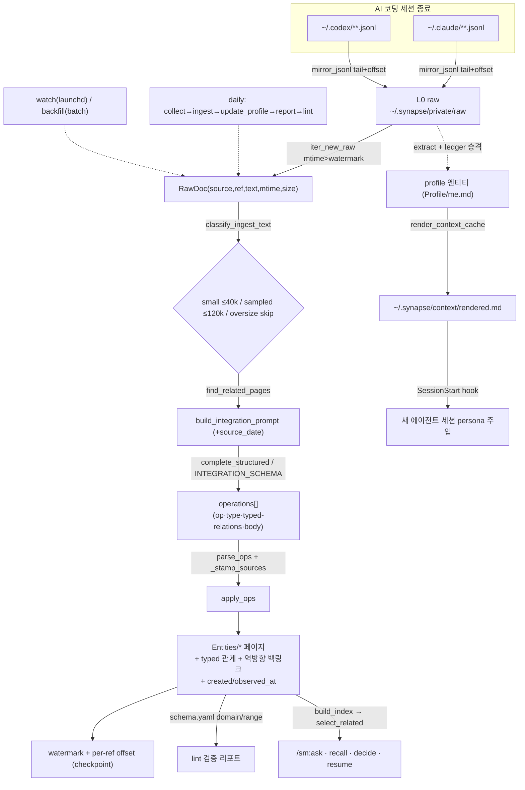

# synapse-memory 리디자인 — 아키텍처·동작원리·예상 아웃풋

작성일: 2026-07-06
대상 독자: 프로젝트 소유자(정준영) — 리디자인 후 시스템이 **무엇이 되고, 어떻게 동작하고,
무엇을 내놓는지** 이해하기 위한 설명 문서.
같이 읽기: `plans/synapse-structural-redesign.md`(실행 blueprint 14단계),
`docs/ontology-architecture-review-2026-07-05.md`(개정판 — Obsidian UI 죽음 전제).

> 이 문서의 코드/YAML/출력 예시는 **실제 현재 코드에 근거**해 구성했습니다. slug(예: `synapse-memory`,
> `megastudy`)는 예시용이지만, frontmatter 키·CLI 출력 헤더·프롬프트 형태는 실제 코드에서 뽑은
> 것입니다. 아직 존재하지 않는 것(schema.yaml, typed relations, 시간성)은 "리디자인 후" 목표입니다.

---

## 0. 한눈에

지금 synapse-memory는 같은 일을 하는 부품이 **2벌씩** 있습니다. 리디자인은 이걸 **1벌로 합치고**,
한 번도 안 쓴 죽은 기능을 **지우고**, 4030줄짜리 `cli.py` 괴물을 **쪼갭니다.**

| | 지금 (2벌) | 리디자인 후 (1벌) |
| --- | --- | --- |
| 지식 모델 | v1 Cards(typed 필드 有) + v2 Wiki(typed 필드 無) | **단일 Entity 모델** + `schema.yaml` |
| frontmatter 직렬화기 | 4곳 중복(`page.py` + card 3개) | **1벌**(`model/`) |
| 인제스트 파이프라인 | daily=v1 카드 빌드 / wiki=별도 watch | **단일 파이프라인**(collect→ingest→lint) |
| 관계 | 무유형 `related: [[slug]]` 나열 | **타입 있는 관계** 6종(uses/part_of/about/…) |
| 시간성 | `updated` 하나 | `created`·`observed_at`·`supersedes` 체인 |
| 검색 인덱스 | v1 `card_index` + v2 `page_index` | **단일 EntityIndex** → 하나의 `select_related` |
| lint | 백링크 수선 + Obsidian 검토큐(`index.md`) | **schema.yaml 검증 계층**(터미널 리포트) |
| Obsidian UI | MOC·Dataview·Graph·node태그 (죽음) | **삭제** |
| cli | `cli.py` 4030줄 god-file | `cli/` 패키지(명령별 모듈) |

**핵심 통찰 하나**: 검색기(`select_related`)는 이미 v1·v2 공용입니다. 이게 통합의 이음새 —
모델만 하나로 합치면 나머지가 따라옵니다.

---

## 1. 아키텍처 (리디자인 후 모듈 지도)

```
src/synapse_memory/
├── model/            ★신설  단일 Entity + parse/serialize 1벌 (v1 카드 3개 + WikiPage 흡수)
├── schema.yaml       ★신설  타입·필드·관계의 단일 원본(SSoT). 모델·lint·인제스트가 모두 이것만 읽음
├── retrieval/        ★승격  select_related + EntityIndex (wiki 밖으로 — v1·v2 공용이었음)
├── vault.py(or config) ★  vault 경로 해소 SSoT (지금 5+경로 → 1개)
├── collectors/       축소   claude-code·codex jsonl-tail만 (죽은 콜렉터 5개 삭제)
├── ingest/           분해   RawDoc → LLM 통합 → Entity 페이지 (ingest.py 5책임 분리)
├── llm/              축소   provider 어댑터 통합(claude/codex 중복 제거)
├── recipes/          유지   ask/recall/resume/decide를 markdown 레시피로 (ask도 레시피화)
├── recall/timeline.py ★신설 결정론적 시간 질의(persona에서 추출)
├── profile/          이관   flat Profile.md → profile 타입 Entity 페이지 emit
├── cli/              ★분해  명령별 모듈(doctor/daily/ingest/ask/persona/…) + register()
├── daily.py          단순   단일 파이프라인 오케스트레이션
├── cost/·hooks/·folders/·storage/l0.py   유지  (관측·훅·경로 인프라)
└── (삭제) moc/ · redaction/ · eval/ · rag/ · installer/ · wiki/index_md.py · wiki/schema.py
```

죽는 것: `moc/`(Obsidian 뷰), `redaction/`·`eval/`·`rag/`(빈 껍데기), `installer/`(고아),
`wiki/index_md.py`·`wiki/schema.py`(수기편집 표면), 콜렉터 5개(cursor/continue/aider/day_one/gmail —
L0에 미러하지만 소비자 0), feedback 적용 루프.

---

## 2. 핵심 — 단일 Entity 모델 + schema.yaml

### 왜 통합인가

지금 지식이 두 세계로 갈라져 있습니다.

- **v1 Card**: `ProjectCard`/`CompanyCard`/`InsightCard` — 이력서·타임라인이 실제로 쓰는
  **typed 필드**가 풍부(회사 `positions`·`resume_language`, 프로젝트 `metrics`·`period_*`·`stack`).
- **v2 WikiPage**: 단일 dataclass, 6타입, **typed 필드 0개**, 관계는 무유형 `related` 나열.

문제: v2로 그냥 합치면 v1의 typed 필드가 **전부 증발**합니다(이력서가 망가짐). 그래서 통합
모델은 v1의 typed 필드를 `attrs`로 흡수하고, 스키마를 `schema.yaml` 한 곳에서 선언합니다.

### schema.yaml — 단일 원본

타입·폴더·필드(enum)·관계(domain/range)를 한 파일에. `model`(파싱), `lint`(검증), `ingest`
(LLM 스키마)가 **모두 이 파일만** 읽습니다. 지금은 이 규칙이 코드 상수·`SCHEMA.md` 프로즈·
`MOC.md` Dataview 셋으로 갈라져 서로 어긋나 있습니다(그 drift를 구조적으로 차단).

```yaml
version: 1

common:                                    # 모든 타입 공통 frontmatter
  required: [type, slug, title, status]     # slug == 파일명 stem
  fields:
    created:  {type: date}                   # ★유효시각 시작 (신규)
    updated:  {type: date}                   # 파일 최종 수정
    sources:  {type: list[string]}           # "kind:ref" — codex:/claude-code:/git:

types:
  project:
    folder: Entities/Projects
    status: [active, archived, superseded]
    attrs:                                   # ← v1 ProjectCard typed 필드 보존
      role: {type: string, nullable: true}
      period_start: {type: string, nullable: true}   # 'YYYY-MM'
      period_end:   {type: string, nullable: true}
      domains: {type: list[string]}
      stack:   {type: list[string]}
      metrics:                               # v1 ProjectMetric
        type: list[object]
        item: {name: string, before: string?, after: string?, value: string?}
  company:
    folder: Entities/Companies
    status: [target, applied, interviewing, offered, rejected, hired]   # v1 상태 어휘 유지
    attrs:
      country: {type: string, nullable: true}
      size:    {type: enum, values: [startup, small, medium, large, mega]}
      resume_language: {type: enum, values: [ko, en], nullable: true}    # 이력서 언어 우선순위
      positions:                             # v1 JobPosition
        type: list[object]
        item: {title: string, seniority: string?, keywords: list[string]?, jd_url: string?}
  concept:   {folder: Entities/Concepts, status: [active, archived, superseded]}   # ← v1 domain 흡수
  insight:   {folder: Insights, dated: true, status: [active, superseded]}
  log:       {folder: Entities/Logs, dated: true, status: [active, superseded]}    # ★신설(활동기록)
  profile:   {folder: Profile, status: [active, superseded]}                       # ★실제 emit 시작
  # person 제거 — 인스턴스 0 (YAGNI)

relations:                                   # 타입 있는 관계 — frontmatter 최상위 key
  uses:       {domain: [project],              range: [concept]}
  part_of:    {domain: [project, log, insight], range: [project, company]}
  about:      {domain: [insight, log],          range: [project, company, concept]}
  decided_in: {domain: [insight],               range: [log, project]}
  supersedes: {domain: "*", range: same_type}  # 입장 변화 체인
  same_as:    {domain: "*", range: same_type}  # 병합 대기 중복 표시
```

타입은 6종: `project · company · concept · insight · log · profile`.
지금 대비 **`log` 신설**(활동로그를 insight에서 분리), **`person` 제거**(인스턴스 0),
**`concept`가 v1 domain 흡수**, **`profile` 실제 emit 시작**.

### Entity 페이지 — 실제 파일 모습

무유형 `related` 대신 **타입 있는 관계가 최상위 key**로 붙습니다. `node/*` 태그는 사라집니다.
typed 필드는 `attrs:` 아래.

```markdown
---
type: project
slug: math-heart-ios-modernization
title: 매쓰하트 iOS 아키텍처 현대화
status: active
created: '2026-05-19'
updated: '2026-07-02'
uses:                          # project → concept (관계에 이름이 붙음)
- '[[swiftui]]'
- '[[the-composable-architecture]]'
part_of:                       # project → company
- '[[megastudy]]'
sources:
- codex:sessions/2026/07/02/rollout-2026-07-02T12-08-00-019f20cc.jsonl
- git:math-heart-ios:3ac2a12
attrs:                         # v1 typed 필드 보존 — 이력서/타임라인이 소비
  role: iOS 개발자
  period_start: '2026-01'
  domains: [교육, 모바일]
  stack: [Swift, SwiftUI, TCA, Tuist]
  metrics:
  - {name: 앱 콜드스타트, before: 2.1s, after: 1.3s}
  - {name: 모듈 빌드시간, value: -38%}
---

## 개요
레거시 UIKit MVC 화면을 SwiftUI + TCA로 점진 이관하고 Tuist로 모듈 경계를 재정의.
```

### 시간성 — `/sm:recall` "입장 변화"의 데이터 기반

지금 recall은 LLM에게 "처음엔 X, 나중엔 Y라고 말해줘"라고 시킬 뿐 **뒷받침 데이터가 없습니다**
(`supersedes`도 `observed_at`도 없음). 리디자인은 `created`/`observed_at`/`supersedes` 체인을
넣어, 입장이 바뀌면 옛 페이지를 **삭제하지 않고** `status: superseded`로 무효화하고 새 페이지가
이를 가리킵니다. 옛 입장은 현재형 답변엔 안 섞이지만 recall이 체인으로 되살립니다.

```markdown
# 옛 입장 (무효화됨)
--- Insights/2026/06/2026-06-14-dual-model-ok.md ---
type: insight
status: superseded            # ← 무효화
observed_at: '2026-06-14'
## 입장
v1 Card와 v2 Wiki 이중 모델을 유지하는 게 낫다.

# 현재 입장 (위를 대체)
--- Insights/2026/07/2026-07-06-single-model.md ---
type: insight
status: active
observed_at: '2026-07-06'
supersedes:                   # ← 새 페이지가 옛 페이지를 가리킴
- '[[2026-06-14-dual-model-ok]]'
## 입장
이중 모델은 인제스트·retriever·serializer가 전부 2벌이 된다. 단일 Entity로 통합한다.
```

---

## 3. 동작원리 — raw 세션 로그가 답변이 되기까지

리디자인 후에는 **하나의 세션이 하나의 파이프라인**을 흐릅니다. 지금은 daily가 v1 카드를 빌드하고
(classify→generate), v2 wiki 인제스트는 별도 watch로 도는 **두 갈래**입니다. 통합 후 daily·watch·
backfill은 전부 같은 `ingest_source → apply_ops`를 부르는 **드라이버 3개**일 뿐입니다.



단계별로 하나의 세션을 따라가면:

**① collect — 로그를 L0로 미러(byte-faithful).**
세션이 끝나면 `collect_claude_code`가 `~/.claude/projects/<slug>/<id>.jsonl`을 tail해서
`~/.synapse/private/raw/claude-code/...`로 새 바이트만 append합니다. 파싱하지 않고 바이트 그대로
복사(offset 원자적 기록, 회전 안전). codex도 동일(`mirror_jsonl` 공유).
```
collect_claude_code: scanned=41 mirrored=1 bytes+=18734 truncations=0 errors=0
```

**② RawDoc — 새 파일만 골라 읽기.**
`iter_new_raw`가 마이크로초 watermark보다 새 파일을, byte offset부터 tail로 읽어 텍스트 추출
(claude-code·codex 추출기 다름). jsonl 1파일 = 세션 1건 = `RawDoc` 1건.
```
RawDoc(source="claude-code", ref="claude-code:projects/synapse-memory/sess-a1b2.jsonl",
       text="schema.yaml 검증 계층으로 lint을 재작성하자\n\nlint을 schema.yaml 주도 검증기로...",
       mtime_iso="2026-07-06T14:22:07.913004", byte_size=18734)
```

**③ 비용 라우팅.** `classify_ingest_text` → 문서 길이로 분기: small(≤40k자, 1~2 LLM콜) /
sampled(≤120k, 앞6k+핵심8k+뒤6k 요약 1콜) / oversize(>120k, **건너뜀** 0콜 — 단 watermark는
전진시켜 backfill이 막히지 않음).

**④ 통합(integrate-not-index).** 관련 기존 페이지를 찾아 프롬프트에 넣고, provider에게
"새 내용을 wiki에 통합하는 operations를 반환하라"고 시킵니다. 핵심 규칙: **가급적 기존 페이지를
`update`, 진짜 새 개체만 `create`.** (인덱싱이 아니라 통합이라 페이지가 무한 증식하지 않음.)
리디자인 후 스키마가 typed 관계·`log`·`observed_at`을 받도록 커집니다:
```json
{"operations": [
  {"op":"create","type":"log","slug":"2026-07-06-lint-schema-validation",
   "title":"lint을 schema.yaml 검증 계층으로 재작성","observed_at":"2026-07-06",
   "part_of":["[[synapse-memory]]"],"about":["[[schema-validation]]"],
   "body":"## 결정\nlint을 schema.yaml 주도 검증기로 전환. domain/range 위반을 리포트."},
  {"op":"update","type":"project","slug":"synapse-memory","title":"Synapse Memory",
   "about":["[[schema-validation]]"],"body":"..."}
]}
```

**⑤ apply — 디스크에 쓰고 역방향 백링크.** `apply_ops`가 페이지를 저장하고, 관계의 반대 방향
엣지를 대상 페이지에 자동 추가(schema.yaml의 domain/range로 역방향 결정). op=update면 기존
관계·sources와 병합. 결과 파일:
```markdown
--- Entities/Logs/2026/07/2026-07-06-lint-schema-validation.md ---
type: log
slug: 2026-07-06-lint-schema-validation
title: lint을 schema.yaml 검증 계층으로 재작성
part_of: ['[[synapse-memory]]']
about: ['[[schema-validation]]']
sources: [claude-code:projects/synapse-memory/sess-a1b2.jsonl]
created: 2026-07-06
observed_at: 2026-07-06
updated: 2026-07-06
status: active
---
## 결정
lint을 schema.yaml 주도 검증기로 전환. domain/range 위반을 리포트.
```

**⑥ 즉시 검색 가능(인덱스 빌드 없음).** 벡터 임베딩이 없으므로(spec 020에서 제거) 별도 인덱싱
단계가 없습니다. `save_page` 직후 바로 검색 대상 — 조회 때마다 페이지 인덱스를 즉석에서 만들고
provider를 리트리버로 씁니다.

---

## 4. 예상 아웃풋 — 4개 명령이 내놓는 것

네 명령 모두 **같은 검색 경로**를 씁니다: `질의 → 단일 EntityIndex → select_related(LLM 사서가
관련 slug 선별) → 엔티티 로드 → LLM 답변 → 출처 인용`. 리디자인은 v1/v2 두 인덱스를 하나로
합치고, persona의 **이중 검색을 제거**(지금 decide/recall은 select_related를 2번 호출)합니다.

### `sm ask` — 근거 인용 답변
```
질문: synapse-memory 인제스트가 왜 2벌이야?

인제스트가 2벌인 건 지식모델이 v1 Cards와 v2 Wiki로 병존했기 때문입니다 [[synapse-memory]].
v1은 cluster→classify→generate로 카드를 빌드하고, v2는 per-doc ingest가 따로 돌았습니다
[[ingest-pipeline]]. 리디자인에서 단일 파이프라인(collect→ingest→lint)으로 합쳐집니다.

============================================================
출처 (3):
  project   synapse-memory   — Synapse Memory
  concept   ingest-pipeline  — 인제스트 파이프라인
  log       2026-07-06-...   — 구조 리디자인 결정
```
변화: 답변 내 인용이 `[[slug]]`로 통일(지금 ask만 `[card_id]`로 불일치). 출처 열에 통합 타입 표시.

### `sm recall` — 입장 변화 (★신규 역량)
지금은 LLM 서술뿐이지만, `supersedes` 체인 + `observed_at`이 생기면 **실제 데이터로** 변화를
추적합니다. `recall/timeline.py`가 체인을 렌더, 레시피가 서술.
```
주제: 온톨로지 통합 입장 변화

입장이 두 번 바뀌었습니다. 처음엔 점진 마이그레이션을 고수했지만(2026-06), 개발단계라
재인제스트 비용이 낮다고 판단해 big-bang 통합으로 선회했습니다(2026-07) [[ontology-unification]].

## 입장 변화 체인 (supersedes, observed_at 순)
1. 2026-06-18 · [[ontology-migrate-gradual]]   (superseded)
   > "소급 마이그레이션 없이 v1/v2를 점진 수렴, 기존 페이지 보존"
2. 2026-07-06 · [[ontology-unification]]        (current)
   > "big-bang 통합 + L0 raw 1회 재인제스트, 하위호환 불요"
```

### `sm resume megastudy` — 이력서 (positions·metrics·period_* 소비)
```
✓ 이력서 생성: ~/vault/30_Creative/Drafts/Resume - Megastudy (2026-07).md
  매칭 ProjectCard (3):
    - synapse-memory
    - team-synapse
```
저장 파일:
```markdown
---
title: Megastudy 지원 이력서
company_id: megastudy
language: 한국어                         # ← company 엔티티의 resume_language
based_on: [project:synapse-memory, project:team-synapse]
---
## 프로젝트 상세
### Synapse Memory — 로컬 세컨드 브레인  [[synapse-memory]]
- 역할: 단독 설계·구현 / 기간: 2026-05 ~ 2026-07     # ← period_start/period_end
- 영향: 인제스트 2벌 → 1벌, cli.py 4030L → 패키지 분해  # ← metrics(before→after)
- 기술 스택: Python, PyYAML, Claude/Codex CLI          # ← stack
```
`language`는 회사 엔티티의 `resume_language`, `기간`은 `period_*`, `영향`은 `metrics`에서 옵니다 —
이게 v2로 순진하게 합치면 사라지는, 반드시 보존해야 할 typed 필드입니다.

### `sm decide` — 결정 패턴 기반 판단
```
상황: codex vs claude를 기본 provider로?
(Profile/Patterns 사용 ✓)

1. 추천: Codex를 기본, Claude를 fallback으로.
2. 근거:
   - "비용 대비 커버리지"를 반복 우선해온 패턴 [[decision-cost-first]]
   - config 기본값이 이미 codex이고 relevance는 싼 티어를 쓰는 패턴 [[profile]]
3. 대안: auto(런타임 감지) — 유연하나 관측/디버깅 어려움 (트레이드오프)
4. 추가 고려: structured-output 품질이 필요한 recipe는 per-recipe override

============================================================
참고 Card (2):
  - decision-cost-first
  - synapse-memory
```
변화: Profile이 flat 파일이 아니라 `profile` 타입 엔티티(`[[profile]]`). 관련 자료 0건이면 여전히
**거부**("generic 추천 위장 방지"). 이중 검색 제거로 `generate()`가 단일 검색을 소유.

---

## 5. 검증 계층 — lint이 schema.yaml을 강제

지금 lint은 백링크 수선 + Obsidian용 검토큐(`index.md`)입니다. 리디자인 후 lint은 **schema.yaml
기반 검증기**가 됩니다 — 잘못된 지식이 쓰기 시점에 조용히 쌓이는 걸 막습니다(온톨로지 성숙도
3단계). 리포트는 터미널/plain md(Obsidian 아님).

검사: ① 필수 필드·값 enum, ② type↔폴더 일치, ③ slug=파일명, ④ **관계 domain/range**
(예: `uses`의 range=concept인데 `uses: [[megastudy]]`(company)면 위반), ⑤ index 신선도.
```
lint (schema.yaml): 142 pages checked
  ok: type↔folder 142/142 · slug=filename 142/142
  VIOLATION relation domain/range:
    Entities/Projects/synapse-memory.md: uses → [[obsidian]] range=project (expected concept)
  1 violation, 0 missing-required, index fresh
```

---

## 6. 부가 흐름 — profile → persona 주입

같은 L0 raw가 profile 파이프라인도 먹입니다. `extract`가 사실/결정패턴을 뽑고, ledger가 여러 날
반복 검증(3회/14일 창, 확신 0.90 fast-path)해 승격, dedupe/dismissed 통과분이 **`profile` 타입
엔티티**로 emit됩니다(지금은 flat `Profile.md`/`DecisionPatterns.md` — 폐기). 그 다음:

```
profile 엔티티(Profile/me.md)
  → render_context_cache → ~/.synapse/context/rendered.md (≤2KB)
  → SessionStart hook(stdlib-only, 실패해도 세션 안 막음)
  → 새 에이전트 세션에 persona 주입:

    ## Second Brain (Synapse Memory)
    ### Quick reference
    **Facts**
    - 단계별 의사코드 후 코드 작성
    - 성능보다 가독성 우선
    **Decision patterns**
    - 새 기능 요청 → planner로 plan 먼저
```

즉 당신의 축적된 사실·결정패턴이 다음 AI 세션에 자동으로 주입돼, 도구가 당신처럼 판단하도록
만드는 게 최종 목적입니다.

---

## 7. 요약 — 무엇이 좋아지나

- **모델 1벌**: 타입·직렬화·검색·vault경로·provider해소가 각각 단일 원본(SSoT). 4벌 중복 소멸.
- **파이프라인 1벌**: daily·watch·backfill이 같은 `ingest_source`의 드라이버. 두 갈래 → 한 갈래.
- **온톨로지 성숙**: 무유형 링크 → 타입 있는 관계, `updated` 하나 → 시간성 체인, 프로즈 스키마 →
  기계 검증(schema.yaml + lint). 이게 `/sm:recall` "입장 변화"를 진짜 역량으로 만듭니다.
- **표면 축소**: 죽은 Obsidian UI·고아 코드·콜렉터 5개·god-file 제거 → 유지비 급감.
- **정체성 유지**: 저장은 여전히 git-diff 가능한 마크다운. 바뀌는 건 내부 구조지 저장 포맷이 아님.
