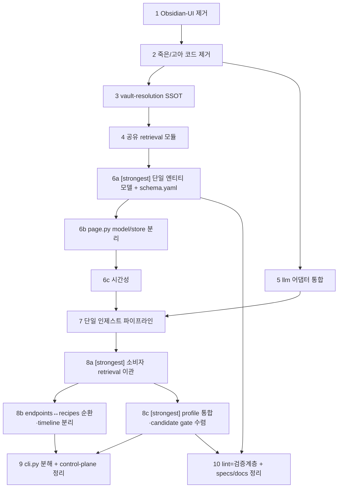

# Blueprint — synapse-memory 구조 리디자인

## 배경

리서치 8-서브시스템 실사 + 온톨로지 리뷰(개정판)가 가리키는 근본 문제 3가지:

1. **지식모델이 2벌 병존.** v1 `cards/`(ProjectCard/CompanyCard/InsightCard — 풍부한 typed
   필드 + `clusters/identify.py` cwd 기반 그룹핑 + 분류 게이트)와 v2 `wiki/`(단일 `WikiPage`
   frozen dataclass, 6 타입, typed 필드 **0개**, per-doc 스트리밍 인제스트). **같은 caller**
   (cli.py·daily.py·endpoints/ask·endpoints/persona·recipes/pipeline)가 둘 다 임포트한다.
   `wiki/llm_retrieval.select_related`가 v1·v2 공용 리트리버 — 통합의 이음새.
   daily.py는 v1 Cards만 빌드(classify+generate)하고 v2 wiki 인제스트는 별도
   ingest/backfill/watch 경로로 돈다 → **인제스트 파이프라인도 2벌**.
2. **죽은 표면이 코드의 상당 부분.** Obsidian-UI(moc/·index_md·node/* 태그·Dataview
   doctor·SCHEMA.md·lint 검토큐·spec 015)는 한 번도 안 쓰였고, redaction/·eval/·rag/·
   llm/credentials·installer/·콜렉터 5개(cursor/continue/aider/day_one/gmail — L0에 미러하지만
   소비자 0)·feedback 적용 루프가 전부 죽어 있다.
3. **god-file + 광범위 중복.** cli.py 4030L(파서+50 핸들러+비즈니스로직 인라인), ingest.py
   (책임 5개), page.py(모델+직렬화+저장IO+링크그래프). vault-resolution 5+경로, frontmatter
   parse/serialize ×4, retriever glue ×2, `_all_pages` ×2, provider-resolution ×2,
   `_format_bytes` ×2(단위 KiB vs KB 불일치).

**전략: 빼기 → 다지기 → 통합 → 분해.** 개발단계라 파괴적 변경이 허용되므로, 온톨로지
리뷰의 "소급 마이그레이션 안 함·점진" 신중론 대신 **big-bang 통합 + 1회 재인제스트**로 간다.
기존 vault 페이지는 폐기하고 L0 raw에서 새 모델로 다시 만든다.

## 의존 그래프

- **직렬 필수**: 6a→6b→6c→7→8a→{8b,8c}→9 (모델→저장분리→시간성→인제스트→소비자), 1→2 (둘 다 cli.py/daily.py/cards 편집).
- **병렬 가능**: {3, 5} 동시(3=cli/config/collectors, 5=llm/* — 무충돌), {8b, 8c} 동시(8a 후), {9, 10} 동시(충돌 시 9 먼저).
- **최대 레버리지**: Step 6a(통합의 축) + Step 1·2(표면 대폭 축소로 이후 스텝 비용↓).
- **주의(M3)**: 6a는 llm(Step 5)에 의존하지 않음 — 모델이 `complete()`를 호출 안 함. llm 통합은 인제스트(Step 7)가 소비하므로 5→7 엣지만 둔다.

## model tier

- **strongest(Opus급)**: Step 6a(모델·스키마 설계 — 리디자인의 크럭스), Step 8a·8c(소비자 이관 — 회귀 위험 큼).
- **default**: Step 1·2(기계적 삭제), 3·4·5·6b·6c·7·8b·9·10(구조 편집).

## rollback

전부 `main`에서 스텝별 `feat/redesign-NN-*` 브랜치 → 커밋 → PR. 각 스텝은 독립 배포·revert
가능하도록 배열. 데이터: 개발단계라 vault 백업 후 폐기·재인제스트가 기본. 각 삭제 스텝 전
`git rm` 대상 목록을 커밋 메시지에 남겨 복원 지점 확보.

## 완료 판정(전역 불변식 — 매 스텝 후 검증)

- `synapse-memory --help` 정상, `python -c "import synapse_memory.cli"` 오류 없음.
- `pytest -q` 통과(삭제 스텝은 해당 테스트도 함께 삭제 후 green).
- `ruff check src tests` + `mypy src` 통과.
- 삭제한 심볼/모듈에 대한 잔존 임포트 grep = 0.

---

## Step 1 — [default] Obsidian-UI 표면 제거

**Context brief**: Obsidian Graph/Dataview/수기편집은 죽은 기능(온톨로지 리뷰 개정판 전제).
라이브 조회 경로(`wiki/llm_retrieval.select_related`)는 이 표면을 한 줄도 안 읽는다. spec
015-graph-viz가 통째로 이 표면을 겨냥한다. 삭제 대상은 UI지 저장 포맷(마크다운)이 아니다.

**Tasks**
1. 모듈 삭제: `src/synapse_memory/moc/` 전체, `src/synapse_memory/wiki/index_md.py`.
2. cli.py: `cmd_moc`(~2534), `p_moc` 파서(~3220-3229), Dataview doctor 블록(~408-424) 제거.
3. `doctor.py`: `diagnose_dataview_plugin`(170-225) + 호출부 제거.
4. `wiki/lint.py`: 검토큐 절반 제거 — `find_orphans`/`stale_candidates`/`merge_candidates`
   + `write_index` 호출(~249) 삭제. `apply_structural_fixes`(dead-link/backlink)만 남기되,
   backlink이 그래프 전용이면 Step 6에서 재평가하도록 `# redesign: Step 6 재검토` 주석.
5. node/* 프런트매터 태그 write 제거: `wiki/page.py:82`(`tags:['node/wiki',...]`),
   `cards/project.py:139`·`cards/company.py:107`(`node/card`), `cards/insight.py:163`
   (`node/insight`), `daily.py:809-810`(`node/daily-report`). (cards 태그는 Step 6·8에서
   모듈째 사라지지만, 이 스텝에서 태그 emission만 먼저 죽여 그래프 잔재 제거.)
6. `wiki/schema.py`(SCHEMA.md writer) 제거 — 수기편집 계약은 죽었고 내용은
   `wiki/integration.py:INTEGRATION_SYSTEM`과 중복. `ingest.py`의 `ensure_schema` import(:28)와
   호출(:219) 제거.
7. **[C1 필수] `wiki/__init__.py` barrel 갱신** — 이걸 빼면 첫 스텝에서 빌드가 깨진다.
   `index_md`(lines 6-12) import 블록 삭제, `schema`(lines 47-52) import 블록 삭제, lint에서
   제거한 이름(`find_orphans`/`merge_candidates`/`stale_candidates` + `index_md_path`/
   `render_index`/`write_index`/`SCHEMA_FILENAME`/`ensure_schema`/`schema_path`/`write_schema`)을
   import문·`__all__`에서 제거. (grep 확인: wiki 밖에서 이 barrel 이름들을 쓰는 모듈 없음 —
   수정은 `__init__.py`에 self-contained.)
8. 테스트 삭제/정리: `tests/test_moc_generator.py`, `tests/test_node_tags.py`,
   `tests/test_doctor_dataview_check.py`, `tests/test_wiki_schema.py`,
   **`tests/test_wiki_index_md.py`**(index_md 임포트 — 삭제), **`tests/test_wiki_lint_review.py`**
   (find_orphans/stale/merge 테스트 — 삭제), **`tests/test_wiki_lint_analyze.py`**(write_index/
   render_index 참조 — 삭제/트림). 그리고 `test_daily.py`/`test_cards_auto_*.py`/`test_recipes_*.py`/
   `test_endpoints_persona*.py`의 dataview/graph/node-tag 단언 제거.
9. `specs/015-graph-viz/`를 `specs/_historical/`로 이동(Step 10에서 일괄 정리하나 근거 남김).

*(구 task 9 `clusters/identify.py:52` "MOC" 편집은 삭제 — 그건 exclude 세그먼트 집합이라
제거하면 오히려 MOC 폴더가 클러스터링되고(반대 효과), clusters는 Step 7에서 통째 삭제된다.)*

**Verification**
- `rg -rn "\bcmd_moc\b|write_or_update_moc|MOC\.md|dataview|Dataview|node/(wiki|card|insight|daily)" src/` → UI 관련 잔존 0.
- `python -c "import synapse_memory.wiki, synapse_memory.cli"` 오류 없음(C1 회귀 가드).
- `synapse-memory --help` 에 `moc` 서브커맨드 없음. `synapse-memory doctor` 정상 실행.
- `pytest -q tests/test_wiki_*.py tests/test_doctor*.py` green.

**Exit criteria**: moc/·index_md.py·schema.py(wiki) 삭제, `wiki/__init__.py` barrel 정합,
Dataview/node-tag 코드 0, doctor·lint 정상 축소, 관련 테스트 삭제 후 스위트 green.

---

## Step 2 — [default] 죽은·고아 코드 + 미사용 콜렉터 제거  (depends: Step 1)

**Context brief**: 소비자 0 코드가 대량. redaction/·eval/은 소스 삭제되고 stale `__pycache__`만
잔존. rag/는 spec 020 이후 test-only. installer/는 spec 009 스캐폴딩이나 런타임 미연결이고
`scripts/bootstrap_runtime.sh`가 대체. 콜렉터 5개는 L0 미러하지만 downstream 소비자 0(grep
확인). feedback은 write-only(적용 루프 죽음).

**Tasks**
1. 디렉터리/모듈 삭제: `src/synapse_memory/redaction/`, `src/synapse_memory/eval/`,
   `src/synapse_memory/rag/`, `src/synapse_memory/llm/credentials.py`,
   `src/synapse_memory/installer/`(state/runtime/logging).
2. 죽은 콜렉터 삭제: `collectors/cursor/`, `collectors/continue_dev/`, `collectors/aider/`,
   `collectors/day_one/`, `collectors/gmail_sent/`. `collectors/_sqlite_mirror.py`는 **day_one만
   임포트**하므로(cursor는 자체 중복 `_sqlite_backup`/`_enumerate_sqlite` 보유, 임포트 안 함)
   day_one 삭제와 함께 제거. `collectors/_filestate.py`는 **obsidian이 쓰므로 유지**.
   `daily.py`의 해당 collect_* 제거는 **스테이지 정의(58-62)·디스패치(272-276)·action(310-341)
   뿐 아니라 report-render 블록(963-1012)까지** 포함(caveat). `cli.py`에 노출된 서브커맨드 있으면 제거.
3. feedback 적용 루프 제거: `feedback/apply.py`(card_feedback_scores/FeedbackAggregate) 삭제.
   `feedback/events.load_feedback_events`가 프로덕션 리더 없으면 write-path만 남기고 정리.
   (feedback 랭킹 반영을 살릴지는 범위 밖 — 지금은 죽은 절반 삭제.)
4. phantom read 제거: `recipes/pipeline.py:53`·`endpoints/persona.py:296`가 읽는
   `DecisionQualityRegistry.md`(아무도 안 씀) 리드 경로 삭제.
   *(cards 죽은 필드 `team_size`/`links`(def :82/:87, serialize :115/:129, parse :205/:210 — 3곳
   모두)는 여기서 안 건드림 — cards/project.py는 Step 6a에서 통째 흡수되므로 그 흡수 시 함께 제거.
   파일을 세 번 편집하지 않는다(M4).)*
5. stale 잔재: `src/synapse_memory/*/__pycache__` 중 삭제된 모듈 pyc, `tests/__pycache__`의
   `test_rag_*`·`test_eval_golden*` pyc, `tests/golden/raw_rag_hybrid/` 삭제.
6. 테스트 삭제: `test_rag_chunker.py`, `test_feedback_apply.py`, `test_installer_state.py`,
   `test_runtime_bootstrap_contract.py`, 삭제 콜렉터 테스트(`test_collectors_*` 해당분).
7. `pyproject.toml`에 gmail의 optional google-auth 의존 흔적 있으면 제거(런타임 PyYAML-only 유지).

**Verification**
- `rg -rn "redaction|synapse_memory.eval|synapse_memory.rag|credentials|installer|cursor|continue_dev|aider|day_one|gmail_sent|feedback.apply|DecisionQualityRegistry|card_feedback_scores" src/ tests/` → 0.
- `find src -name '__pycache__' \( -path '*redaction*' -o -path '*eval*' \)` → 없음.
- `pytest -q` green. `synapse-memory daily --help` 스테이지 목록에 죽은 콜렉터 없음.

**Exit criteria**: 6개 패키지/모듈 + 5개 콜렉터 + feedback 죽은 절반 삭제, 잔존 임포트 0, 스위트 green, 런타임 의존 PyYAML-only 유지.

---

## Step 3 — [default] vault-resolution SSOT 확립  (depends: Step 2)

**Context brief**: `get_vault_path()`가 leaf 콜렉터(`collectors/obsidian/mirror.py`)에 살면서
~15개 모듈이 리치인 — 잘못된 소유. 런타임 vault 해소 경로가 5+개로 갈라짐
(`assistant_status.resolve_vault_path`, `cli._setup_vault_path`, `cli._resolve_vault_or_fail`,
`cli._resolve_vault_or_exit`, `collectors.obsidian.get_vault_path`). `vault_detector.py`는
194L 완비이나 doctor에서만 쓰이고 런타임 미연결.

**Tasks**
1. `get_vault_path`·`DEFAULT_VAULT_PATH`·`SYNAPSE_OBSIDIAN_VAULT` env 해석을 `config.py`
   (또는 신규 `vault.py`)로 이관. 단일 해석 순서: env → config.vault → `vault_detector.detect`.
2. `vault_detector.py`를 이 단일 해소 함수에 연결(런타임에서도 자동탐지 동작).
3. `cli.py`의 5+ vault 해소 함수를 하나로 통합, 전 caller(cards/wiki/profile/recipes/
   endpoints/daily/cleanup/assistant_status)를 새 SSOT로 재배선.
4. `collectors/obsidian/mirror.py`는 `collect_obsidian`만 남기고 vault-path 소유권 반납.
   (obsidian raw 미러는 v1 clusters만 소비 → Step 7에서 clusters 운명과 함께 삭제 여부 결정;
   이 스텝에선 경로 소유권만 옮긴다.)

**Verification**
- `rg -rn "from synapse_memory.collectors.obsidian.mirror import get_vault_path" src/` → 0.
- `rg -rn "def .*resolve_vault|def .*vault_path|_setup_vault_path" src/synapse_memory/cli.py` → 1개.
- `pytest -q tests/test_config*.py tests/test_vault*.py tests/test_doctor*.py` green.

**Exit criteria**: vault 해소 진입점 1개, 15개 크로스임포트가 config(또는 vault 모듈) 경유, vault_detector 런타임 연결.

---

## Step 4 — [default] 공유 retrieval 모듈 승격  (depends: Step 3)

**Context brief**: `wiki/llm_retrieval.select_related` + `wiki/page_index`가 v2에 살지만 v1
cards(`card_index`, `endpoints/ask`, `endpoints/persona`, `recipes/pipeline`)의 주 리트리버.
`SelectableIndex` Protocol로 이미 index-agnostic. 이게 v1/v2 통합의 자연 이음새. 중복도
집중: `_all_pages` ×2(retrieval·lint), retriever glue ×2(retrieval._default_semantic·
query._retrieve_wiki), provider-resolution ×2(ingest._configured_provider·llm_retrieval._provider).

**Tasks**
1. `select_related`·`SelectableIndex`·`page_index`를 신규 `src/synapse_memory/retrieval/`
   패키지로 승격(wiki 밖). v1·v2 모두 여기서 `SelectableIndex`를 구현해 하나의 `select_related`에 주입.
2. provider-resolution 단일화: `retrieval/provider.py`(또는 llm 내) 헬퍼 1개로
   `ingest._configured_provider`·`llm_retrieval._provider` 대체.
3. `_all_pages` 로더 1벌로 통합(retrieval 소유), lint·query가 임포트.
4. retriever glue 1개로 통합: `retrieval._default_semantic`(retrieval.py:30)와
   `query._retrieve_wiki`(query.py:60)의 `build_index→select_related` 중복 제거 → index-agnostic
   헬퍼 1개.
5. query.py↔retrieval.py 함수-로컬 임포트로 회피하던 import cycle 해소(공유 모듈 승격의 부수효과).

**Verification**
- `rg -rn "def _all_pages" src/` → 1개. `rg -rn "def _provider|_configured_provider" src/` → 1개.
- `rg -rn "def select_related" src/` → 1개, 위치 `retrieval/`.
- `pytest -q tests/test_wiki_retrieval.py tests/test_wiki_query.py tests/test_provider_retrieval_020.py tests/test_card_index.py` green.

**Exit criteria**: retrieval 공유 패키지 존재, select_related/page_index/_all_pages/provider-res 각 1벌, import cycle 소멸.

---

## Step 5 — [default] llm/ 어댑터 통합  (depends: Step 2 · Step 3와 병렬 가능)

**Context brief**: `ai_api.py`의 `AIProviderAdapter`는 2개 프로바이더용인데 10-필드 dataclass +
7 lambda accessor + isinstance 강제 + 4 thin forwarder — 과도한 간접. `claude.py`·`codex.py`는
~80% 구조 클론(cost 기록·env 탐지·structured-system·JSON 파싱 tail 중복). `complete()` 7-param
시그니처가 8곳 hand-copy(드리프트 함정).

**Tasks**
1. `AIProviderAdapter` + 7 lambda + isinstance 강제 → 두 Environment가 만족하는 작은 Protocol +
   `dict[provider→module]`로 축소(~150L 제거).
2. claude/codex 공유부 hoist: cost-recording·env-detection scaffolding·structured-system
   prompt·JSON-parse tail을 헬퍼 1개로. 각 어댑터는 `_build_cmd` + envelope-read 델타만 남김.
3. `complete()`/`complete_structured()` 시그니처를 1곳(dataclass 또는 Protocol)에 정의, 8 call site 참조로 전환.

**Verification**
- `rg -c "def complete" src/synapse_memory/llm/*.py` 합계 감소 확인, 시그니처 정의 1곳.
- `pytest -q tests/test_llm_*.py tests/test_ai_api*.py` green.
- `wc -l src/synapse_memory/llm/*.py` 합계가 이전 대비 감소.

**Exit criteria**: 어댑터 registry 제거, claude/codex 공유부 단일화, complete 시그니처 SSoT, llm/ LOC 대폭 감소, 프로바이더 동작 회귀 없음.

---

## Step 6a — [strongest] 단일 엔티티 모델 + schema.yaml  (depends: Step 4)

**Context brief**: 리디자인의 축. v1 3개 Card + v2 WikiPage → **단일 타입 엔티티 모델 1벌**.
핵심 제약: v2 WikiPage로 순진하게 통합하면 v1의 라이브 소비 typed 필드가 전부 증발한다 —
`CompanyCard.resume_language`(resume locale 우선순위), `positions/JobPosition`(resume 매칭),
`ProjectMetric.before/after/value`(resume·answer 텍스트), `ProjectCard.period_start/end·role·
domains·stack`(timeline recall). frontmatter parse/serialize는 4곳 중복(project·company·
insight·page) → wiki/page.py가 이미 일반화한 것을 SSoT로. 온톨로지 리뷰(개정판) Phase 0·2를
big-bang으로 흡수: schema.yaml 단일 스키마 원본 + typed relations. (llm[Step 5] 불의존 — 모델은
`complete()`를 호출 안 함.)

**Tasks**
1. **schema.yaml 신설**(`src/synapse_memory/schema.yaml`) — 타입·폴더·필드(enum 포함)·관계
   (domain/range)의 단일 원본. 타입 어휘 확정:
   - `project`, `company`, `concept`(← v1 domain), `insight`, `log`(신설 — activity-log를
     insight에서 분리), `profile`(실제 emit 시작 — Step 8c).
   - `person` **제거**(인스턴스 0, YAGNI). `company` **유지**(resume CQ 요구).
2. **단일 `Entity` 모델**(`src/synapse_memory/model/`):
   - 공통: `slug·title·type·status·updated·sources·body` + typed relations
     (`uses·part_of·about·decided_in·supersedes·same_as`) 프런트매터 최상위 key.
     (`created`/`observed_at`는 Step 6c에서 추가.)
   - per-type typed 속성: schema.yaml이 선언, `attrs` 맵(또는 타입별 sub-struct)로 담아
     v1의 resume_language/positions/metrics/period_* 보존.
   - parse/serialize **1벌**(project/company/insight card의 3중 `_FRONTMATTER_RE` 대체).
3. v1 InsightCard 삭제(= insight로 흡수). cards/project·company 흡수 시 **죽은 필드 team_size/
   links 제거**(Step 2에서 이연한 것 — def :82/:87, serialize :115/:129, parse :205/:210). 매핑
   문서화: v1 domain→concept, life→skip/concept.

**Verification**
- `python -c "import yaml,synapse_memory.model as m; m.load_schema()"` 오류 없음.
- `rg -rn "_FRONTMATTER_RE" src/` → 1곳(공유). 타입 상수 정의 1곳.
- `pytest -q tests/test_model_*.py` green(신규 모델 테스트 — TDD).
- schema.yaml의 각 타입에 실인스턴스 ≥1 또는 명시적 CQ 근거 존재(주석).

**Exit criteria**: 엔티티 모델·parse/serialize·타입 상수 각 1벌, schema.yaml 단일 스키마 원본,
typed relations 도입, person 제거, InsightCard/team_size/links 제거, v1 typed 필드 전부 보존.

---

## Step 6b — [default] page.py model/store 분리  (depends: Step 6a)

**Context brief**: page.py는 model + yaml 직렬화 + 디스크 IO/경로 + 링크그래프 4책임. vault 결합이
store 계층에 집중 — 통합 저장 백엔드가 슬롯인되는 자리.

**Tasks**
1. **분리**: `model`(Entity + serialize/parse, Step 6a) vs `store`(page_dir/save/load/list/paths).
   store가 vault-resolution(Step 3 SSOT)을 통해서만 경로를 얻도록.
2. 링크그래프 헬퍼(`extract_wikilinks`/`with_related`/backlink)를 model에서 분리 — retrieval
   1-hop 확장(Step 4)이 쓰는 forward-only 링크만 남기고, 그래프 전용 양방향 backlink 유지 여부
   결정(Step 1의 `# redesign: Step 6 재검토` 주석 소거).

**Verification**
- `rg -rn "def save_page|def load_page|def page_dir|def page_path" src/` → store 모듈 1곳 집중.
- `pytest -q tests/test_model_*.py tests/test_store_*.py` green.

**Exit criteria**: model/store 분리, 저장 경로 전부 vault SSOT 경유, backlink 정책 확정.

---

## Step 6c — [default] 시간성 (bi-temporal 경량판)  (depends: Step 6b)

**Context brief**: `/sm:recall` "입장 변화"의 데이터 기반. Obsidian UI가 없으니 순전히 데이터
모델 + git으로 답해야 함. git이 "기록 시각" 축을 무료 제공 → `created`/`observed_at`/`supersedes`가
"유효 시각" 축 완성(온톨로지 리뷰 Phase 3).

**Tasks**
1. `created` 도입(현재 커버리지 0% → 신규 기록 시작 + git/`sources:` 타임스탬프에서 1회 소급).
2. `observed_at`(insight/log — 사실 관찰 시각, `updated`=파일수정과 분리).
3. `supersedes` 체인(입장 변화 → 옛 엔티티 `status: superseded` 무효화, 삭제 안 함).

**Verification**
- 신규 엔티티에 `created` 기록됨. `supersedes` 체인 순회로 "X 입장 변화" 구성 가능(단위테스트).
- `pytest -q tests/test_model_temporal*.py` green.

**Exit criteria**: created/observed_at/supersedes 도입, 무효화된 옛 입장이 현재형 답변에 안 섞임.

---

## Step 7 — [default] 단일 인제스트 파이프라인  (depends: Step 6c, Step 5)

**Context brief**: 인제스트가 2벌 — v1 cluster→classify→generate(daily)와 v2 per-doc
ingest/backfill/watch(별도). v1이 하고 v2가 못 하는 것: `clusters/identify.py`의 cwd 기반
그룹핑("프로젝트 X 활동 전체를 모아 한 페이지"). 단 v2의 integrate-not-index는 per-doc를 LLM이
기존 프로젝트 페이지로 병합(`apply_ops`)하므로 명시적 클러스터링을 대체할 수 있다. ingest.py는
책임 5개(cost 라우팅·샘플링·watermark·checkpoint·provider·청킹) god-module.

**Tasks**
1. **결정: per-doc LLM 통합이 클러스터링을 대체**(권장 기본값). `clusters/identify.py` +
   `cards/auto_classify.py` + `cards/auto_generate.py` + `classifications.json` 사이드카 +
   daily의 classify/generate 스테이지 + cli cluster/card-generate 커맨드 삭제. cwd→프로젝트
   힌트는 인제스트 컨텍스트로만 유지(RawDoc의 cwd ref). *(대안: 그룹핑 가치가 크면 identify를
   ingest 앞단 스테이지로 포팅 — 이 경우 이 스텝을 그렇게 치환. 권장은 삭제.)*
2. **ingest.py 분리**: cost-routing/sampling(`classify_ingest_text`·`_budgeted_sample`·chunks)를
   orchestration 루프 + watermark/checkpoint bookkeeping에서 떼어냄.
3. **watermark.py 분리(M1)**: `ingest_state.json`에 뭉쳐 있는 per-source ISO watermark와
   per-ref byte offset(`__offsets__` 예약키)을 별개 저장소로 분리.
4. **daily에 wiki 인제스트 흡수**: daily가 단일 파이프라인을 돌린다 — collect(claude-code/codex
   jsonl-tail) → ingest(단일 모델) → lint. v1 classify/generate 스테이지 제거.
5. `config.vault_folders`의 v1 `reference.*` vs v2 `wiki.*` 병렬 트리를 단일 트리로 축소.
6. **1회 재인제스트 [H2 데이터가드]**: (a) vault를 복원 가능한 위치로 백업. (b) **compact된 L0
   raw sidecar를 먼저 `rehydrate`** — `wiki/compact.py`/`sm compact-raw`(commit 8e1a07c)가 이미
   소비된 jsonl 라인을 gzip sidecar로 잘라냈으므로, 구 모델에서 소비된 라인이 새 재인제스트엔
   없다. rehydrate 없이 폐기하면 이력 손실. (c) 그 뒤 vault 페이지 폐기 → L0 raw에서 새 모델로
   재생성. (rehydrate 대상이 없으면 "compaction 미실행" 확인으로 대체.)

**Verification**
- `synapse-memory daily --help` 스테이지: collect→ingest→lint(단일). classify/generate 없음.
- `rg -rn "identify_clusters|auto_classify|auto_generate|classifications.json" src/` → 0(대안 택 시 ingest 스테이지로만).
- 재인제스트 후 `synapse-memory doctor` wiki 페이지 카운트 > 0, 타입 분포에 log/concept 반영.
- `pytest -q tests/test_wiki_ingest.py tests/test_daily.py` green.

**Exit criteria**: 인제스트 파이프라인 1벌, daily가 wiki 인제스트 소유, v1 cluster/classify/generate
제거(또는 grouping 스테이지로 통합), config 폴더 트리 단일, 재인제스트로 vault 재구성 완료.

---

## Step 8a — [strongest] 소비자 retrieval 이관  (depends: Step 6a, Step 7)

**Context brief**: 회귀 위험 최대. endpoints/ask·persona·recipes/pipeline이 전부 v1 Card 모델 +
`card_index`/`card_text`에 결합. persona.decide/what_did_i_think은 select_related를 2회 호출
(pre-guard + generate 내부).

**Tasks**
1. endpoints/persona·ask·recipes/pipeline을 **단일 엔티티 모델(Step 6a) + Step 4 공유 retrieval**로
   이관. `card_index`/`card_text` → 통합 모델의 index/text로 교체.
2. persona.decide/what_did_i_think의 중복 pre-guard retrieval 제거 — `generate()`가 단일
   select_related 소유 + 0-match 신호 반환.

**Verification**
- `synapse-memory ask "..."` / `persona resume` / `decide` 정상 산출(스모크).
- `rg -rn "card_index|card_text" src/synapse_memory/{endpoints,recipes}/` → 0.
- select_related 호출 계측: decide/what_did_i_think 경로에서 1회.
- `pytest -q tests/test_recipes_*.py tests/test_endpoints_*.py` green(이관 반영).

**Exit criteria**: 소비자가 단일 모델·단일 retrieval 사용, card_index/card_text 소멸, 이중 retrieval 제거.

---

## Step 8b — [default] endpoints↔recipes 순환·ask=recipe·timeline 분리  (depends: Step 8a)

**Context brief**: endpoints↔recipes 레이어 순환(persona→recipes.generate,
pipeline→endpoints.postprocess). endpoints/ask는 recipes가 이미 하는 RAG를 hand-roll.
persona.py 388-698은 결정론적 timeline-recall이 AI 엔드포인트에 잘못 주차됨.

**Tasks**
1. endpoints/ask를 builtin recipe(`ask.md`)로 흡수, inline RAG 파이프라인 삭제(recipes가 소유).
2. 순환 해소: `strip_meta_prefix`를 공유 util로 이동 → recipes가 endpoints 임포트 안 함.
3. timeline-recall 블록(persona.py 388-698, `CardWithMeta`/`TimelineGroup`/quarter grouping)을
   `recall/timeline.py`로 추출 — 통합 모델의 결정론적 시간 질의 홈.

**Verification**
- `rg -rn "from synapse_memory.endpoints.postprocess" src/synapse_memory/recipes/` → 0(순환 소멸).
- `synapse-memory recall` / `ask` 정상 산출(스모크).
- `pytest -q tests/test_endpoints_*.py tests/test_recall_*.py` green.

**Exit criteria**: endpoints↔recipes 순환 소멸, ask=recipe, timeline 분리 모듈.

---

## Step 8c — [strongest] profile 통합 + candidate gate 수렴  (depends: Step 8a)

**Context brief**: profile은 v1 flat Profile.md/DecisionPatterns.md로 살고 v2 wiki `profile`
타입은 선언만 되고 죽음(Step 6a에서 실 emit 대상으로 정의됨). 3중 candidate gate(ledger+dedupe+
dismissed)가 daily에 인라인 재배선. `storage/last_response.py`는 feedback 상태인데 storage에
잘못 주차(storage→feedback 엣지).

**Tasks**
1. **profile→wiki profile 페이지 통합**: 추출 파이프라인이 `profile` 타입 엔티티를 emit,
   flat Profile.md/DecisionPatterns.md 폐기(clone read path·marker도 새 소스로).
2. 3중 candidate gate(ledger+dedupe+dismissed)를 단일 `CandidateFilter`로 수렴,
   `_normalize/_token_set/_jaccard`를 공유 text/similarity util로 추출(ledger가 dedupe privates를
   cross-import하던 것 해소).
3. `storage/last_response.py`를 `feedback/`로 이동(M1) — storage→feedback 엣지 제거.
4. 공유 헬퍼 dedup: `_load_profile_text`(×2 — persona/pipeline), domain/locale frontmatter
   파서(×2, 필드명 파라미터화), `_SOURCE_KIND_TO_CARD_KIND`(×2) 각 1벌.

**Verification**
- profile 추출 → `profile` 타입 페이지 생성(Profile.md/DecisionPatterns.md 미생성).
- `rg -rn "_load_profile_text|_SOURCE_KIND_TO_CARD_KIND" src/` → 각 1곳.
- `rg -rn "from synapse_memory.feedback" src/synapse_memory/storage/` → 0.
- `pytest -q tests/test_profile_*.py tests/test_feedback_*.py` green.

**Exit criteria**: profile이 wiki profile 페이지로, candidate gate 단일 `CandidateFilter`,
last_response가 feedback/로, 공유 헬퍼 1벌.

---

## Step 9 — [default] cli.py 분해 + control-plane 정리  (depends: Step 8b, Step 8c)

**Context brief**: cli.py 4030L god-file(파서+50 핸들러+로직 인라인). 최상단 eager 임포트가
거의 전 패키지를 끌어와 `_fast_path_hook()` 해킹(22-30)으로 SessionStart 경로를 빠르게 유지.
`_format_bytes` ×2(단위 KiB vs KB), config가 Claude/Codex 모델 테이블 중복, daily collect
스테이지 8개 near-identical 클로저.

**Tasks**
1. cli.py를 `cli/` 패키지로 폭파 — command-noun별 모듈(doctor·daily·config·cleanup·wiki·
   ingest·watch·persona·ask·hook·setup·feedback·cost·profile). 각 모듈 `register(subparsers)` 노출,
   `main()`은 조립+디스패치만.
2. 커맨드별 lazy load가 자연히 됨 → `_fast_path_hook` 해킹 **삭제**.
3. `_format_bytes` 단일 util(단위 규약 1개)로 통합(cli.py:761 vs daily.py:936).
4. daily collect 스테이지를 데이터 주도로: `(stage_name, "module:func")` 테이블이 8개 손코딩
   클로저 대체.
5. config: `ClaudeModelsConfig`/`CodexModelsConfig` → task→model 단일 테이블 + per-provider
   override. `_resolve_model`(cli.py:225) 단순화. `_parse_value` 문자열 리플렉션은 typed field
   metadata로 교체(여유 시).
6. profile 비즈니스 로직(dismiss/ledger/review-awaiting/list-pending)을 profile 서브시스템으로
   이동, cli 핸들러는 thin adapter.
7. daily.py 낡은 docstring(13 스테이지, wiki-sync 스텝 없음) 수정.

**Verification**
- `wc -l src/synapse_memory/cli.py` → 없음(패키지화) 또는 `cli/__init__.py` 얇음.
- `rg -rn "_fast_path_hook|def _format_bytes" src/` → fast-path 0, _format_bytes 1곳.
- `synapse-memory --help` 및 모든 서브커맨드 `--help` 정상.
- `pytest -q tests/test_cli*.py tests/test_config*.py tests/test_daily.py` green.

**Exit criteria**: cli/ 패키지(모듈당 1 noun), god-file 소멸, fast-path 해킹 제거, _format_bytes/
config 모델테이블/vault 단일화 완료, daily 스테이지 데이터 주도.

---

## Step 10 — [default] lint=검증 계층 + specs/docs 정리  (depends: Step 6a, Step 8c)

**Context brief**: Step 1에서 lint 검토큐(Obsidian용)를 걷어냈으니, 온톨로지 리뷰가 권한
**검증 계층**으로 재건한다 — schema.yaml(Step 6a)이 원본. specs는 20개 중 019+020만 현행,
나머지는 020/019 리라이트 후 드리프트(001 chroma/bm25 기술맥락은 삭제됨). 권위 문서 부재.

**Tasks**
1. lint를 schema.yaml 주도 검증기로: ① frontmatter 필수 필드·값 enum, ② type↔폴더 일치,
   ③ slug=파일명, ④ typed relation domain/range(예: `uses`의 range=concept 아니면 위반),
   ⑤ index 신선도(전체 페이지 수 대조). 위반은 리포트(터미널/plain md — Obsidian 아님).
2. SCHEMA.md·검증을 schema.yaml에서 생성(SCHEMA.md 자체는 Step 1에서 삭제했으므로, 에이전트
   가이드가 필요하면 `INTEGRATION_SYSTEM`에 흡수). MOC 생성은 부활 안 함.
3. specs 정리: `specs/001-008`·`015-018`을 `specs/_historical/`로 이동. **단일 권위 설계문서**
   `specs/021-unified-model/design.md` 작성(현행 = 019+020+이 리디자인 결과). `tests/golden/
   raw_rag_hybrid/`(잔재) 삭제 확인.
4. (선택) `tests/`를 `tests/<subsystem>/`로 재편해 서브시스템별 커버리지 가시화 — 이득 없으면 skip.
5. `CLAUDE.md`의 active plan 포인터를 이 리디자인/021로 갱신.

**Verification**
- `synapse-memory lint --now`(또는 등가)가 타입·값·relation domain/range 위반을 탐지·리포트.
- `ls specs/` → 현행 019·020·021 + `_historical/`. drifted 스펙이 루트에 없음.
- `pytest -q tests/test_wiki_lint.py tests/test_lint_validation*.py` green.

**Exit criteria**: lint이 schema.yaml 기반 검증 계층으로 동작, specs 단일 권위 문서 확립,
drifted 스펙 아카이브, CLAUDE.md 포인터 갱신.

---

## 플랜 변이 프로토콜

- **스텝 분할**: 한 스텝이 1-PR 초과로 커지면 `Step N.a/N.b`로 분할, 의존 그래프에 반영.
- **스텝 스킵**: 선행 스텝이 후행을 이미 흡수하면 스킵 사유를 이 문서에 1줄 기록.
- **재정렬**: Step 5는 Step 3와 병렬. Step 8b·8c는 8a 후 병렬. Step 9·10은 8b·8c 후 병렬(cli 충돌 시 9 먼저).
- **중단/재개**: 각 스텝은 독립 브랜치라 세션 경계에서 중단 안전. 재개 시 이 문서의 해당 스텝
  Context brief만으로 cold-start 가능.

## 보류 (명시적 범위 밖)

리서치가 지적했으나 이번 구조 리디자인에 넣지 않는 것 — 이유 명기(YAGNI/비구조/단일사용자):

- **projects/registry.py 이중 포맷**(YAML + JSON 사이드카): 훅 러너가 stdlib-only라 JSON이
  필요. 구조 문제 아님, 단일 사용자 유지비 미미 → 보류. (없앨 거면 훅이 context cache만 읽게.)
- **cost/pricing.py 언더카운트**(self-report 없는 프로바이더는 usd=0.0): 정확성 이슈지 구조
  이슈 아님. 관측 정확도가 문제되면 별도로 price table 추가 또는 USD 컬럼 제거.
- **feedback 랭킹 반영 루프 부활**: Step 2에서 죽은 절반만 제거. 랭킹에 실제 반영하는 건 새
  기능이라 리디자인 범위 밖.

## 예상 순효과

- **삭제 우세**: Step 1·2로 moc/·redaction/·eval/·rag/·installer/ + 콜렉터 5개 + 죽은 UI/
  feedback 제거 → 수천 LOC 감소. 통합(6-8)으로 cards/ 3중 모델·중복 retriever/glue 소멸.
- **god-file 소멸**: cli.py 4030L → cli/ 패키지, ingest.py·page.py 분리.
- **모델 1벌**: 타입·parse/serialize·retrieval·vault-resolution·provider-res 각 SSoT.
- **온톨로지 성숙도**: schema.yaml 검증 계층(3단계) + typed relations + 시간성 도달.
